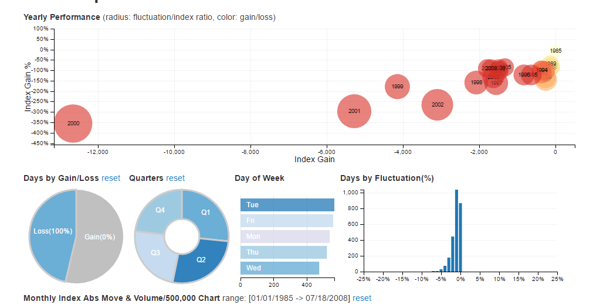
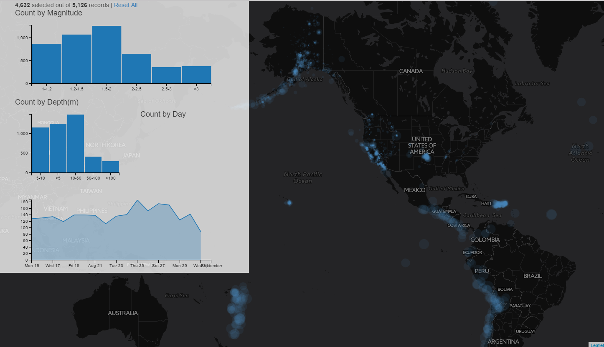

# Data Interaction

> Spring 2017 | Geography 472/572 | Geovisualization: Geovisual Analytics
>
> Instructor: Bo Zhao | TA: Kyle R. Hogrefe | Location: LINC 368 | Time: Thursday 9-9:50am

**Learning Objectives**

- Understand how to make data-driven maps; and
- Understand how to realize data interactions via d3, dc and crossfiter.

Today, let's start with some data driven maps.

**[California's Getting Fracked](http://www.facesoffracking.org/data-visualization/)**

**[Climate Proxies Finder](http://climateproxiesfinder.ipsl.fr/)**

## 1. Crossfilter

Crossfilter is a JavaScript library for exploring large multivariate datasets in the browser. Crossfilter supports extremely fast (<30ms) interaction with coordinated views, even with datasets containing a million or more records; we built it to power analytics for Square Register, allowing merchants to slice and dice their payment history fluidly.

Since most interactions only involve a single dimension, and then only small adjustments are made to the filter values, incremental filtering and reducing is significantly faster than starting from scratch. Crossfilter uses sorted indexes (and a few bit-twiddling hacks) to make this possible, dramatically increasing the perfor­mance of live histograms and top-K lists. For more details on how Crossfilter works, see the API reference.

**[Aireline on-time performance](http://square.github.io/crossfilter/)**

The coordinated visualizations below (built with D3) show nearly a quarter-million flights from early 2001: part of the ASA Data Expo dataset. The dataset is 5.3MB, so it might take a few seconds to download. Click and drag on any chart to filter by the associated dimension. The table beneath shows the eighty most recent flights that match the current filters; these are the details on demand, anecdotal evidence you can use to weigh different hypotheses.

Some questions to consider: How does time-of-day correlate with arrival delay? Are longer or shorter flights more likely to arrive early? What happened on January 12? How do flight patterns differ between weekends and weekdays, or mornings and nights? Fork this example and try your own data!

## 3. [Dc.js](https://dc-js.github.io/dc.js/)

dc.js is a javascript charting library with native crossfilter support, allowing highly efficient exploration on large multi-dimensional datasets (inspired by crossfilter's demo). It leverages d3 to render charts in CSS-friendly SVG format. Charts rendered using dc.js are data driven and reactive and therefore provide instant feedback to user interaction.

dc.js is an easy yet powerful javascript library for data visualization and analysis in the browser and on mobile devices.

> Example: Nasdaq 100 Index 1985/11/01-2012/06/29

Play with the [dc.js examples](http://dc-js.github.io/dc.js/examples/).

## 4. Map amd Char Interaction

This section is greatly inspired by [chriswhong's crossfilter-geo-input](https://github.com/chriswhong/crossfilter-geo-input). This application uses crossfilter to filter a leaflet map, and you can see the interaction between charts and maps. Either the map or the chart is updated, the other chart or map components will be updated as well.

Read and download the source codes of this earthquake application from this lecture's directory. (Execute the index file on Webstorm). While you read the code, you can refer to the (Crossfilter API)[https://github.com/square/crossfilter/wiki/API-Reference].

## References:

[1] http://square.github.io/crossfilter/

[2] https://dc-js.github.io/dc.js/

[3] https://github.com/chriswhong/crossfilter-geo-input