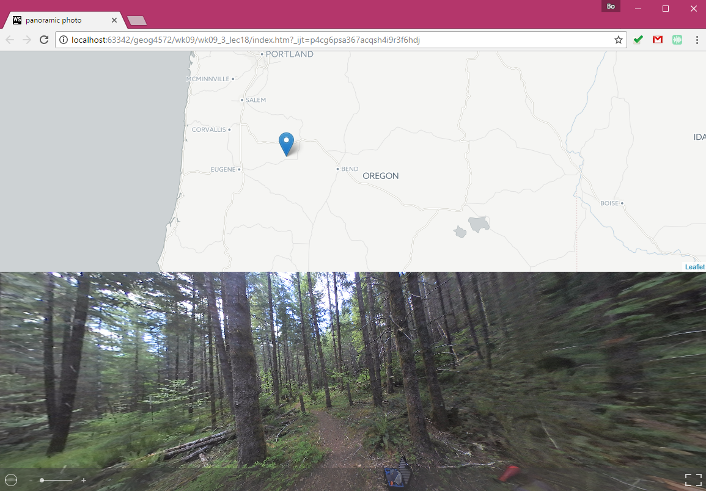

# Visualize Geo-tagged Panoramic Photo

> Spring 2017 | Geography 472/572 | Geovisualization: Geovisual Analytics
>
> Instructor: Bo Zhao | TA: Kyle R. Hogrefe | Location: LINC 368 | Time: Thursday 9-9:50am

**Learning Objectives**

- Get to know the Server-side Javascript;
- Understand some basic packages for Server-side Javascript; and
- Making a real-time twitter map using NodeJs.

In this lecture, we will introduce how to visualize panoramic photos on the web. This task consists of two major steps - reading locational information from the image and then visualize the image in an simulated panoramic environment. Open the `index.html` in an web environment, you can see the geovisualization of today's lecture.




## 1. Panoramic Photos

We have collected some panoramic photos in Andrew forest last Thursday with a panoramic camera or 360 camera. The model we have used is Nikon Key Mission 360 4K edition.

- dual F2.0 lenses for full 360-degree image, each with a 1/2.3" 21MP CMOS sensor
- 4K UHD video capture
- 29MP still capture
- Shockproof and waterproof housing
- Removable battery and microSD card
- Prominent, easy-to-access physical controls


With the KeyMission 360 (and most other 360-degree cameras), the entire surrounding area is recorded as a sphere. Its dual lenses (each backed by a 1/2.3" CMOS sensor) capture two separate images that are stitched together by software, leaving nowhere for a photographer to hide.

The camera itself is compact and solid, with a size and heft a bit larger than a baseball (roughly 6.4cm/2.5in cubed), including the space occupied by the curved lens covers. The KM360 weighs in at around 198g (7oz). If you’re holding the camera, though, your hand and arm dominate much of the field of view. When I asked in the DPReview offices if anyone had a selfie stick I could borrow, I thought I would be knocked over by a concussion wave from eyerolls. And yet, 360 works best when you can get the camera away from yourself, be that on an extended mount, a tripod, or a helmet mount. The KeyMission 360 has a standard 1/4 inch socket at the bottom for attaching almost anything.

The hatch seals tight when closed with a double-locking door, retaining the camera’s waterproofing down to 30m (98ft). It’s also shockproof from 2m (6.6ft) and freezeproof down to -10°C/+14°F.

## 2. Exif Metadata

Exchangeable image file format (officially Exif, according to JEIDA/JEITA/CIPA specifications) is a standard that specifies the formats for images, sound, and ancillary tags used by digital cameras (including smartphones), scanners and other systems handling image and sound files recorded by digital cameras.

When Exif is employed for JPEG files, the Exif data are stored in one of JPEG's defined utility Application Segments, the APP1 (segment marker 0xFFE1), which in effect holds an entire TIFF file within. When Exif is employed in TIFF files (also when used as "an embedded TIFF file" mentioned earlier), the TIFF Private Tag 0x8769 defines a sub-Image File Directory (IFD) that holds the Exif specified TIFF Tags. In addition,

Exif also defines a **Global Positioning System sub-IFD using the TIFF Private Tag 0x8825**, holding location information, and an "Interoperability IFD" specified within the Exif sub-IFD, using the Exif tag 0xA005.

Formats specified in Exif standard are defined as folder structures that are based on Exif-JPEG and recording formats for memory. When these formats are used as Exif/DCF files together with the DCF specification (for better interoperability among devices of different types), their scope shall cover devices, recording media, and application software that handle them.

**Geolocations in Exif metadata**

The Exif format has standard tags for location information. As of 2014 many cameras and most mobile phones have a built-in GPS receiver that stores the location information in the Exif header when a picture is taken. Some other cameras have a separate GPS receiver that fits into the flash connector or hot shoe. Recorded GPS data can also be added to any digital photograph on a computer, either by correlating the time stamps of the photographs with a GPS record from a hand-held GPS receiver or manually by using a map or mapping software. The process of adding geographic information to a photograph is known as geotagging. Photo-sharing communities like Panoramio, locr or Flickr equally allow their users to upload geocoded pictures or to add geolocation information online.

## 3. Visualize Geo-tagged Photos

To visualize panoramic photo, we will use exif.js to read the locational information in the exif metadata of a photo, and then put the geolocation of the photo on the map. At last, we will use a panoramic photo viewer to visualize the virtual scene.


### Include the prerequisite libraries

There are two necessary libraries - Exif.js and photo-sphere-viewer.js.

Because photo-sphere-viewer.min.js relies on three.js, so we will also include three.js.

To map the geolocation of the geo-tagged photo, we will include leaflet.

To design the layout, we will include Bootstrap.

**Exjf.js**

[Exif.js](https://github.com/exif-js/exif-js) is a JavaScript library for reading EXIF meta data from image files. You can use it on images in the browser, either from an image or a file input element. Both EXIF and IPTC metadata are retrieved. This package can also be used in AMD or CommonJS environments.

The package adds a global EXIF variable (or AMD or CommonJS equivalent). Start with calling the EXIF.getData function. You pass it an image as a parameter:

either an image from a 

OR a user selected image in a <file type="input"> element on your page.

As a second parameter you specify a callback function. In the callback function you should use this to access the image with the aforementioned metadata you can then use as you want. That image now has an extra exifdata property which is a Javascript object with the EXIF metadata. You can access it's properties to get data like the image caption, the date a photo was taken or it's orientation.

You can get all tages with EXIF.getTag. Or get a single tag with EXIF.getTag, where you specify the tag as the second parameter. The tag names to use are listed in EXIF.Tags in exif.js.

> **Note:** Note that you have to wait for the image to be completely loaded, before calling getData or any other function. It will silently fail otherwise. You can implement this wait, by running your exif-extracting logic on the window.onLoad function. Or on an image's own onLoad function. For jQuery users please note that you can NOT (reliably) use jQuery's ready event for this. Because it fires before images are loaded. You could use $(window).load() instead of $(document.ready() (please note that `exif-js has NO dependency on jQuery or any other external library).

**photo-sphere-viewer.js**

[photo-sphere-viewer.js](https://github.com/JeremyHeleine/Photo-Sphere-Viewer) is a JavaScript library that allows you to display 360×180 degrees panoramas on any web page. Panoramas must use the equirectangular projection and they can be taken with Photo Sphere, the camera mode brought by Android 4.2 Jelly Bean.

Photo Sphere Viewer uses the Three.js library, so nothing is required for your visitors except for a browser compatible with canvas or, better, WebGL.

`html
	<link rel="stylesheet" href="https://unpkg.com/leaflet@1.0.3/dist/leaflet.css" >
	<link rel="stylesheet" href="https://maxcdn.bootstrapcdn.com/bootstrap/3.3.7/css/bootstrap.min.css">
	<!--<link rel="stylesheet" href="css/main.css">-->

	<script src="https://unpkg.com/leaflet@1.0.3/dist/leaflet.js"></script>
	<script src="https://ajax.googleapis.com/ajax/libs/jquery/3.1.1/jquery.min.js"></script>
	<script type="text/javascript" src="js/exif.js"></script>
	<script src="https://maxcdn.bootstrapcdn.com/bootstrap/3.3.7/js/bootstrap.min.js"></script>
	<script src="js/three.min.js"></script>
	<script src="js/photo-sphere-viewer.min.js"></script>
`

### Web Layout

We will put the map on top and the panoramic photo to the bottom.

There is the structure of HTML Skeleton.

```html
<div class="container">
	<div class="row">
		<div id="pano"></div>
		<div id="map"></div>
	</div>
</div>
```

And we use css stylesheet to control the web layout.

```css

    #map {
        position:  fixed;
        width: 100%;
        top: 0;
        bottom: 50%;
        right: 0;
    }

    #pano {
        position: fixed;
        width: 100%;
        top: 50%;
        bottom: 0px;
        right: 0;
    }

    #pano img{
        display: none;
    }

```

### Get the geolocation of a geo-tagged photo

The locational info are organized in a sexagesimal system (degree, minute and second), we will need to convert it to a decimal number.

```javascript
	function getLatLng() {

		EXIF.getData($("img")[0], function () {

			var exif = EXIF.getAllTags(this);

			var latObj = exif.GPSLatitude;
			var lngObj = exif.GPSLongitude;

			//Convert coordinates to WGS84 decimal
			var latRef = exif.GPSLatitudeRef || "N";
			var lngRef = exif.GPSLongitudeRef || "W";
			var lat = (latObj[0] + latObj[1] / 60 + latObj[2] / 3600) * (latRef == "N" ? 1 : -1);
			var lng = (lngObj[0] + lngObj[1] / 60 + lngObj[2] / 3600) * (lngRef == "W" ? -1 : 1);
		});
	}
```

Since the exif meta data can be only read when the image is fully loaded, we will assign the getLatLng function to the window `onload` event.

```javascript
window.onload=getLatLng;
```

### Make a marker on a map

To make a marker, we will firstly create a map object, a base map.

```javascript
var map = L.map('map', {zoomControl: false, scrollWheelZoom: true}).setView([44, -122], 6);
L.tileLayer('http://{s}.basemaps.cartocdn.com/light_all/{z}/{x}/{y}@2x.png').addTo(map);
```

Again, since we have to make sure the marker is added on to the map when the exif metadata is read, we will add the marker generating part in the getLatLng function.

```javascript
var latlng = L.latLng(lat, lng);

L.marker(latlng).addTo(map);
```

### Create the Panoramic Viewer

photo-sphere-viewer.js enables you to create a viewer using only one line of code. We will assign the path of the photo to the `panorama` parameter, and the container can be captured by Jquery and assigned to the `container` parameter. You can make a fullscreen container or any size you would like the viewer to be. To control the viewer's size, you will use css. If you want to have a control bar, you can assign the `navbar` parameter as `true`.

```javascript
new PhotoSphereViewer({
    panorama: 'img/DSCN0124.JPG',
    container: $("#pano")[0],
    navbar: true
});
```

### 5. Sum-up

Above is the general steps to extract the locational information of a geo-tagged photo, and visualize it in a panoramic environment.

## References:

[1] https://en.wikipedia.org/wiki/Exif

[2] http://www.trustedreviews.com/nikon-keymission-360-review

[3] https://github.com/JeremyHeleine/Photo-Sphere-Viewer
