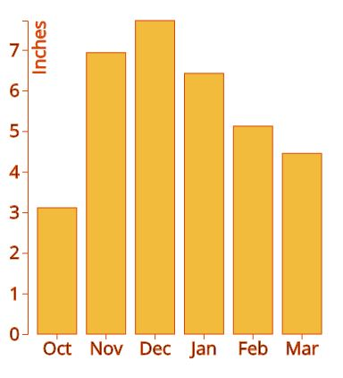
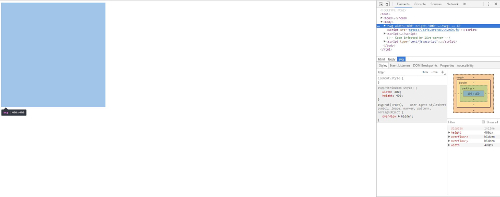
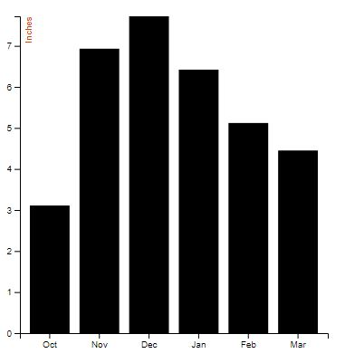

# Lab 4:  Data Visualization with D3.js

> Spring 2018 | Geography 4/572 | Geovisualization: Geovisual Analytics
>
> **Instructor:** Bo Zhao  **Location:** Wilkinson 210 | **Time:** T 1800 - 1950
>
> **Assigned:** 05/01/2018 | **Due:** `05/08/2018 @11:59pm` | **Points Available** = 50
>
> **Contributors:** [Giovanni Svevo](https://github.com/gsvevo)

D3 allows you to bind arbitrary data to a Document Object Model (DOM), and then apply data-driven transformations to the document. For example, you can use D3 to generate an HTML table from an array of numbers. Or, use the same data to create an interactive SVG bar chart with smooth transitions and interaction.

In this lab, we will walk through the process of creating a simple bar chart using D3.js. Then, you will apply these techniques to create a different type of chart based on your interests or on data you would like to visualize. The final result, which will be in the form of a git repository, will be used to enrich the [Neocarto](http://geoviz.ceoas.oregonstate.edu/neocarto/index.html) website, hosted by the Cartography and Geovisualization Group at Oregon State University. Neocarto is a collaborative project whose purpose is to to create reusable charts and other visualizations using d3.js. For this reason, the outcome of this project will need to comply with some stylistic rules, like using the same font type and color scheme. Inside the geog4572 git file for Lab 4 you will find a series of 4 HTML files labeled step1 through step4 which show you the correct outcome for each set of steps.

> Throughout the walk-through section, areas with this `markdown` format indicate extra resources to explore the many options in D3.js. A great reference to always keep in mind is the [D3 API reference](https://github.com/d3/d3/blob/master/API.md).

In the first part of this lab, we will create a bar chart showing last winter's average precipitation in Corvallis. It is based on this [example](https://bl.ocks.org/mbostock/3885304) from [Mike Bostock](https://bost.ocks.org/mike/), the creator of D3.js. Data for this visualization come from [US Climate Data](https://www.usclimatedata.com/climate/corvallis/oregon/united-states/usor0076). Below is the chart you will make by walking through this lab handout.



To get started, please synchronize the course material to the working space of your local computer. If you are working in the Digital Earth Lab, please synchronize your course material on the desktop directory.  The material for this lab is located at `[your_working_space]/geog4572/labs/lab04`. Next, open the course material in Webstorm.

## 1. Set up the workspace

In your IDE (Webstorm), open `step1.html` to prepare for editing.

In this file you will see a basic HTML page which will not display anything on the screen. It is important, though, to start setting up the workspace.

To make use of D3’s capabilities, you must include the `d3.js` file in your web page. Inside the `head` tag, we include the latest version of D3.js (v.5) directly from the [d3js.org]() website.

D3 leverages the Scalable Vector Graphic, or **SVG** format, which allows you to render shapes, lines and fills that can be zoomed in or out without losing quality. Inside the `head` tag, we include an SVG tag specifying width and height of our chart (400x400 pixels).

Inside the `body`, we put our JavaScript code between `script` tags.

```html
<!DOCTYPE html>
<meta charset="utf-8">

<head>
    <svg width="400" height="400"></svg>
    <script src="https://d3js.org/d3.v5.min.js"></script>
</head>

<body>
    <script>

        var svg = d3.select("svg"),
            margin = {top: 20, right: 20, bottom: 30, left: 40},
            width = +svg.attr("width") - margin.left - margin.right,
            height = +svg.attr("height") - margin.top - margin.bottom;

        var x = d3.scaleBand().range([0, width]).padding(0.2),
            y = d3.scaleLinear().range([height, 0]);

        var g = svg.append("g")
            .attr("transform", "translate(" + margin.left + "," + margin.top + ")");

    </script>
</body>
</html>
```


Please  click the chrome button that appears when you hover your mouse over the top right corner of the editing window in Webstorm. In the browser window you should be able, using the inspect tool and placing the mouse over the `svg` tag, to see the area that will be occupied by our chart (image below).





### **1.1 Set dimensions and margins of the graph**

[By convention](https://bl.ocks.org/mbostock/3019563), margins in D3 are specified as an object with top, right, bottom and left properties. Then, the *outer* size of the chart area, which includes the margins, is used to compute the *inner* size available for graphical marks by subtracting the margins. Using this convention is a convenient way to setup the workspace so that all subsequent code can be written without having to worry about margins.

```js
        var svg = d3.select("svg"),
            margin = {top: 20, right: 20, bottom: 30, left: 40},
            width = +svg.attr("width") - margin.left - margin.right,
            height = +svg.attr("height") - margin.top - margin.bottom;
```


### **1.2 Set scales and ranges**

Now we set the scale type and ranges for x and y. Scales are a convenient abstraction for a fundamental task in visualization: mapping a dimension of abstract data to a visual representation.

For continuous quantitative data, you typically want a linear scale.  For discrete ordinal (ordered) or categorical (unordered) data, an ordinal scale specifies an explicit mapping from a set of data values to a corresponding set of visual attributes. Band scales are like ordinal scales except the output range is continuous and numeric. We chose for the x axis a band scale with range between 0 and the width of the graph we defined in the previous section. We also add a padding value (0.2) to keep the individual bars separated from each other. For he y axis we chose a linear scale using as range value the height of the chart. Linear scales are a good default choice for continuous quantitative data because they preserve proportional differences.

```js
        var x = d3.scaleBand().range([0, width]).padding(0.2),
            y = d3.scaleLinear().range([height, 0]);
```

> For more on scales in D3.js look [here](https://github.com/d3/d3-scale/blob/master/README.md)


### 1.3 Append and move the group (g) element

The SVG `g` element is used to group SVG shapes together. Once grouped, you can transform the whole group of shapes as if it was a single shape. You can also style the grouped elements, and reuse them as if they were a single element.

To apply the margins to the SVG container, we set the width and height of the SVG element to the outer dimensions, and add a `g` element to offset the origin of the chart area by the top-left margin.

We use attr() to apply transform as an attribute of `g`. Here using a `translation` transform, we push the whole `g` group to apply the margins we determined earlier. In this way when we add other elements, such as axes, they will be positioned correctly and will not overtype the chart.

```javascript
        var g = svg.append("g")
            .attr("transform", "translate(" + margin.left + "," + margin.top + ")");
```


## 2. Add the data

We can add the data directly in the code or call it from an external file. D3 supports several different file types when loading data, and one of the most common is probably CSV (comma separated values).In our example we are using a file (data.csv) containing the average precipitation in Corvallis last year. To see the code, look at step2.html in the folder. This html page also will not display anything on the screen.

```csv
month,rain
Oct,3.11
Nov,6.93
Dec,7.72
Jan,6.42
Feb,5.12
Mar,4.45
```


### 2.1 Parsing the data

We use the `d3.csv` method to fetch a csv file at the specified URL. The anonymous function (d) gets the data from the 'rain' column of the csv and returns an array of objects. The + operator `+d` is used to return the numeric representation of the object.

```js
        d3.csv("assets/data.csv", function(d) {
        d.rain = +d.rain;
        return d;
        }.then(function(data) {
```

Then we set the domain for the x and y axis. You should recall from the lesson that the **domain** is the complete set of values, so for example all the precipitation values from 0.47 to 7.72 inches. The **range** is the set of resulting values of a function, in this case the resulting values of scaling precipitations from 0 to 400 (the max height of our chart defined before).

For our x value we use the `map` method, to map a discrete domain to a discrete range. Our x domain will be therefore the number of months in the data.

For our y value, we use the `max` method, that sets the highest value in the precipitation column as the higher value of the domain.

```js
        x.domain(data.map(function(d) { return d.month; }));
        y.domain([0, d3.max(data, function(d) { return d.rain; })]);
```


## 3. Building the chart

Once the workspace has been set up and we have the data, we can build our chart using D3.js. From the folder, open the file `step3.html`. The final result should look like in the image below.



### 3.1 Adding the x and y axes

First we need to add the x and y axes to the chart. To do so, we append them to `g`. Recall that the SVG `g` element is used to group SVG shapes together.

For the `x` axis we use the `d3.axisBottom` method to create a new bottom-oriented axis. To place it at the bottom of the chart, we need to translate it (just as done before with the SVG chart when we added the margins) because by default an SVG element has origin on the top left corner of the screen. To do so we use the transform method `translate` and move the axis of an amount of pixels equivalent to the attribute `height` defined earlier.

For the `y` axis we use the `d3.axisLeft` method and we concatenate the method `ticks` to determine the number of horizontal lines we would like to display on the y axis.

```js
        g.append("g")
            .attr("transform", "translate(0," + height + ")")
            .call(d3.axisBottom(x));

        g.append("g")
            .call(d3.axisLeft(y).ticks(10))
```

> More on axes in D3.js [here](https://github.com/d3/d3-axis)

### 3.2 Building the chart

Finally we draw the chart using the SVG element `rect` to build the individual bars of the chart. As you can see below, the code calls the data and appends [rectangular shapes](https://www.w3schools.com/graphics/svg_rect.asp) using the x (month) and y (rain) values. The width is computed by dividing the available chart width by the size of the dataset (`x.bandwidth`). The height is determined by a function. We want the zero-value to be positioned at the bottom of the chart, rather than the top (remember that the SVG by default sets the origin in the top left corner). Therefore before adding the bar using the y value, we need to subtract the height.

```js
        g.selectAll(".bar")
            .data(data)
            .enter().append("rect")
            .attr("x", function(d) { return x(d.month); })
            .attr("y", function(d) { return y(d.rain); })
            .attr("width", x.bandwidth())
            .attr("height", function(d) { return height - y(d.rain); });
```


## 4. Styling the chart

Now that our chart is drawn, we want to style it so that we can effectively communicate. It doesn’t matter how good a chart looks if it doesn’t communicate anything. We will label the chart, change the type and size of the font and modify the colors.

### 4.1 Label the chart

A label can be added to the y axis by appending a `text` element and positioning it as desired. We are going to add to the code we used to generate the y axis some lines.

```js
        g.append("g")
            .call(d3.axisLeft(y).ticks(10))
            .append("text")
            .attr("transform", "rotate(-90)")
            .attr("y", 6)
            .attr("dy", "0.7em")
            .attr("fill", "#DC4404")
            .attr("text-anchor", "end")
            .text("Inches");
```

So, what did we do here?

- We appended a new `text` element
- Then rotated it by 90 degrees anti clockwise to orient it as the y axis using the transform method `rotate`
- `y` - This attribute designates the anchor point location for the text in the y dimension
- `dy` - This attribute designates the offset of the text from the anchor point in the y dimension
- `text-anchor` This attribute controls the horizontal text alignment (optional). It has three values; `start` (left aligned), `middle` (centre aligned) and `end` (right aligned)
- Lastly, we defined `text`, the actual label that will be displayed on the chart (in this case, *Inches*)


### 4.2 Use CSS to Style

We are going to use CSS to style the chart. Rather than writing the code in the html page between style tags, we'll create an external file called style.css.

```css
.bar {
  fill:#F3BB3B;
  stroke: #DC4404;
}

.bar:hover {
  fill:#DC4404;
}

.axis{
    stroke: #DC4404;
    font-family: 'Open Sans', sans-serif;
    font-size: 20px;
  }

.axis line {
    stroke: #DC4404;
  }

.axis path {
    stroke: #DC4404;
  }

.axis--x path {
  display: none;
}
```

#### 4.2.1 Color the chart bars

To color the bar chart we create in style.css the .bar class and specify colors for the `fill` and the `stroke` properties. The fill property defines the fill color of the bars in the chart. The stroke property defines the color of a line, text or outline of an element. In our case it is the outline of the bars. We can also specify an hover color that will change as we move the mouse above the bars.

```css
.bar {
  fill:#F3BB3B;
  stroke: #DC4404;
}

.bar:hover {
  fill:#DC4404;
}
```

#### 4.2.2 Change the fonts

As you learned in the previous lab, choosing fonts is an important part of visualization, and an often overlooked one.

> Right now, our page uses the default Browser font, usually Times New Roman. To edit fonts, we want to style CSS. In CSS, there are a lot of options for fonts, for more reading, check out the [w3schools font documentation](http://www.w3schools.com/css/css_font.asp).
>
> Traditionally, a font is loaded into your page only if you have it on your computer. This presents a problem though, if someone doesn't have the font, it will change the page to use secondary or default fonts. In order to ensure that every visitors computer display the same, you can link to online font libraries. A common, useful online font library is Google Fonts. Google fonts can be added to any site, and since you link to the style, you don't have to worry about the user not having the font installed on their computer. Check out the [Google Font library](fonts.google.com) and explore their options. Let's link a common web font called `Titillium Web` to our document so we can use it. To link it to our document, enter the following line of code into the head section of your document. It should go right after your stylesheets.

Instead of `Titillium`, we will use the font `Open Sans`

```html
<head>...
<link href="https://fonts.googleapis.com/css?family=Open+Sans" rel="stylesheet">
...</head>
```

To style all the text in our chart with the `Open Sans` font, we modify the `.axis` tag in the CSS file. We also specify the `font-size` and the color (`stroke`)

```css
.axis{
    stroke: #DC4404;
    font-family: 'Open Sans', sans-serif;
    font-size: 20px;
  }
```


#### 4.2.3 Final editing

Finally we give a value for the `stroke` property of line (horizontal lines in the y axis) and `path` (the y axis). We also decide to not display the x axis line.

```css
.axis line {
    stroke: #DC4404;
  }

.axis path {
    stroke: #DC4404;
  }

.axis--x path {
  display: none;
}
```

To see these changes applied in the chart, we need to add the classes to the SVG element. So we insert as attribute in the g element the classes `axis`, `axis--x` and `axis--y`.

```js
        g.append("g")
            .attr("class", "axis axis--x")
            .attr("transform", "translate(0," + height + ")")
            .call(d3.axisBottom(x));

        // add the y Axis
        g.append("g")
            .attr("class", "axis axis--y")
            .call(d3.axisLeft(y).ticks(10))
            .append("text")
            .attr("transform", "rotate(-90)")
            .attr("y", 6)
            .attr("dy", "0.7em")
            .attr("fill", "#DC4404")
            .attr("text-anchor", "end")
            .text("Inches");

        // append the rectangles for the bar chart
        g.selectAll(".bar")
            .data(data)
            .enter().append("rect")
            .attr("class", "bar")
            .attr("x", function(d) { return x(d.month); })
            .attr("y", function(d) { return y(d.rain); })
            .attr("width", x.bandwidth())
            .attr("height", function(d) { return height - y(d.rain); });
```


## 5. Deliverables

****

After you successfully build this chart, you are expected to build another data visualization using D3.js. You can use some of your own data or you can get inspiration visiting one of many sites that host D3 examples. The [official website](https://d3js.org/) of D3.js is the best place to start. Other websites with live examples and code snippets are [bl.ocks.org](https://bl.ocks.org/), [d3-discovery.net](https://d3-discovery.net/) and [christopheviau.com](http://christopheviau.com/d3list/gallery.html#title=all). To get an idea about the different chart types and what kind of data they are better suited for, take a look at [datavizproject.com](http://datavizproject.com/).

As said before, your visualization will be used to enrich the [Neocarto](http://geoviz.ceoas.oregonstate.edu/neocarto/index.html) website, hosted by the Cartography and Geovisualization Group at Oregon State University. For this reason, the style of your chart should comply with these rules:

#### SVG

The SVG area of the chart should be 400 x 400 pixels

#### Font

Font-type: Open Sans (https://fonts.googleapis.com/css?family=Open+Sans)

Font-size: Between 10px and 36px (depending on the type of chart)

#### Color

Please choose from these colors:


>
>
>  HSL
>
> color1: hsla(18%, 96%, 44%, 1);
>
> color2: hsla(42%, 88%, 59%, 1);
>
> color3: hsla(0%, 1%, 86%, 1);
>
> color4: hsla(203%, 38%, 65%, 1);
>
> color5: hsla(214%, 42%, 53%, 1);
>
> RGB
>
> color1: rgba(220, 68, 4, 1);
>
> color2: rgba(243, 187, 59, 1);
>
> color3: rgba(220, 219, 219, 1);
>
> color4: rgba(132, 174, 200, 1);
>
> color5: rgba(85, 129, 186, 1);


#### License

Please credit the author of the example you are basing your visualization on and acknowledge the license. A software license tells others what they can and can't do with your source code, so it's important to mention it. More info on licenses can be found [here](https://help.github.com/articles/licensing-a-repository/).

#### Readme.md

You are also required to write a project description in the `readme.md` file. This file will describe the type of visualization, a brief introduction, the major functions (for example what type of data are best visualized with it), data sources, credit acknowledgement, and other necessary information.

#### Images

Add an `img` folder inside the `assets` folder and place in it an SVG image of your visualization. To do so you need to export it from the html page.

> To extract an SVG image from an html file proceed like this:
>
> In Microsoft Edge
>
> 1. Right Click **>** Save Picture As
>
> In Chrome, Firefox, etc.
>
> 1. Inspect Element (*Make sure you've selected the root svg element you'd like to save*).
>
> 2. Right Click **>** Edit as HTML
>
> 3. Copy the outer HTML
>
> 4. Paste in your favorite text editor (*VS Code*), and save as a `.svg`
>
>    ​

The extracted SVG will not have color information, therefore you will need to add color (same colors of the html visualization) using an image editor. The most known software to manipulate vector images is Adobe Illustrator, but a good (and open source) alternative is [Gravit](https://gravit.io/). Once you added the color, you will need to resize the chart leaving a 30 px border on top and bottom sides and a 20 px border on the left and right sides, as shown in the image below.


#### Grading criteria:

- SVG dimensions (400 x 400 pixels) and margins (50 x 50 px)  **(7 points)**
- Font-type Open Sans **(4 points)**
- Font size between 10 and 36 (depending on the type of chart) **(4 points)**
- Color palette **( 8 points)**
- License acknowledgement  **(4 points)**
- Readme.md file **(8 points)**


## Submission

- you will need to synchronize this project to a GitHub repository. And make sure the chart is accessible from a url link, which should be similar to `http://[your_github_username].github.io/[your_repository_name]/index.html`. (You may want to check out previous lecture or lab handouts on project management and hosting via GitHub); **(7 points)**

- To simplify your html page, please put the CSS file `style.css` inside a `css` folder and all images in an `img` folder. These folders will be placed inside an `assets` folder, which will contain also your data (csv or json).  Please make sure the project repository structure is well organized. It should be similar to the file structure below. **(8 points)**

  ```powershell
  [your_repository_name]
      │index.html
      │readme.md
      ├─assets
          │
          ├─css
          │      style.css
          ├─img
          │      image.jpg
          │      image.svg
          └─data.csv
  ```


For submission, you are expected to submit the **url of the GitHub repository** to the **Canvas Lab 4 submission page** of this course. This url should be in the format of `https://www.github.com/[your_github_username]/[your_repository_name]`. Also the TA and other audience should be able to visit your chart through the url `https://[your_github_username].github.io/[your_repository_name]`. Please contact the instructor if you have any difficulty in submitting the url link.

> If you have a genuine reason(known medical condition, a pile-up of due assignments on other courses, ROTC,athletics teams, job interview, religious obligations etc.) for being unable to complete work on time, then some flexibility is possible. However, if in my judgment you could reasonably have let me know beforehand that there would likely be a delay, and then a late penalty will still be imposed if I don't hear from you until after the deadline has passed. For unforeseeable problems,I can be more flexible. If there are ongoing medical, personal, or other issues that are likely to affect your work all semester, then please arrange to see me to discuss the situation. There will be NO make-up exams except for circumstances like those above.

## References for D3.js

[1] The [official website](https://d3js.org/) of D3 is the best place to start.

[2] Live examples and code snippets:  [bl.ocks.org](https://bl.ocks.org/), [d3-discovery.net](https://d3-discovery.net/) and [christopheviau.com](http://christopheviau.com/d3list/gallery.html#title=all).

[3] D3.js API reference: [D3 API reference](https://github.com/d3/d3/blob/master/API.md).
