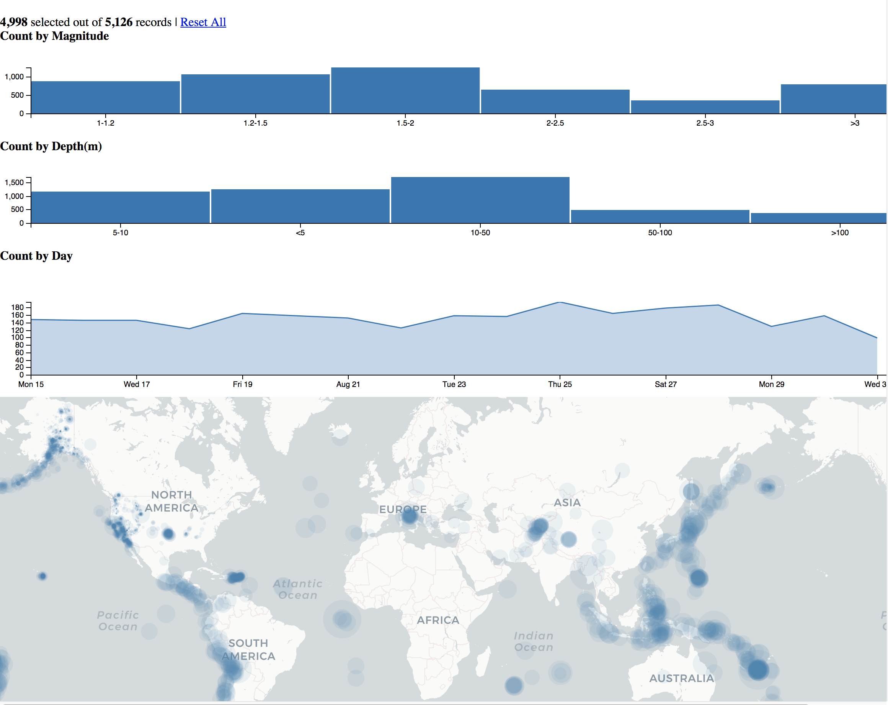

# Coordinated View

> Spring 2018 | Geography 4/572 | Geovisualization: Geovisual Analytics
>
> **Instructor:** Bo Zhao  **Location:** WITH 205 | **Time:** TR 1100 - 1150

> **Contributors:** [Alex Water](https://github.com/walteral)

**Learning Objectives**

-create bar charts that are filtered dynamiclly

-create a line chart that is filtered dynamiclly

-create a map that acts as the filter for the charts

`dc.js` is a JavaScript Library that allow you to develop graphs/charts, and highly interactive Dashboards. `dc.js` builds on `d3.js` and use `d3.js` to render charts in CSS friendly SVG format. By using this library you will be able to develop bar chart (histogram), pie chart, row chart, line chart, bubble chart, geo choropleth chart, and others. You can link the charts to each other to make a well connected charting interface for your work.

This JavaScript library is really a powerful tool for data visualization and analysis on the web. Here in this tutorial we'll try to cover some basics of `dc.js` that will help you to move on with `dc.js`. This tutorial shows you a coordinated view geovisualization of global Earthquakes from August 15 to Septmeber 1, 2016. The original data is downloaded from USGS, and later converted to geojson. Open up the geovisualization at [here](http://jakobzhao.github.io/labs/lab05/coordinated/index.html)



>  **note:** dc.js didn't works alone, it require `crossfilter.js` and `d3.js` to work.

1\. [crossfilter](https://github.com/square/crossfilter/wiki) is also a JavaScript library released by Square, allow you to explore large multidimensional datasets. It aggregates and filter raw data extremely fast (<30ms). It doesn't have its own user interface, so it combine to work with `d3.js` and Google Visualization API. It’s really easy to get your raw data into `crossfilter.js` by using JSON data format.

2\. [D3](https://d3js.org/) also known as Data-Driven Documents or `d3.js`, a JavaScript Library for data visualization, allow you to present raw data into a more visual form using SVG, Canvas and HTML5 and CSS standards. It is the more powerful library of JavaScript as to visualize data in graphical format as compared to above mentioned.

Please copy the following libraries in the same order to your html file. Besides, make sure you include the css stylesheet for `dc.css`.

```html
<link rel="stylesheet" type="text/css" href="http://dc-js.github.io/dc.js/css/dc.css"/>
<script type="text/javascript" src="https://d3js.org/d3.v5.min.js"></script>
<script type="text/javascript" src="https://cdnjs.cloudflare.com/ajax/libs/crossfilter/1.3.12/crossfilter.min.js"></script>
<script type="text/javascript" src="https://dc-js.github.io/dc.js/js/dc.js"></script>
```

**The web page: `index.html`**

```html
<!DOCTYPE html>
<html>

<head>
    <title>DC.js Bar Chart</title>
    <link rel="stylesheet" type="text/css" href="http://dc-js.github.io/dc.js/css/dc.css" />
    <script type="text/javascript" src="https://d3js.org/d3.v5.min.js"></script>
    <script type="text/javascript" src="https://cdnjs.cloudflare.com/ajax/libs/crossfilter/1.3.12/crossfilter.min.js"></script>
    <script type="text/javascript" src="https://dc-js.github.io/dc.js/js/dc.js"></script>
</head>


```
For this exercise we will be looking to display four major items: 1) a bar chart showing the magnitude of each earthquake, 2) a bar chart showing the depth of each earthquake, 3) an area chart showing the number of earthquakes a specific datas and 4) a map where each earthquake happened.

Next add the correct elements that you will be updating to the body of the html file. In this example we will be creating a text narrative that will display the number of recorded events in a <p>, a earthquake magnitude chart that will be contained in a <div>, a earthquake depth chart that will be contained in another <div> chart, a area chart displaying the nubmer of earthquakes by day in a <div> and finally a map element.

    <p class = "dc-data-count">Number of Earthquakes</p>
    <h4>Count by Magnitude</h4>
    <div id="mag-chart"></div>
    <h4>Count by Depth(m)</h4>
    <div id="depth-chart"></div>
    <h4>Count by Day</h4>
    <div id="date-chart"></div>
    <div id="map"></div>

**Javascript
Next within the `<script>` we will place the rest of our code. It is broken down into several simple steps:
1) Create a basemap
2) Prep the data
3) Sort the Data
4) Group the Data
5) Add the markers to the map
6) Create the Charts
7) Draw the Charts
8) Add listeners

## 1) Create the basemap
First create the basemap that you will add to the webpage. Here we are using the cartoDB 'dark_all' map to style our basemap

    var map = L.map('map', {zoomControl: false, scrollWheelZoom: true}).setView([30,-150], 3);
    L.tileLayer('http://{s}.basemaps.cartocdn.com/dark_all/{z}/{x}/{y}.png').addTo(map);

## 2) Prep the data

Since DC can't use data driectly from our source we have to change it into a format that it can read. Here we will be using the crossFilter() function to set up the data. Add the .csv using `d3.json` and create a filter variable that will hold all of our data.

    d3.json('assets/earthquakes.geojson').then(function(data) {

      var filter = crossfilter(data.features);

 Now that we have the data in a format the DC can use we have to use another method to sort it. We will use the .dimension() method to seperate out each record, for now we want everything so create a variable everything and create a function to return each record.

      var everything = filter.dimension(function(d) {
        return d
      });

## 3) Sort the data
Now that we have the data in a format that DC can read we can create differenet variables where we sort the data to display what we want shown. Similar to creating the `everything` variable we will use the .dimension() method to sort through the data. Recall that one of the elements that we want to show is the point locations of the earthquakes, to get those we can sort through our data with the .dimension() method and store it in a variable. This function takes our pre-formated `filter` variable and sorts out just the geometry.

           var geomDimension = filter.dimension(function(d) {
            return d.geometry
          });

Next we will want to find out the date that the earthquakes took place. To do that we will have to convert the time that is a given property in the geojson to a format that DC can read using the d3.timeDay method.

    var dateDimension = filter.dimension(function(d) {

        return d3.timeDay(new Date(d.properties.time));
    });

The next two steps we will gather the magnitude and depth variables using the same .dimension() method but this time with a new feature, the lamda operator. This allows us to sort data in categories easily within a function. In this example we are sorting the data based on the intensity of the magnitude and depth of the earthquake.

    var magDimension = filter.dimension(function(d) {
    var mag = d.properties.mag;
    return  mag < 1.2 ? '1-1.2' :
            mag < 1.5 ? '1.2-1.5' :
            mag <   2 ? '1.5-2' :
            mag < 2.5 ? '2-2.5' :
            mag <   3 ? '2.5-3' :
                      '>3'
  });

    var depthDimension = filter.dimension(function(d) {
        var depth = d.properties.depth;
        return  depth <   5 ? ' <5'   :
                depth <  10 ? ' 5-10' :
                depth <  50 ? '10-50' :
                depth < 100 ? '50-100':
                        '>100'
    });

## 4)Group the Data

This is an easy step, now that we have our variables with our sorted data (geometry, date, depth and magnitude) we have to group them back together so that DC can read them more efficently. To do this we will use the .group() method.

      var magDimensionGroup = magDimension.group();

      var depthDimensionGroup = depthDimension.group();

      var dateDimensionGroup = dateDimension.group();

      var all = filter.groupAll();

The last variable we used .groupAll() instead of group. This is because we have multiple dimensions in that variable that needed to be grouped together for DC to use.

## 5) Add the Markers to the Map

Now we can finally start adding some data! This step have been covered in previous labs, we will be adding simple markers to the map based on the geometry points of the data. We'll add custom markers using `pointToLayer` and add a bind a popup showing the magnitude of each earthquake to those markers.

      var geoJsonLayer = L.geoJson({
        type: 'FeatureCollection',
        features: geomDimension.top(Infinity)
      }, {
        pointToLayer: function (feature, latlng) {
          return L.circleMarker(latlng, {
            radius: Math.pow(feature.properties.mag, 2)/2,
            fillColor: "steelblue",
            color: "#fff",
            weight: 1,
            stroke: false,
            opacity: 0.1,
            fillOpacity: 0.1
          })
        },
        onEachFeature: function (feature, layer) {
            layer.bindTooltip(feature.properties.mag.toString());
        }
      }).addTo(map);

## 6) Create the Charts
Now that we have our variables sorted to show the data that we want displayed we have to create the chart that the data go into. DC offers a few easy tools to do this, in this example we'll use the `dc.barChart`, `dc.lineChart` and `dataCount` in our charts. We first have to define the chart variable and bind it to our html element in the `<body>` sections that we want it to attach to. Once we capture the right element DC has some parameters that we need to fill out:
`height:` the height in pixels of our chart
`margins:` how big we want our margins to be
`diminson:` This is our actual dimension data that we sorted out earlier and want to display
`group:` our group variable that we created from the dimension variable earlier
`elasticY:` this allows our y axis to update on-the-fly according to our filters (true/false)
`x:` our x-axis scale, in this case we are using ordinal data so we'll use d3.scaleOrdinal()
`xUnits:` What we want our units to be in for the x-axis
`yAxis:` This is gathered from DC from our dataset
`ticks:` how many ticks we want


    var magChart = dc.barChart('#mag-chart');
        magChart
        .height(100)
        .margins({top: 10, right: 50, bottom: 30, left: 40})
        .dimension(magDimension)
        .group(magDimensionGroup)
        .elasticY(true)
        .x(d3.scaleOrdinal())
        .xUnits(dc.units.ordinal)
        .yAxis()
        .ticks(3);


      var depthChart = dc.barChart('#depth-chart');

      depthChart
        .height(100)
        .margins({top: 10, right: 50, bottom: 30, left: 40})
        .dimension(depthDimension)
        .group(depthDimensionGroup)
        .elasticY(true)
        .x(d3.scaleOrdinal())
        .xUnits(dc.units.ordinal)
        .yAxis()
        .ticks(3);

      var dateChart = dc.lineChart('#date-chart');
      dateChart
          .renderArea(true)//area or lines
          .height(150)
          .transitionDuration(1000)//how long it takes to transition
          .margins({top: 30, right: 50, bottom: 25, left: 40})
          .dimension(dateDimension)
          .group(dateDimensionGroup)
          .elasticY(true)
          .x(d3.scaleTime().domain([new Date(2016, 7, 15), new Date(2016, 8, 1)]))
          .xUnits(d3.timeDays);

  The last part is different isn't a chart be will update on-the-fly a text box that will count the number of elements displayed on the screen. When `All` of the elements are displayed it will display the text string, when `some` of the elements are displayed it will run the inside script.


      var earthquakeCount = dc.dataCount('.dc-data-count');//creates text depicting how many earthquakes are on screen, needs a <p> element
      earthquakeCount
        .dimension(filter)
        .group(all)
        .html({
          some: '<strong>%filter-count</strong> selected out of <strong>%total-count</strong> records' +
              ' | <a href=\'javascript:dc.filterAll(); dc.renderAll();\'>Reset All</a>',
          all: 'All records selected. Please click on the graph or change the map view to apply filters.'
        });

## 7) Draw the Charts
This is the easiest step, now that all of the variables are sorted, the charts are planned we have to actually draw the data into the html elements. Make sure this is the last step in the process.

     dc.renderAll()


## 8) Listen for Changes

Since we want our charts and map to update on-the-fly we have to set up listeners to look for those changes. To do this we'll create two functions: the first one will update the map as we move the viewport around based on the bounding box of the screen, and the second will update the points on the map.

    function updateMapFilter() {
        geomDimension.filter(function(d) {
            return map.getBounds().contains(L.geoJSON(d).getBounds())
        });
        dc.redrawAll();
    }

    function updateMap() {
        geoJsonLayer.clearLayers();//removes everything
        geoJsonLayer.addData({//adds the new data to the map/chart within the scope of the filter
            type: 'FeatureCollection',
            features: everything.top(Infinity)
        });
    }

Finally we have to place these listeners on the datasets that we want them to look at. So for the map we will call `updateMapFilter()` when the user has ended their zoom or movement.

            map.on('zoomend moveend', function() {//passes the zoom and move locations as the new filter
                updateMapFilter(); //triggers the new function
            });

For each of the charts we will run `updateMap()` whenever the map is `filtered` so that they update when the map updates.

      magChart.on('filtered', function(chart, filter) {
        updateMap()//calls the update map function
      });

      depthChart.on('filtered', function(chart, filter) {
        updateMap()
      });

      dateChart.on('filtered', function(chart, filter) {
        updateMap()
      });

    })


To sum up, the tutorial above shows yout a detailed step-by-step tutorial on how to generate a coordinated-view geovisualization through a combination of charts and maps. In `dc.js`, you can actually find mutiple types of charts. Try to make your coordinated view using Dc.js and Leaflet at the same time.


