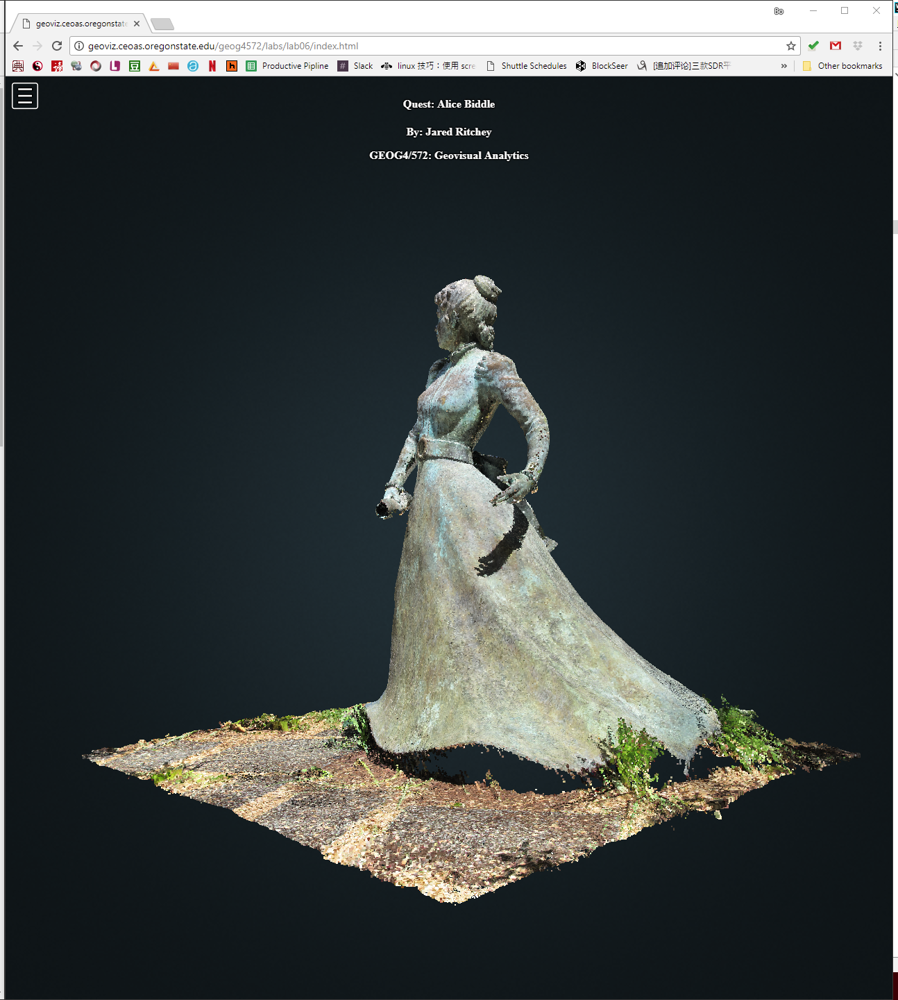

# Lab 6: (*Optional*) Structure from Motion and Point Cloud Visualization

> Spring 2018 | Geography 4/572 | Geovisualization: Geovisual Analytics
>
> **Instructor:** Bo Zhao  **Location:** Wilkinson 210 | **Time:** T 1800 - 1950
>
> **Assigned:** 05/22/2018 | **Due:** `06/05/2018 @11:59pm` | **Points Available** = 25


**This lab is optional rather than required.** You can get extra points if you can compelete and submit this lab. This lab accounts 25 points in total.

In this lab, you are expected to generate a structure from Motion (SfM) using a dataset of 2-dimensional photos. You can use the dataset provided by the course or collected by yourself. Once the SfM is generated, you will need to visualize this SfM model on github page as usual. To do that, you will need to use a dedicated web based point cloud platform - Potree.  (a free open-source WebGL based point cloud renderer for large point clouds, originally developed at the Institute of Computer Graphics and Algorithms, TU Wien). [Check this demo](https://jakobzhao.github.io/geog4572/labs/lab06/index.html)



> **Note:** Structure from motion (SfM) is a photogrammetric range imaging technique for estimating three-dimensional structures from two-dimensional image sequences that may be coupled with local motion signals. It is studied in the fields of computer vision and visual perception. In biological vision, SfM refers to the phenomenon by which humans (and other living creatures) can recover 3D structure from the projected 2D (retinal) motion field of a moving object or scene.

## Grading Criteria:

Create a new repository on github to store this lab submission.


- Generate a SfM from Photoscan from a dataset of photos. This dataset can be the one which provided by this course ([Clink here to download](https://drive.google.com/open?id=18jXLaFHFg0y2aqSsJ61Q0QOYaV_1nqdX)), or collect a dataset all by yourself. To generate the dataset, you will need to use PhotoScan, you can use a demo version, which can be downloaded from the photo official website. The demo version would not allow you export the SfM model, so for turning in, please get a screenshot of the point cloud of the generated SfM model, and then insert this screenshot image to the `readme.md` file in the root directory of this repository (**9 POINTS**)

> **Note:** If you want to export the point cloud, you will need to use an full version of PhotoScan. In Strand Ag Hall 347 (Instructor's office), there is a dedicated workstation which has installed a full version of the PhotoScan. If you want to export your SfM, you can use that workstation with you onid whenever the door is open.

- Visualize the SfM as a point cloud with Potree. The raw code of this point cloud viusalization should be updated to a newly generated github repository. This SfM can be the one was given by the course, or generated by yourself. (**9 POINTS**)

 In the end, the file structure of this repository should look like:

```Powershell
[Submission_Lab_06]
│──────readme.md
│──────index.html
├─libs
├─pointclouds
├─resources
```

- Make sure the point cloud visualization can be visited through a url link. (**4 POINTS**)

- Briefly describe your lab submission in the `readme.md` file. You will need to briefly introduce how you generate the SfM and the potree based point cloud visualization. Also, acknowledge this course if you use the data set provided by this course.  (**3 POINTS**)


## 3. Deliverable

Once you complete this lab assignment, please make sure both the github repository and the web site work appropriately. Then, you will need to submit the url of the GitHub repository to **Canvas Dropbox**. (On the assignment tab,  press the `Submit Assignment` button to submit. Please contact the instructor or TA if you have any difficulty.)
