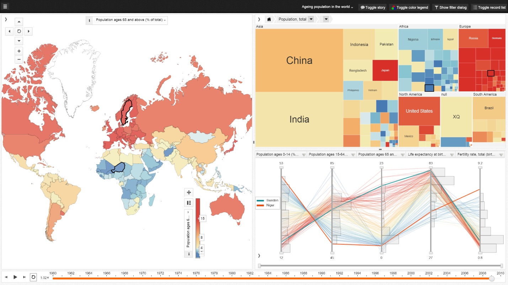
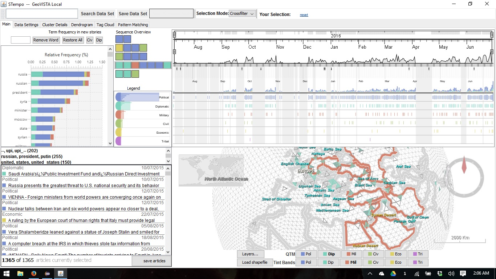
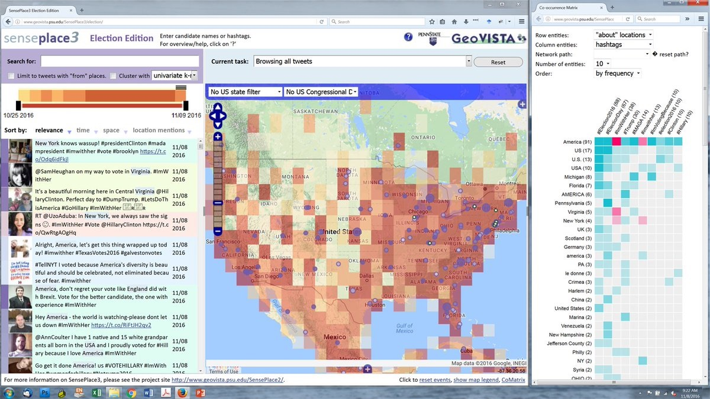
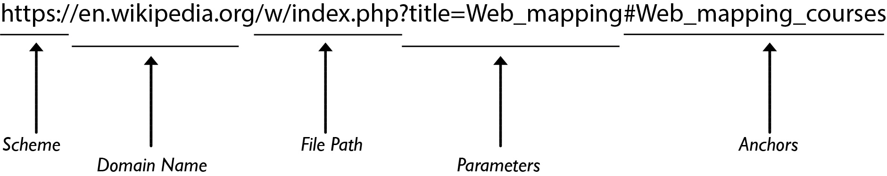

# Geovisual Analytics Basics

> Spring 2018 | Geography 4/572 | Geovisualization: Geovisual Analytics
>
> **Instructor:** Bo Zhao  **Location:** WITH 210 | **Time:** TR 1100 - 1150

**Learning Objectives**

- Understand the system architecture for web mapping; and
- Get to know the elements of a web map through examples.


Geovisual analytics refers to the science of analytical reasoning with spatial information as facilitated by interactive visual interfaces. It is distinguished by its focus on novel approaches to analysis rather than novel approaches to visualization or computational methods alone. As a result, geovisual analytics is usually grounded in real-world problem solving contexts. Research in geovisual analytics may focus on the development of new computational approaches to identify or predict patterns, new visual interfaces to geographic data, or new insights into the cognitive and perceptual processes that users apply to solve complex analytical problems. Systems for geovisual analytics typically feature a high-degree of user-driven interactivity and multiple visual representation types for spatial data. Geovisual analytics tools have been developed for a variety of problem scenarios, such as crisis management and disease epidemiology. Looking ahead, the emergence of new spatial data sources and display formats is expected to spur an expanding set of research and application needs for the foreseeable future.


## 1\. What is Geovisual Analytics (Robinson, 2017)


### 1.1 Defination of Geovisual Analytics

Geovisual analytics is the science of analytical reasoning with spatial information as facilitated by interactive visual interfaces (G. Andrienko et al., 2007). This domain emerged in the late-2000s following the development of a broader field called visual analytics (Thomas & Cook, 2005). Visual analytics itself emerged as a separable discipline from the field of Information Visualization, becoming distinct via its focus on the science of analytical reasoning with visual interfaces, rather than primarily emphasizing the visual representation of data as is common in Information Visualization. Put simply, visual analytics places emphasis on supporting analytical processes, not just the development of new visual methods for representing data. Therefore, in the context of geographic information science, geovisual analytics is an emerging research domain that advances the state of the art in analytical reasoning with visual interfaces for spatial data sources, and it builds upon a great deal of earlier work in Geovisualization (see Geovisualization, forthcoming) which focused on new visual methods for representing and interacting with spatial data.

Geovisual analytics is a focus today for a significant amount of geographic research on cartography, computational methods, interface design, and cognitive science. The field blends each of these areas together in the pursuit of new interactive mapping systems that allow users to detect patterns and predict future outcomes using spatial data. A key motivating force on this field is its focus on supporting analytical work that connects to complex human and environmental problems. As a result, geovisual analytics approaches tend to embrace the fact that datasets are messy and uncertain, that problems may not have singular outcomes, and that different user groups may have radically different requirements for meeting their analytical goals. Geovisual analytics today is also heavily influenced by the challenges posed by volume, velocity, variety, veracity, and other aspects associated with Big Data. A considerable amount of attention in geovisual analytics centers on the challenges associated with analyzing spatio-temporal problems.

#### Key aspects of Geovisual analytics:

 - **Analytical Reasoning**: the process of examining information in order to find patterns within that information.

 - **Coordinated-view** visualization: dynamic visual interfaces in which multiple data representations are interactively linked to support operations such as cross-filtering, highlighting, and selection.



- **User-Centered Design** ensures that tools reflect user-centered design principles and are iteratively designed with end-user considerations at the core to support high degrees of utility and usability.

### 1.2 Applications

The STempo toolkit is a geovisual analytics system designed to support pattern discovery and analysis in spatio-temporal events collected from news articles (Anthony C. Robinson, Peuquet, Pezanowski, Hardisty, & Swedberg, 2016). This figure shows multiple coordinated views that highlight key terms mentioned in events extracted from news articles, their temporal and spatial distributions, and the results of a modified T-pattern analysis algorithm which suggests potentially interesting combinations of events that could warrant further analyst investigation. These views highlight the spatial, temporal, and attribute footprints associated with newsworthy events in and around Syria in 2015-2016.



The [SensePlace3](https://www.geovista.psu.edu/SensePlace3/election/) geovisual analytics system allows users to explore the place references included in Twitter messages, including the locations messages are sent from as well as those that are referenced in the message content itself. In this example, tweets about the 2016 United States presidential election are visualized from multiple perspectives. A timeline and list view on the left of the display shows recent activity, while the map at the center of the display shows the density of location mentions for election-related tweets. At right, a matrix view allows users to compare relationships between locations mentioned in tweets to the use of specific hashtags.



## 2\. System Architecture for web based Geovisual Analytics


It can take several different physical machines to create, serve, and use a web map. These are often depicted in diagrams as separate levels, or tiers of architecture. In this course, you use one machine to play all these roles; however, it's important to understand how the tiers fit together.


>  **System architecture for web mapping**.
>
>  - A line extends from the bottom of this cloud into a wide oval diagram with the label: Internal network.
>  - The line leads to the drawing of a Web server and then, below the Web server, to a Geospatial server.
>  - The line then branches to drawings of a file server (left) and a database server (right).
>  - To the left (within the Internal network rectangler) is another computer drawing with the label: Administrators and internal client applications. Desktop workstations that are used by administrators and internal client applications. These machines will also be used to prepare data, author maps, and sometimes administer the other machines.

In some cases, your web map may be designed solely for the use of people within your organization and may never see the open web. In this scenario, client applications may also reside on these desktop workstation machines.

A database and/or file server holding all of your GIS data. This machine might be equipped with redundant storage mechanisms and regular backup scripts that prevent the loss of data.

In this course, you'll be using folders of shapefiles for some of the exercises. If you had decided to use a database like PostgreSQL or MongoDB, it would also go on this tier.

A geospatial web services server that has specialized software and processing power for drawing maps, responding to feature queries, and performing GIS analysis operations. In this course, you will use GeoServer to host your web services.

A web server that acts as a web entry point into your organization's network. This is also called a proxy server. It is protected by firewalls that shield malicious traffic into your internal network. It's also a place where you can put web application code (such as HTML and JavaScript files) for your web maps. You will just be using GeoServer; therefore, you will not install separate web server software. GeoServer comes with an embedded “servlet” called **Jetty** that gives you a simple endpoint to your web services that you can locally access for testing. In a more formal setup where you wanted to reveal your GeoServer web services to the world, you would have a web server such as **Apache** that would forward requests to GeoServer.

Many client applications that use the web map. These can be apps that run on your desktop workstation or they could be mobile apps. The clients may be based within your network, or you may allow them to come from outside your network. All clients must be able to make web requests through HTTP, and any client coming from outside your network must have an Internet connection.

In this course, you can use any modern web browser to test your apps and services. You can also use a mobile browser, such as Safari on the iPhone, to test the apps that you place on your personal web space.

Again, when developing and testing a web map, you can certainly use a single physical machine to play all these roles. This is a common practice that keeps things simple and more economic. When you work for a “real world” company with its own network and you are ready to deploy your web map, you will move your tested services and applications into a formal “production” environment where you have individual enterprise-grade machines for each role, as described above.

## 3\. Web Basics

### 3.1 Internet

The Internet is a worldwide telecommunications system that provides connectivity for millions of other, smaller networks; therefore, the Internet is often referred to as a network of networks. It allows computer users to communicate with each other across distance and computer platforms.

The Internet began in 1969 as the U.S. Department of Defense's Advanced Research Project Agency (ARPA) to provide immediate communication within the Department in case of war. Computers were then installed at U.S. universities with defense related projects. As scholars began to go online, this network changed from military use to scientific use. As ARPAnet grew, administration of the system became distributed to a number of organizations, including the National Science Foundation (NSF). This shift of responsibility began the transformation of the science oriented ARPAnet into the commercially minded and funded Internet used by millions today.

The Internet acts as a pipeline to transport electronic messages from one network to another network. At the heart of most networks is a server, a fast computer with large amounts of memory and storage space. The server controls the communication of information between the devices attached to a network, such as computers, printers, or other servers.

### 3.2 World Wide Web (WWW)

The Internet is often confused with the World Wide Web. The misperception is that these two terms are synonymous. The Internet is the collection of the many different systems and protocols. The World Wide Web, developed in 1989, is actually one of those different protocols. As the name implies, it allows resources to be linked with great ease in an almost seamless fashion.

The World Wide Web contains a vast collection of linked multimedia pages that is ever-changing. However, there are several basic components of the Web that allow users to communicate with each other. Below you will find selected components and their descriptions.

#### TCP/IP protocols

In order for a computer to communicate on the Internet, a set of rules or protocols computers must follow to exchange messages was developed. The two most important protocols allowing computers to transmit data on the Internet are Transmission Control Protocol (TCP) and Internet Protocol (IP). With these protocols, virtually all computers can communicate with each other. For instance, if a user is running Windows on a PC, he or she can communicate with iPhones.

#### Domain name system

An Internet address has four fields with numbers that are separated by periods or dots. This type of address is known as an IP address. Rather than have the user remember long strings of numbers, the Domain Name System (DNS) was developed to translate the numerical addresses into words. For example, the address `geoviz.ceoas.oregonstate.edu` is really `151.101.53.147`. You can find the IP by ping a domain name. For example, open `cmd prompt` if you are a windows user or open `terminal` if you are a mac user.

``powershell
$ ping geoviz.ceoas.oregonstate.edu
``

> `$` is the prompt symbol to notify you to enter your command.

Then, you will see the following result on cmd prompt or mac terminal.

```powershell
PING sni.github.map.fastly.net (151.101.53.147): 56 data bytes
64 bytes from 151.101.53.147: icmp_seq=0 ttl=59 time=6.426 ms
64 bytes from 151.101.53.147: icmp_seq=93 ttl=59 time=6.381 ms
64 bytes from 151.101.53.147: icmp_seq=94 ttl=59 time=6.496 ms
64 bytes from 151.101.53.147: icmp_seq=95 ttl=59 time=6.453 ms
64 bytes from 151.101.53.147: icmp_seq=96 ttl=59 time=6.549 ms
64 bytes from 151.101.53.147: icmp_seq=97 ttl=59 time=6.384 ms
... ...
```

### 3.3 URLs

Addresses for web sites are called URLs (Uniform Resource Locators). Most of them begin with http (HyperText Transfer Protocol), followed by a colon and two slashes. For example, the URL for the Geoviz Lab is http://geoviz.ceoas.oregonstate.edu. Here is another url example, which has more parts.

**A whole Url**

[https://en.wikipedia.org/w/index.php?title=Web_mapping#Web_mapping_courses](https://en.wikipedia.org/w/index.php?title=Web_mapping#Web_mapping_courses)



#### Scheme

Every URL begins with the scheme. This tells your browser what type of address it is so the browser connects to it correctly. There are many types of schemes, but for typical web browsing you will mostly see http and https. Your browser usually won’t show the scheme in the address bar, and usually you don’t need to type the scheme when typing a web address; instead, you can just begin with the domain name. The scheme is still always part of the URL; it just isn’t being displayed.

#### Domain name

The domain name is the most prominent part of a web address. Typically, different pages on the same site will continue to use the same domain name. For example, all pages on this site share the GCFLearnFree.org domain name.

Each segment of the domain name separated by a period is called a domain. The domain on the right is called a top-level domain, with the domain to the left of it called the second-level domain, then third-level domain, and so on.

> In most URLs, the www domain can be omitted. Google.com and www.google.com lead to the same page. However, other subdomains cannot be omitted. For example, all pages under news.google.com require the news subdomain in the URL.

#### File Path

The file path—often just called the path—tells your browser to load a specific page. If you don’t specify a path and only enter a domain name, your browser is still loading a specific page; it’s just loading a default page, which usually will help you navigate to other pages.

URLs that end with the domain name without a file path usually will load a homepage or an index page that's designed to help you navigate to specific pages on the site. Often, if you can’t remember the file path for a specific page, you can go to the homepage and search for it.

#### Parameters

Some URLs include a string of characters after the path—beginning with a question mark—called the parameter string. You have probably noticed this part of a URL appear in your address bar after performing a search on Google or YouTube. The parameter string can be clear or confusing to a human user, but it is critical information for the server.

#### Anchor

Also appearing after the path, the anchor tells your browser to scroll to or load a specific part of the page. Usually the anchor begins with a hashtag and is used to direct your browser to a specific part of a very long page, much like a bookmark. Different anchors don’t load different pages; they simply tell the browser to display different parts of the page.


## 4. References

[1] Robinson, A. (2017). [Geovisual Analytics](https://gistbok.ucgis.org/bok-topics/geovisual-analytics). The Geographic Information Science & Technology Body of Knowledge (3rd Quarter 2017 Edition), John P. Wilson (ed.). doi: 10.22224/gistbok/2017.3.6.

[2] https://fcit.usf.edu/internet/chap1/chap1.htm

[3] https://www.tutorialspoint.com/internet_technologies/internet_overview.htm

[4] https://www.gcflearnfree.org/internetbasics/understanding-urls/1/