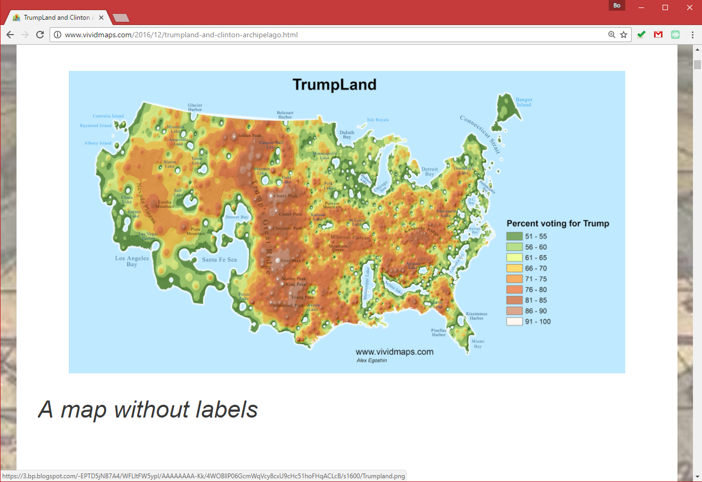
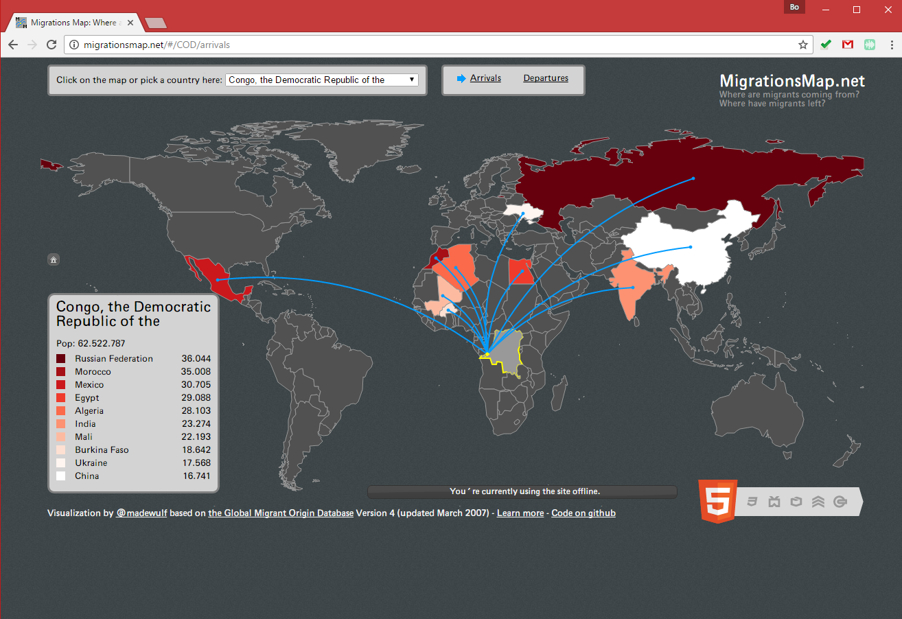
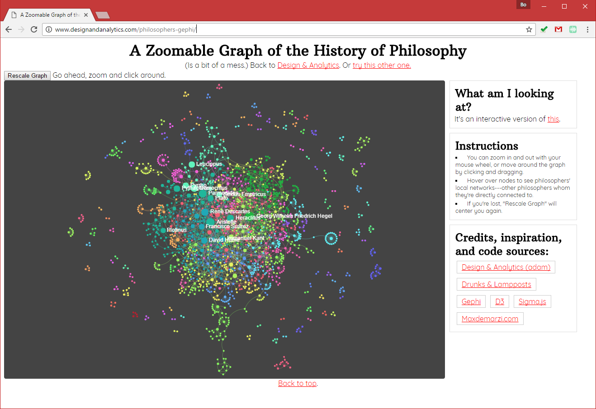
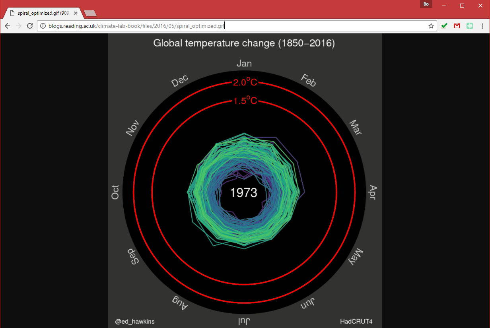
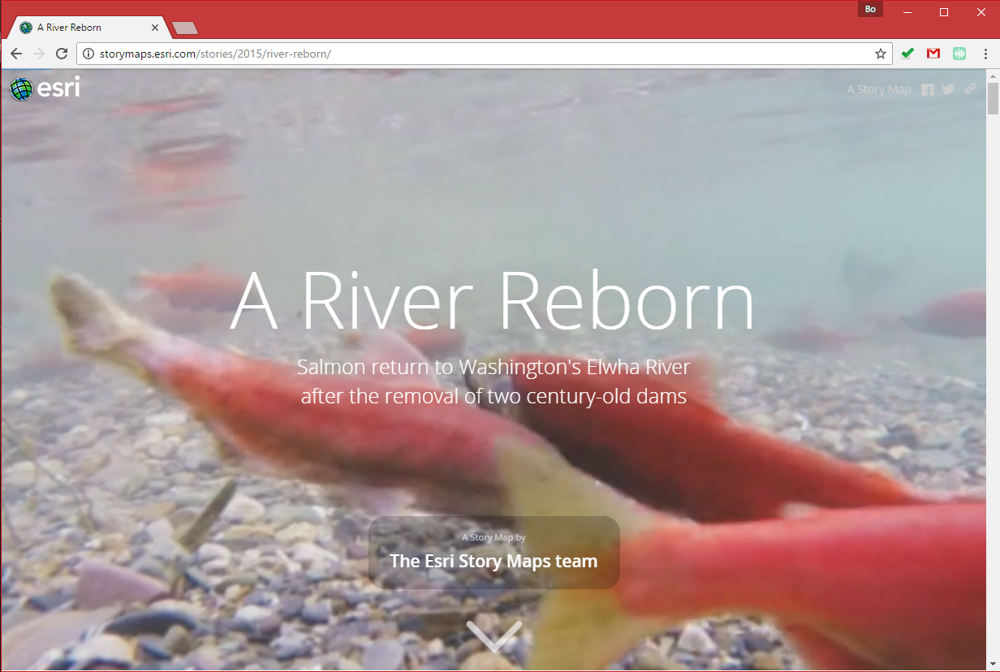
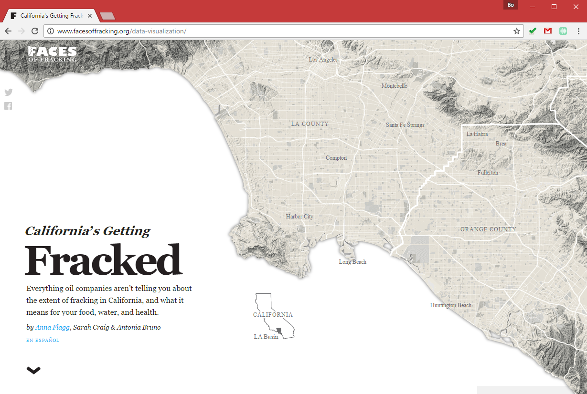

# Geovisual Analytics Basics

> Spring 2019 | Geography 4/572 | Geovisual Analytics
>
> **Instructor:** Bo Zhao  **Location:** Wilkinson 210 | **Time:** TR 1600 - 1650

**Learning Objectives**

- Understand the basic concepts related to Geovisual Analytics
- Understand the system architecture for web based geoviz; and

Geovisual analytics refers to **the science of analytical reasoning with spatial information as facilitated by interactive visual interfaces.** It is distinguished by its focus on novel approaches to analysis rather than novel approaches to visualization or computational methods alone. As a result, geovisual analytics is usually grounded in real-world problem solving contexts. Research in geovisual analytics may focus on the development of new computational approaches to identify or predict patterns, new visual interfaces to geographic data, or new insights into the cognitive and perceptual processes that users apply to solve complex analytical problems. Systems for geovisual analytics typically feature a high-degree of user-driven interactivity and multiple visual representation types for spatial data. Geovisual analytics tools have been developed for a variety of problem scenarios, such as crisis management and disease epidemiology. Looking ahead, the emergence of new spatial data sources and display formats is expected to spur an expanding set of research and application needs for the foreseeable future.

## 1\. What is Geovisual Analytics (Robinson, 2017)

### 1.1 Definition of Geovisual Analytics

**Geovisual analytics is the science of analytical reasoning with spatial information as facilitated by interactive visual interfaces (G. Andrienko et al., 2007).** This domain emerged in the late-2000s following the development of a broader field called visual analytics (Thomas & Cook, 2005). Visual analytics itself emerged as a separable discipline from the field of Information Visualization, becoming distinct via its focus on the science of analytical reasoning with visual interfaces, rather than primarily emphasizing the visual representation of data as is common in Information Visualization. Put simply, visual analytics places emphasis on supporting analytical processes, not just the development of new visual methods for representing data. Therefore, in the context of geographic information science, geovisual analytics is an emerging research domain that advances the state of the art in analytical reasoning with visual interfaces for spatial data sources, and it builds upon a great deal of earlier work in Geovisualization (see Geovisualization, forthcoming) which focused on new visual methods for representing and interacting with spatial data.

Geovisual analytics is a focus today for a significant amount of geographic research on cartography, computational methods, interface design, and cognitive science. The field blends each of these areas together in the pursuit of new interactive mapping systems that allow users to detect patterns and predict future outcomes using spatial data. A key motivating force on this field is its focus on supporting analytical work that connects to complex human and environmental problems. As a result, geovisual analytics approaches tend to embrace the fact that datasets are messy and uncertain, that problems may not have singular outcomes, and that different user groups may have radically different requirements for meeting their analytical goals. Geovisual analytics today is also heavily influenced by the challenges posed by volume, velocity, variety, veracity, and other aspects associated with Big Data. A considerable amount of attention in geovisual analytics centers on the challenges associated with analyzing spatio-temporal problems.

#### Key aspects of Geovisual analytics:

 - **Analytical Reasoning**: the process of examining information in order to find patterns within that information.

 - **Coordinated-view**: or coordinated multiple view. Dynamic visual interfaces in which multiple data representations are interactively linked to support operations such as cross-filtering, highlighting, and selection.

- **User-Centered Design** ensures that tools reflect user-centered design principles and are iteratively designed with end-user considerations at the core to support high degrees of utility and usability.

### 1.2 Applications

The STempo toolkit is a geovisual analytics system designed to support pattern discovery and analysis in spatio-temporal events collected from news articles (Anthony C. Robinson, Peuquet, Pezanowski, Hardisty, & Swedberg, 2016). This figure shows multiple coordinated views that highlight key terms mentioned in events extracted from news articles, their temporal and spatial distributions, and the results of a modified T-pattern analysis algorithm which suggests potentially interesting combinations of events that could warrant further analyst investigation. These views highlight the spatial, temporal, and attribute footprints associated with newsworthy events in and around Syria in 2015-2016.

The [SensePlace3](https://www.geovista.psu.edu/SensePlace3/election/) geovisual analytics system allows users to explore the place references included in Twitter messages, including the locations messages are sent from as well as those that are referenced in the message content itself. In this example, tweets about the 2016 United States presidential election are visualized from multiple perspectives. A timeline and list view on the left of the display shows recent activity, while the map at the center of the display shows the density of location mentions for election-related tweets. At right, a matrix view allows users to compare relationships between locations mentioned in tweets to the use of specific hashtags.

## 2\. Major types of geovisual analytical applications

This section introduces some major types of interactive geovisual applications. Regarding the course project, you are expected to work as a team to make a similar geovisual application. By viewing the following geovisual applications, you would get sense how geovisual skills can be applied for illustrating real-world problems.

### 2.1 Single-view Geoviz

**[Economic Output of Asian Countries - New York Times](http://www.nytimes.com/interactive/2013/04/08/business/global/asia-map.html)**

> In this map, geography is distorted so that each country is **sized according to its economic output** in 2012. The countries are colored by their rate of growth; more established economies tend to grow more slowly.

The use of cartogram.

**[TrumpLand vs. Clinton Archipelago](http://www.vividmaps.com/2016/12/trumpland-and-clinton-archipelago.html)**

The use of isoline maps.

**[Migrations Map](http://migrationsmap.net/#/COD/arrivals)**

**[A Graph of the History of Philosophy](http://www.designandanalytics.com/philosophers-gephi/)**

Please pay attention to how (social) network is implemented to visualize connectivity.

**[Global temporal change](http://blogs.reading.ac.uk/climate-lab-book/files/2016/05/spiral_optimized.gif)**

**[Electric Generation in Spain](http://energia.ningunaparte.net/en/)**

Connect the idea of infographics with the data-driven visualization.

### 2.2 Coordinated (Multiple) View Geoviz

**[Climate Proxies Finder](http://climateproxiesfinder.ipsl.fr/)**

> This application allows you to select different paleo-oceanographic proxies collected at LSCE according to various dimensions (spatial position, depth, age, archive, material type and chronological information).

One data source, and multiple visual analytical ways.

### 2.3 Storymap (a.k.a geo-narrative, online map based storytelling, etc.)

**[Stand with #Standingrock](https://winkyt.github.io/standwithstandingrock/)**

Following months of conflict, triggered by a proposed pipeline, in January 2017, environmental protestors were forced to leave their camping area at Standing Rock. Today, it has become nearly impossible for people to access the former camping area. Even though protestors no longer stay there, a growing number of social media users still stand with #StandingRock by spoofing their check-ins on Facebook. With storymap techniques, this dynamic map geo-narrates the whole story of the environmental protest at Standing Rock and #standing rock.

Esri Story Maps let you combine authoritative maps with narrative text, images, and multimedia content. They make it easy to harness the power of maps and geography to tell your story.

**[A River Reborn](http://storymaps.esri.com/stories/2015/river-reborn/)**

Please pay attention to how the author uses the 2D map, 3D virtual environment and multi-media (e.g., video, images, etc.).

**[California's Getting Fracked](http://www.facesoffracking.org/data-visualization/)**

Please pay attention to the use of map elements, and how the window scrolling behavior triggers the map events.

### 2.4 Point Cloud Geoviz

[Potree](http://potree.org/index.html) is a free open-source WebGL based point cloud renderer for large point clouds, developed at the Institute of Computer Graphics and Algorithms, TU Wien.

### 2.5 Spatial Data Platform

**[HJA Geospatial data Platform]**

[http://mapious.ceoas.oregonstate.edu:3001/](http://mapious.ceoas.oregonstate.edu:3001/)

This project seeks to develop a web map-based data catalog for the H.J. Andrews Experimental Forest. The initial goal is to provide a central platform for researchers and the broader public to visualize geospatial data within a 3D digital landscape. The portal was developed using Cesium, an open-source JavaScript library for 3D maps, in conjunction with TerriaJS, a library for building geospatial data catalogs, and GeoServer, a Java-based software server that allows users to view and edit geospatial data. The datasets currently available are for demonstration purposes; this is a pilot project to be built upon in the future.

## 3\. System Architecture for web based Geovisual Analytics

It can take several different physical machines to create, serve, and use a web map. These are often depicted in diagrams as separate levels, or tiers of architecture. In this course, you use one machine to play all these roles; however, it's important to understand how the tiers fit together.

>  **System architecture for web based geoviz**.
>
>  - A line extends from the bottom of this cloud into a wide oval diagram with the label: Internal network.
>  - The line leads to the drawing of a Web server and then, below the Web server, to a Geospatial server.
>  - The line then branches to drawings of a file server (left) and a database server (right).
>  - To the left (within the Internal network rectangler) is another computer drawing with the label: Administrators and internal client applications. Desktop workstations that are used by administrators and internal client applications. These machines will also be used to prepare data, author maps, and sometimes administer the other machines.

In some cases, your web based geoviz may be designed solely for the use of people within your organization and may never see the open web. In this scenario, client applications may also reside on these desktop workstation machines.

A database and/or file server holding all of your GIS data. This machine might be equipped with redundant storage mechanisms and regular backup scripts that prevent the loss of data.

In this course, you'll be using folders of shapefiles for some of the exercises. If you had decided to use a database like PostgreSQL or MongoDB, it would also go on this tier.

A geospatial web services server that has specialized software and processing power for drawing maps, responding to feature queries, and performing GIS analysis operations. In this course, you will use GeoServer to host your web services.

A web server that acts as a web entry point into your organization's network. This is also called a proxy server. It is protected by firewalls that shield malicious traffic into your internal network. It's also a place where you can put web application code (such as HTML and JavaScript files) for your web based geoviz. You will just be using GeoServer; therefore, you will not install separate web server software. GeoServer comes with an embedded “servlet” called **Jetty** that gives you a simple endpoint to your web services that you can locally access for testing. In a more formal setup where you wanted to reveal your GeoServer web services to the world, you would have a web server such as **Apache** that would forward requests to GeoServer.

Many client applications that use the web based geoviz. These can be apps that run on your desktop workstation or they could be mobile apps. The clients may be based within your network, or you may allow them to come from outside your network. All clients must be able to make web requests through HTTP, and any client coming from outside your network must have an Internet connection.

In this course, you can use any modern web browser to test your apps and services. You can also use a mobile browser, such as Safari on the iPhone, to test the apps that you place on your personal web space.

Again, when developing and testing a web based geoviz, you can certainly use a single physical machine to play all these roles. This is a common practice that keeps things simple and more economic. When you work for a “real world” company with its own network and you are ready to deploy your geoviz, you will move your tested services and applications into a formal “production” environment where you have individual enterprise-grade machines for each role, as described above.

## 4. References

[1] Robinson, A. (2017). [Geovisual Analytics](https://gistbok.ucgis.org/bok-topics/geovisual-analytics). The Geographic Information Science & Technology Body of Knowledge (3rd Quarter 2017 Edition), John P. Wilson (ed.). doi: 10.22224/gistbok/2017.3.6.

[2] https://fcit.usf.edu/internet/chap1/chap1.htm

[3] Understanding URLs, https://www.gcflearnfree.org/internetbasics/understanding-urls/1/
