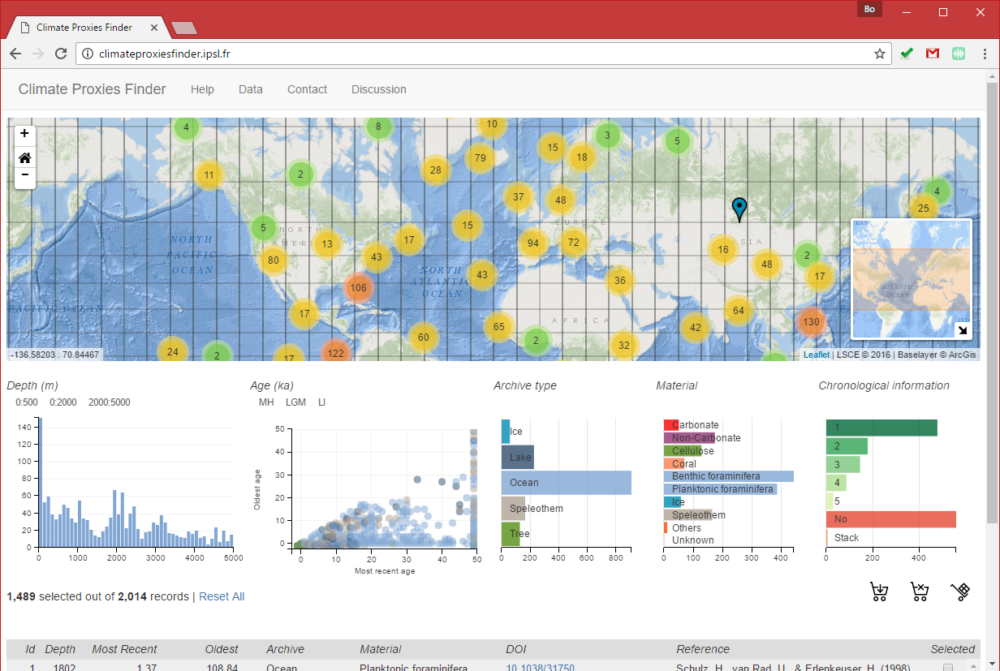
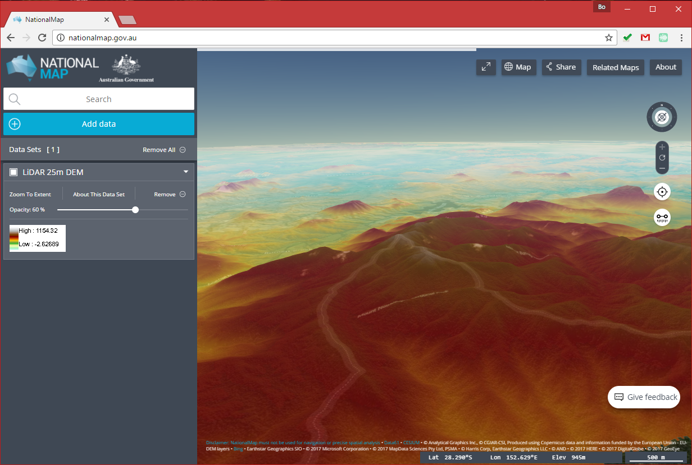

# Brainstorm

> Spring 2018 | Geography 4/572 | Geovisualization: Geovisual Analytics
>
> **Instructor:** Bo Zhao  **Location:** WITH 205 | **Time:** TR 1100 - 1150

## 1\. Major types of Geovisual Analytical applications

This section introduces some major types of interactive geovisual applications. Regarding the course project, you are expected to work as a team to make a similar geovisual application. By viewing the following geovisual applications, you would get sense how geovisual skills can be applied for illustrating real-world problems.

### 2.1 Single-view Geoviz

**[Economic Output of Asian Countries - New York Times](http://www.nytimes.com/interactive/2013/04/08/business/global/asia-map.html)**

> In this map, geography is distorted so that each country is **sized according to its economic output** in 2012. The countries are colored by their rate of growth; more established economies tend to grow more slowly.

The use of cartogram.

**[TrumpLand vs. Clinton Archipelago](http://www.vividmaps.com/2016/12/trumpland-and-clinton-archipelago.html)**

The use of isoline maps.

**[Migrations Map](http://migrationsmap.net/#/COD/arrivals)**

**[A Graph of the History of Philosophy](http://www.designandanalytics.com/philosophers-gephi/)**

Please pay attention to how (social) network is implemented to visualize connectivity.

**[Global temporal change](http://blogs.reading.ac.uk/climate-lab-book/files/2016/05/spiral_optimized.gif)**

**[Electric Generation in Spain](http://energia.ningunaparte.net/en/)**

Connect the idea of infographics with the data-driven visualization.

### 2.2 Coordinated (Multiple) View Geoviz

**[Climate Proxies Finder](http://climateproxiesfinder.ipsl.fr/)**

> This application allows you to select different paleo-oceanographic proxies collected at LSCE according to various dimensions (spatial position, depth, age, archive, material type and chronological information).

One data source, and multiple visual analytical ways.

### 2.3 Storymap (a.k.a geo-narrative, online map based storytelling, etc.)

Esri Story Maps let you combine authoritative maps with narrative text, images, and multimedia content. They make it easy to harness the power of maps and geography to tell your story.

**[A River Reborn](http://storymaps.esri.com/stories/2015/river-reborn/)**

Please pay attention to how the author uses the 2D map, 3D virtual environment and multi-media (e.g., video, images, etc.).

**[California's Getting Fracked](http://www.facesoffracking.org/data-visualization/)**

Please pay attention to the use of map elements, and how the window scrolling behavior triggers the map events.

### 2.4 Point Cloud Geoviz

Potree is a free open-source WebGL based point cloud renderer for large point clouds, developed at the Institute of Computer Graphics and Algorithms, TU Wien.

### 2.5 Spatial Data Platform

**[National Map of Australia](http://nationalmap.gov.au/)**

please pay attention to the use of virtual globe, and how different types of geospatial data (especially **maps made by UAV**) are overlain in the same visualization environment.

## 4\. Homework

The purpose of this handout is to help you brainstorm and identify the geovisualization you would like to work on. Regarding the homework, please submit a word or pdf document to canvas, it should contain

(1) **a url link of the geovisualization**;

(2) a short description of the specific geovisual analytical skills you are interested; and

(3) you can also list the potential topics you would like to work on. **Think bold!** In the meantime, please keep in mind that this course is more about honing the geovisual analytical skills other than concentrating on a specific topic.

**In the lecture this Thursday (4/6)**, you are required to present one geovisualization of your interest to the class.  You should submit the homework **by noon April 5th**.

Once you finish this homework, you need to submit it to **Canvas Dropbox**. On the assignment tab,  check the item of this homework, press the `Submit Assignment` button to submit. Please contact the instructor or TA if you have any difficulty. Note: only submit your homework in Word or PDF format.