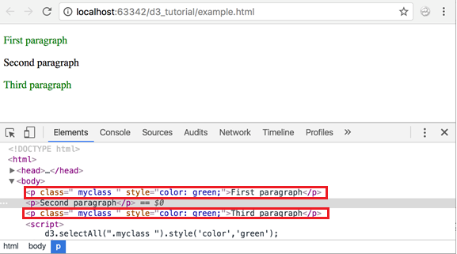
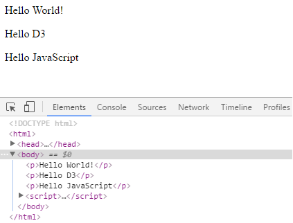
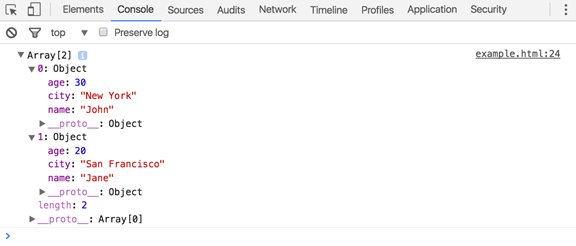

# D3.js Fundamentals

> Spring 2019 | Geography 4/572 | Geovisual Analytics
>
> **Instructor:** Bo Zhao  **Location:** Wilkinson 210 | **Time:** TR 1600 - 1650

**Learning Objectives**

- Understand the basic concept, functions, and methods of D3.js;
- Be familiar with the different in selection between jQuery and D3; and
- Able to update your code from D3 version 4 to version 5.


D3 stands for Data-Driven Documents. It is an open-source JavaScript library developed by Mike Bostock to create custom interactive data visualizations in the web browser using SVG, HTML and CSS. This lecture will help you learn the essentials of D3.js starting from the basics to an intermediate level.

**D3.js setup**: Before we start, you'll need the following components:

- D3 library
- Web server
- Editor
- Web browser

### 1\. D3 Library:

You need to include D3.js library into your HTML webpage in order to use D3 to create data visualization. You can do it in two ways:


> Include D3 library from CDN (Content Delivery Network).

Since D3 is an open-source library, the source code is freely available on the D3 website d3js.org.

Include D3 Library from CDN:
You can use D3 library by linking it directly to your HTML page from the Content Delivery Network (CDN). CDN is a network of servers where files are hosted and are delivered to a user based on their geographic location. If you use the CDN, you don't need to download the source code.

Include D3 library using CDN url https://d3js.org/d3.v4.min.js into your page as shown below.

```html
<!DOCTYPE html>
<html lang="en">
<head>
    <script src="https://d3js.org/d3.v4.min.js"></script>
</head>
<body>

<script>
    // write your d3 code here..
</script>
</body>
</html>
```

>**note:** if you want to compare jQuery with D3, please add a jquery library from cdn.

```javascript
<script src="https://ajax.googleapis.com/ajax/libs/jquery/3.3.1/jquery.min.js"></script>
```

also, if you want to use v5 instead of v4, please simply change the number 4 to 5..

```html
<script src="https://d3js.org/d3.v5.min.js"></script>
```

### 2\. Select DOM Elements using D3

D3 allows us to manipulate DOM elements in the HTML document and for that we first need to select a particular element, or a group of elements and then manipulate those elements using various D3 methods.

In this sect, we will learn about selecting DOM elements using D3.js methods.

This defines a global JavaScript object d3, which includes all the important methods to start with, just like jQuery includes a global object called jQuery (or `$`).

Before manipulating DOM elements, we need to get the reference of DOM elements using the following methods.


| Method                       | Description                                                  |
| ---------------------------- | ------------------------------------------------------------ |
| `d3.select(css-selector`     | Returns the first matching element in the HTML document based on specified css-selector |
| `d3.selectAll(css-selector)` | Returns all the matching elements in the HTML document based on specified css-selector |

#### d3.select():

The d3.select() method returns the first element in the HTML document based on specified css-elector.

**Select Element By Name:**

The following example demonstrates selecting the first matching element by tag name using d3.select.

```html
<!DOCTYPE html>
<html>
<head>
    <script src="https://d3js.org/d3.v4.min.js"></script>
</head>
<body>
    <p>First paragraph</p>
    <p>Second paragraph</p>

    <script>
        d3.select("p").style("color", "green");
    </script>
</body>
</html>
```

In the above example, `d3.select("p")` returns first `<p>` element and then, `.style("color","green")` method sets the color attribute to green. When you run this on your browser, this is how it will look:


You can see in the above result that the first paragraph has now been colored green. Open the developer tools (from Chrome settings > More Tools > Developer Tools). In the developer tools, under the Elements tab, you can see the paragraph elements and a style applied to the paragraphs.

**Select Element by Id:**

```javascript
d3.select("#p2").style("color", "green");
```

#### d3.selectAll():

The d3.selectAll() method returns all the matching elements in the HTML document based on specified CSS selector.

**Select Elements by Name:**

The following example selects all the elements by tag name.

```html
<!DOCTYPE html>
<html>
<head>
    <meta http-equiv="Content-type" content="text/html; charset=utf-8"/>
    <script src="https://d3js.org/d3.v4.min.js"></script>
</head>
<body>
    <p>First paragraph</p>
    <p>Second paragraph</p>
    <script>
        d3.selectAll("p").style("color", "green");
    </script>
</body>
</html>
```

In the above example, d3.selectAll("p") returns all the <p> element and .style("color","green") makes its font color green. When you run this on your browser, this is how it will look:


As you can see in the above result, it applied style attribute to all <p> elements.

**Select Elements by CSS Class Name:**

The following example demonstrates selection of elements by CSS class name.

```html
<!DOCTYPE html>
<html>
<head>
    <meta http-equiv="Content-type" content="text/html; charset=utf-8"/>
    <script src="https://d3js.org/d3.v4.min.js"></script>
    <style>
        .myclass{
            color:'red'
        }
    </style>
</head>
<body>
    <p class="myclass ">First paragraph</p>
    <p>Second paragraph</p>
    <p class="myclass ">Third paragraph</p>

    <script>
        d3.selectAll(".myclass ").style('color','green');
    </script>
</body>
</html>
```

In the above example, d3.selectAll(".myclass") will return all the elements whose css class is "myclass". Then .style() method sets the style attribute with the value color:green.



In the above example, first and third <p> element is colored green because both include "myClass".

**Select Nested Elements:**

The select() and selectAll() method can be used to select nested elements as shown below.

```html
<!DOCTYPE html>
<html>
<head>
    <script src="https://d3js.org/d3.v4.min.js"></script>
</head>
<body>
    <table>
    <tr>
        <td>
            One
        </td>
        <td>
            Two
        </td>
    </tr>
    <tr>
        <td>
            Three
        </td>
        <td>
            Four
        </td>
    </tr>
    </table>

    <script>
        d3.select("tr").selectAll("td").style('background-color','yellow');
    </script>
</body>
</html>
```


In the above example, d3.select("tr") returns the first matching <tr> element, then the selectAll("td") method returns all matching <td> elements within that <tr>. Finally, .style() method applies yellow background color to these <td>. Calling selectAll() method immediately after select() method is called **Method Chaining**.

Thus, you can use d3.select and d3.selectAll method to select matching DOM elements based on specified criteria. After DOM selection, learn how to manipulate DOM elements in the next section.

## 3\. DOM Manipulation using D3

In the previous section, we learned how to select DOM elements using D3. In this section, we will learn how to modify DOM elements.

D3 includes the following DOM manipulation methods that you can use after selecting elements using d3.select() or d3.selectAll().

| Method                     | Description                              |
| -------------------------- | ---------------------------------------- |
| text("content")            | Gets or sets the text of the selected element |
| append("element name")     | Adds an element inside the selected element but just before the end of the selected element. |
| insert("element name")     | Inserts a new element in the selected element |
| remove()                   | Removes the specified element from the DOM |
| html("content")            | Gets or sets the inner HTML of selected element |
| attr("name", "value")      | Gets or sets an attribute on the selected element. |
| property("name", "value")  | Gets or sets an attribute on the selected element. |
| style("name", "value")     | Gets or sets the style of the selected element |
| classed("css class", bool) | Gets, adds or removes a css class from the selection |

## 4\. Method Chaining in D3

In the previous sections, we wrote D3 functions 'connected' to each other with dots. Does that make you curious? This is called **"chain syntax"**. If you are familiar with JQuery, you might be familiar with the following.

```javascript
$("#myDiv").text("Some text").attr("style", "color:red")
```

D3 uses a similar technique where methods are chained together using a period.

```javascript
d3.select("body").append("p").text("Hello World!");
```

The output of the first method is passed as an input to the next method in the chain.

Think of it as a filtered channel. The first method filters out content and provides a reference to the filtered content to the next method, the next method further filters and passes on the reference to the next method and so on.

Now, we could have written our D3 code without using chaining as below.

```javascript
var bodyElement = d3.select("body");

var paragraph = bodyElement.append("p");

paragraph.text("Hello World!");
```

But the method chaining is a shorter and cleaner way of achieving this.

```javascript
d3.select("body").append("p").text("Hello World!");
```

In our example above,

```javascript
d3.select("body")
```

From the DOM, D3 selects the body element and returns a reference of the selection to the next method in the chain which is append().

```javascript
append("p")
```

From the filtered content that it received, the append() method works only on the reference element(s) it received. In this case, it is the body element. Now, it creates and appends a new <p> element to the element that it received and returns this new element to the next method in the chain.

```javascript
text("Hello World!")
```

The text() method receives the paragraph element from the previous method and adds the text provided to it.

Note that you can also write the chained methods in a more readable format by writing each method on a new line. JavaScript is ok with this! And it certainly improves readability.

```javascript
d3.select("body")
  .append("p")
  .text("Third paragraph");
```

## 5\. Function of Data

In the DOM Manipulation chapter, we learned about different DOM manipulation methods in D3 such as append(), style(), text() etc. Each of these functions can take in a constant value or a function as a parameter. This function is a function of data. So each of these methods will be called for each of our data values bound to the DOM. Consider the following text() function.

```javascript
.text(function(d) {
    return d;
});
```

Within this function, we can apply any logic to manipulate the data. These are anonymous functions, meaning that there is no name associated with the function.

Other than the data (or d) parameter, there are two other parameters available to us.

```javascript
.text(function (d, i) {
    console.log(d); // the data element
    console.log(i); // the index element
    console.log(this); // the current DOM object

    return d;
});
```

Considert the following example.

```javascript

<!DOCTYPE html>
<html>
<head>
    <script src="https://d3js.org/d3.v4.min.js"></script>
</head>
<body>
    <p></p>
    <p></p>
    <p></p>

    <script>
        var data = [1, 2, 3];
        var paragraph = d3.select("body")
                .selectAll("p")
                .data(data)
                .text(function (d, i) {
                    console.log("d: " + d);
                    console.log("i: " + i);
                    console.log("this: " + this);

                    return d;
                });
    </script>
</body>
</html>
```

In the above example, **the parameter "d" gives you your data element, "i" gives you the index of data in the array and this is a reference of the current DOM element. In this case, it is the paragraph element.**

**Notice that we have called .data(data) function above. The data() function provides data to the selected elements, in our case it is data array. You will learn about data() function in the Data Bindingsection.**


**Dynamic Properties**

Along with manipulating DOM elements, we might want to add certain properties or attributes to our elements. Sometimes, you might want these properties to be bound to or driven by your data.

Function of data can be useful to setting up properties dynamically based on your data or business logic. For example, if you would like to color your paragraph depending on the content of the paragraph, you can do so inside your style property function.

```javascript
<!DOCTYPE html>
<html>
<head>
    <script src="https://d3js.org/d3.v4.min.js"></script>
</head>
<body>

    <p>Error: This is dummy error.</p>
    <p>Warning:This is dummy warning.</p>

<script>
    d3.selectAll("p").style("color", function(d, i) {
            var text = this.innerText;

            if (text.indexOf("Error") >= 0) {
                return "red";
            } else if (text.indexOf("Warning") >= 0) {
                return "yellow";
            }
    });
</script>
</body>
</html>
```

In the above example, d3.selectAll("p") selects all the <p> elements and the .style () method applies a color attribute to the selected elements based on the given function's return statement. Inside this function, we have used some logic to check whether the current <p> element's text contains keywords like "Error" or "Warning". If it contains the keyword "Error", we return the color red or if it contains the keyword "Warning", we return the color yellow.

Thus, function of data is an important feature of D3.js.

## 6\. Events in D3

As in all other libraries, D3 also supports built-in events and custom events. We can bind an event listener to any DOM element using d3.selection.on() method.

**Syntax:**

```javascript
d3.selection.on(type[, listener[, capture]]);
```

The on() method adds an event listener to all selected DOM elements. The first parameter is an event type as string such as "click", "mouseover" etc. The second parameter is a callback function which will be executed when an event occurs and the third optional parameter capture flag may be specified, which corresponds to the W3C useCapture flag.

The following table lists important event handling method and objects.

| Event Methods        | Description                              |
| -------------------- | ---------------------------------------- |
| selection.on()       | Add or remove event listeners to capture event types like click, mouseover, mouseout etc. |
| selection.dispatch() | Captures event types like click, mouseover, mouseout. Typenames is the eventname, listener is the event listener |
| d3.event             | Event object to access standard event fields such as timestamp or methods like preventDefault |
| d3.mouse(container)  | Gets the x and y coordinates of the current mouse position in the specified DOM element. |
| d3.touch()           | Gets the touch coordinates to a container |

The following example demonstrates handling of mouseover and mouseout events.

```html
<!DOCTYPE html>
<html>
<head>
    <style>
        div {
            height: 100px;
            width: 100px;
            background-color: steelblue;
            margin:5px;
        }
    </style>
    <script src="https://d3js.org/d3.v4.min.js"></script>
</head>
<body>
<div> </div>
<script>
    d3.selectAll("div")
      .on("mouseover", function(){
          d3.select(this)
            .style("background-color", "orange");

          // Get current event info
          console.log(d3.event);

          // Get x & y co-ordinates
          console.log(d3.mouse(this));
      })
      .on("mouseout", function(){
          d3.select(this)
            .style("background-color", "steelblue")
      });
</script>
</body>
</html>
```

In the above example, we have two div elements and applied a css to each with a steelblue color. We have captured the mouseover and mouseout events of all div elements using selection.on(event) and added event listener functions to each captured event. Then we went on to apply the styles to each of these event, viz. orange on mouseover and steelblue on mouseout.

Notice that we display current event object (d3.event) and x & y co-ordinates of the mouse using d3.mouse() method to the developer console of the browser. Please visit D3 documentation to know more about [Event Handling](https://github.com/d3/d3-selection/blob/master/README.md#handling-events).

## 7\. Data Binding in D3

In this section, you will learn how to bind data to DOM elements and create new elements based on your data.

D3 includes the following important methods for data binding.

| ethod   | Description                              |
| ------- | ---------------------------------------- |
| data()  | Joins data to the selected elements      |
| enter() | Creates a selection with placeholder references for **missing elements** |
| exit() | Removes nodes and adds them to the exit selection which can be later removed from the DOM |
| datum() | Injects data to the selected element without computing a join. |

### data()

D3 is data driven. The data() function is used to join the specified array of data to the selected DOM elements and return the updated selection. D3 works with different types of data like Array, CSV, TSV, JSON, XML etc.

You can pass two types of value to the data() function, an array of values (number or object) or a [function of data](http://www.tutorialsteacher.com/d3js/function-of-data-in-d3js).

The following example demonstrates how to join data as an array into your existing DOM element using data() function.

```html
<body>
    <p>D3 Tutorials</p>
    <script>

         var myData = ["Hello World!"];

         var p = d3.select("body")
                .selectAll("p")
                .data(myData)
                .text(function (d) {
                    return d;
                });

    </script>
</body>
```


In the above example, we have a paragraph element `<p>D3 Tutorials</p>`. We have created a data array named 'myData' with a single string "Hello World" that we want to bind to the `<p>` element.

This is how it works:

`d3.select("body")` selects the HTML Body element.

`.selectAll("p")` returns the paragraph element. Since there is only one paragraph element, this will return a selection with one `<p>` element object.

`.data(myData)` - the data() function then binds our data array 'myData' to the selection returned from the previous selection. Since our selection has single p element, the data() function will bind the first value from our data array to the `<p>` element.

`.text(function(d, i) { return d; });` this text function adds the data as text to each of our selection element. Each array value is passed as the first argument (d) to text function. In this case, an existing text from paragraph element, 'D3 tutorial', will get replaced with the first array value 'Hello World'.

Remember, you need to pass an array to the data() function. It does not do anything if you provide a constant value.

```javascript
<body>
    <p> </p>
    <script>
        var myData = 100;

         var p = d3.select("body")
                 .selectAll("p")
                 .data(myData)
                 .text(function (d, i) {
                     return d;
                 });
    </script>
</body>
```

The above example will not display anything as data() function requires an array.

The following example demonstrates joining data to multiple elements.

```javascript
<body>
    <p> </p>
    <p> </p>
    <p> </p>
    <script>
        var myData = ["Hello World!", "Hello D3","Hello JavaScript"];

         var p = d3.select("body")
                 .selectAll("p")
                 .data(myData)
                 .text(function (d, i) {
                     return d;
                 });
    </script>
</body>
```

The above example would display the following result in the browser.



In the above example, HTML includes three `<p>` elements and data array myData also includes three values. So, data() joins three data values to three selected `<p>` elements respectively and text() function displays this data value as a text. Let's take a look at another example.

```javascript
<body>
    <p>D3 Tutorials </p>

    <script>
        var myData = [1, 2, 3, 4, 5];

         var p = d3.select("body")
                   .selectAll("p")
                   .data(myData)
                   .text(function (d, i) {
                        return d;
                    });
    </script>
</body>
```

The above example would display the following result.


In this example, we have replaced our data array with [1, 2, 3, 4, 5]. Just like in the previous example, we select all the paragraph elements from the body. We then bind our data to the selection and add the data as text to our paragraph selection. Notice how the text 'D3 tutorial' got replaced with the first element from our data array `<p>1</p>`.

But what happened to the rest of the data elements? When we selected our paragraph elements using `.selectAll("p")`, it returned only one element in the selection because we had only one paragraph element in the DOM. Hence, when we bind the data to our paragraph selection, only the first data element bound to the one available paragraph element. Rest of the data elements from the array were ignored because there were no other `<p>` elements.

To handle such scenarios, where we are not aware of the number of data elements in our dataset and DOM elements, d3 provides the enter() function.

Let's see how we can use the enter() function to handle unknown data.

### enter()

In the above example, we have seen that the data() function joins one on one mapping to the selection elements (nodes) and array values. But, what if number of elements (nodes) and data values are not matching? In such cases, we cannot get our selection using only select() and selectAll() because they may either return lesser elements than your dataset, or no selections at all, if the html code is not in place.

The enter() method dynamically creates placeholder references corresponding to the number of data values. The output of enter() can be fed to append() method and append() will create DOM elements for which there are no corresponding DOM elements on the page.

What happens if we don't use enter()? D3 will simply update the existing nodes like we saw in the earlier example. If there are no existing nodes available to bind the data to, there won't be any updates.

In the following example, there are 6 data values in our array. So enter() will create six reference placeholders and append will create six span elements.

```javascript
<body>
<script>
    var data = [4, 1, 6, 2, 8, 9];
    var body = d3.select("body")
                .selectAll("span")
                .data(data)
                .enter()
                .append("span")
                .text(function(d) { return d + " "; });
</script>
</body>
```


Just like our previous example, we have taken a data array [4, 1, 6, 2, 8, 9].

Let's see what our program does:

`d3.select("body")`
This statement selects the HTML Body.

`.selectAll("span")`
At this point, there are no span elements in the body. So this will return an empty array.

`.data(data)`
We provide our data array to the data() function. Since our array has six elements, the code after this will run six times for every element in the array.

`.enter()`
The enter() function checks for `<span>` elements corresponding to our five array elements. Since it does not find any, it will create a span for each of the five elements.

`.append("span")`
And this will append above created spans to the body element.

`.text(function(d) { return d + " "; });`
And finally our text function adds each of the numbers from the data array as text to each of our span selections and prints them onto the screen!

Let's take the program to the next level and add logic to paint the numbers green if the numbers are even and red if the numbers are odd.

```javascript
<body>
<script>
    var data = [4, 1, 6, 2, 8, 9];
    var body = d3.select("body")
                 .selectAll("span")
                 .data(data)
                 .enter().append("span")
                 .style('color', function(d) {
                     if (d % 2 === 0) {
                         return "green";
                     } else {
                         return "red";
                     }
                 })
                 .text(function(d) { return d + " "; });
</script>
</body>
```


What we added here was the style() function with our logic in it:

```javascript
.style('color', function(d) {
            if (d % 2 === 0) {
                return "green";
            } else {
                return "red";
            }
        });
```

Here, we are styling our elements based on our logic. For each data element, the logic runs to determine whether the element is even or odd and returns a color based on the result.

As mentioned in the data() section, you can specify a function instead of an array to the data() function if the previous selection returns multiple groups (using multiple select methods). This function will be executed for each group in the selection. Consider the following example of a matrix with two dimensional array.

```html
<body>
    <script>
        var matrix = [
                        [1, 2, 3, 4],
                        [5, 6, 7, 8],
                        [9, 10, 11, 12],
                        [13, 14, 15, 16]
                    ];

        var tr = d3.select("body")
            .append("table")  // adds <table>
            .selectAll("tr")  // selects all <tr>
            .data(matrix)      // joins matrix array
            .enter()           // create placeholders for each row in the array
            .append("tr");// create <tr> in each placeholder

        var td = tr.selectAll("td")
            .data(function (d) {    // joins inner array of each row
                console.log(d);
                return d;
            })
            .enter()    // create placeholders for each element in an inner array
            .append("td") // creates <td> in each placeholder
            .text(function (d) {
                console.log(d);
                return d; // add value of each inner array as a text in <td>
            });
    </script>
</body>
```


As you can see, we have specified a function as a parameter in the data() after selection of `td`. The `tr.selectAll("td")` returns multiple `td` for the selection of each `tr` and thus it forms multiple `<tr><td></td></tr>` groups. As you can see in the result, `console.log(d)`returns 1st element in the two dimensional array that is a row in an array. The parameter d in the `text(function(d))` represents a single element of a row returned from the previous data() function.

This was a basic example of D3 to show how D3 handles data and what you can do with the data. In the future chapters, we will be using these functions extensively as we see more examples to understand D3 in depth.

### exit()

While enter() is used to add new reference nodes, exit is used to remove a node.

In the below code, all p elements will be removed. With exit(), the elements enter an exit phase. This means that all the exited elements are stored in some invisible place ready to be removed when the command is given. And that command is remove(). remove() will remove all the 'exited' nodes from the DOM.

```html
<body>
    <p>D3 Tutorials</p>
    <p></p>
    <p></p>
    <script>

    var myData = ["Hello World!"];

    var p = d3.select("body")
                .selectAll("p")
                .data(myData)
                .text(function (d, i) {
                    return d;
                })
                .exit()
                .remove();
    </script>
</body>

```


In the above example, HTML included three <p> elements whereas data array includes only one data value. So, the .exit().remove() removed additional `<p>` elements.

### datum()

The datum() function is used for static visualization which does not need updates. It binds data directly to an element.

```html
<body>
    <p>D3 Tutorials</p>
    <script>

    d3.select("body")
        .select("p")
        .datum(100)
        .text(function (d, i) {
            return d;
        });
    </script>
</body>
```

In the next chapter, learn how to load different types of data from files.

## 8\. Data Loading in D3

n the previous sections, we have worked with data stored in local variables. In this chapter, we will learn to load data from different types of files and bind it to DOM elements.

D3 can handle different types of data defined either locally in variables or from external files.

D3 provides the following methods to load different types of data from external files.

### d3.csv()

We can load a csv file or csv data using d3.csv() method.

```javascript
d3.csv(url[, row, callback]);
```

The first parameter is the url of .csv file, or webapi, or webservice which will return csv data. The second optional parameter is a conversion function which allows us to change the representation. The third optional parameter is a callback function which will be executed once the .csv file/data is loaded. It passes parsed data object as a parameter to callback function.

Lets take a look at how to load the following CSV data stored in a file named "employees.csv".

```csv
Name, Age
John, 30
Jane, 32
```

Copy the employees.csv file into the data folder of your project's root folder and write the following code in the `<script>` tag.

```javascript
<script>
d3.csv("assets/employees.csv", function(data) {
    for (var i = 0; i < data.length; i++) {
        console.log(data[i].Name);
        console.log(data[i].Age);
    }
});
</script>
```

Run the above example in a browser and open the developer tools, and click on Console tab and you will see the following result.


As you can see in the above example code, the D3 function d3.csv() takes a file name as an input, processes the file and loads the data into an array of objects. Note that the first row of the csv file does not get printed. This is because the first row is treated as the column name and rest of the rows are considered as the data. The data object loaded by d3 uses these column names as the object's properties and hence are converted to object keys.

### d3.json

JSON data can be a single object or an array of JSON objects.

**Json Object**

```json
var nameObj = {
    "name": "John",
    "age": 30,
    "city": "New York"
};
```

Json Array

```json
var nameArray = [{
    "name": "John",
    "age": 30,
    "city": "New York"
},
{
    "name": "Jane",
    "age": 20,
    "city": "San Francisco"
}];
```

JSON works in a similar way to CSV. d3.json() takes a JSON file as input and converts it into an array of objects.

```javascript
d3.json(url, callback);
```

The first parameter is the url of .json file and second parameter is a callback function which will be executed once .json file is loaded. It passes parsed data object as a parameter to callback function.

Let's look at an example. Create a sample file "users.json" in the data folder of your project's root folder and paste the following JSON in it.

```json
[{
    "name": "John",
    "age": 30,
    "city": "New York"
},
{
    "name": "Jane",
    "age": 20,
    "city": "San Francisco"
}];
```


Now, load the above JSON file using `d3.json()` as shown below.

```javascript
d3.json("assets/users.json", function(data) {
    console.log(data);
});
```

You should see the following output in the developer console:



As you can see in the above result, D3 created an array of objects with name, city and age properties. This makes it easy for us to work with the data.

### Bind Loaded Data:

Once we have loaded our data, we have the data object available to work with. For this tutorial, we will work with JSON data stored in a file named "users.json".

```json
[{
    "name": "Jon",
    "age": 30,
    "location": "The Wall"
},
{
    "name": "Arya",
    "age": 12,
    "location": "Braavos"
},
{
    "name": "Cersei",
    "age": 42,
    "location": "Kings Landing"
},
{
    "name": "Tyrion",
    "age": 40,
    "location": "Kings Landing "
}]
```

It is an array of person objects, with each object containing a name, age and location. Let's load the above json data using `d3.json()` method and bind it with DOM elements.

```javascript
d3.json("assets/users.json", function(error, data) {

    d3.select("body")
        .selectAll("p")
        .data(data)
        .enter()
        .append("p")
        .text(function(d) {
            return d.name + ", " + d.location;
        });

});
```

You will see the following result in the browser when you run the above code.


Let's run through this code.

`d3.json("assets/users.json", function(error, data) {`
Our project has a file named "users.json". We loaded this file using d3.json(). The d3.json() method returned a formatted data object. It also returned an argument "error". We will have a look at that shortly.

`d3.select("body")` Once we have our data object, we want to output the content to our page. Where do we want to add it? That's right - to the body element. So, we select the body element. D3 returns the selection and we can pass this on to the next method using [method chaining](http://www.tutorialsteacher.com/d3js/method-chaining-in-d3js).

`.selectAll("p")`
We choose to output our data as paragraphs. You can use divs, spans, lists, whatever you fancy. We want four <p> elements because that is the size of our data. Now, D3 will look for <p> elements on the page. It looks up all <p> elements and sends the references to the next method in the chain. But whoa! We don't have any, do we? Don't panic just yet. D3 is very smart. Read on.

`.data(data)`
Now we need to bind our data. So we provide our data object to D3's data() function. That data() function passes on the data values from our dataset to the next method in the chain.

`.enter() `
The enter() function receives the values from data(). In our case, there are four values. But since we don't already have the references to our <p> elements corresponding to these data values, enter() returns empty placeholder references to the new elements.

`.append("p")`
We now have the references to our elements. The append() method adds these elements to the DOM.

`.text(function(d) { return d.name + ", " + d.location; }); `
And finally the text() method. Most d3 functions accept functions as parameters. In our case, we have passed an anonymous function to the text method that returns a concatenation of name and location from our data object. text() is called and bound to each of our page elements with the corresponding data value.

### 9\. Error Handling:

While loading data from an external source, D3 returns an argument called "error". You can use this argument to check whether your data got loaded successfully.

```javascript
d3.json("assets/users.json", function(error, data) {

    if (error) {
        return console.warn(error);
    }

    d3.select("body")
            .selectAll("p")
            .data(data)
            .enter()
            .append("p")
            .text(function(d) {
                return d.name + ", " + d.location;
            });
    });
```

If there is some error while loading your data, say your data is malformed; D3 will return an error object. You can check for errors and take a decision based on this.

Thus, you can load data from various sources using the available D3 methods.


### 10\. Changes in D3 V5

D3 5.0 introduces only a few non-backwards-compatible changes.

To include D3 V5, you can simply change the version nunmber to `5` in the script linking element. So in the head elements.

```html
<script src="https://d3js.org/d3.v5.min.js"></script>
```


D3 now uses [Promises](https://developer.mozilla.org/docs/Web/JavaScript/Guide/Using_promises) instead of asynchronous callbacks to load data. Promises simplify the structure of asynchronous code, especially in modern browsers that support [async and await](https://javascript.info/async-await). (See this [introduction to promises](https://beta.observablehq.com/@mbostock/introduction-to-promises) on [Observable](https://beta.observablehq.com).) For example, to load a CSV file in v4, you might say:

```js
d3.csv("file.csv", function(error, data) {
  if (error) throw error;
  console.log(data);
});
```

In v5, using promises:

```js
d3.csv("file.csv").then(function(data) {
  console.log(data);
});
```

Note that you don’t need to rethrow the error—the promise will reject automatically, and you can *promise*.catch if desired. Using await, the code is even simpler:

```js
const data = await d3.csv("file.csv");
console.log(data);
```


> D3 no longer provides the **d3.schemeCategory20*** categorical color schemes. These twenty-color schemes were flawed because their grouped design could falsely imply relationships in the data: a shared hue can imply that the encoded data are part of a group (a super-category), while relative lightness can imply order. Instead, D3 now includes [d3-scale-chromatic](https://github.com/d3/d3-scale-chromatic), which implements excellent schemes from ColorBrewer, including [categorical](https://github.com/d3/d3-scale-chromatic/blob/master/README.md#categorical), [diverging](https://github.com/d3/d3-scale-chromatic/blob/master/README.md#diverging), [sequential single-hue](https://github.com/d3/d3-scale-chromatic/blob/master/README.md#sequential-single-hue) and [sequential multi-hue](https://github.com/d3/d3-scale-chromatic/blob/master/README.md#sequential-multi-hue) schemes. These schemes are available in both discrete and continuous variants.
>
> D3 now provides implementations of [marching squares](https://beta.observablehq.com/@mbostock/d3-contour-plot) and [density estimation](https://beta.observablehq.com/@mbostock/d3-density-contours) via [d3-contour](https://github.com/d3/d3-contour)! There are two new [d3-selection](https://github.com/d3/d3-selection) methods: [*selection*.clone](https://github.com/d3/d3-selection/blob/master/README.md#selection_clone) for inserting clones of the selected nodes, and [d3.create](https://github.com/d3/d3-selection/blob/master/README.md#create) for creating detached elements. [Geographic projections](https://github.com/d3/d3-geo) now support [*projection*.angle](https://github.com/d3/d3-geo/blob/master/README.md#projection_angle), which has enabled several fantastic new [polyhedral projections](https://github.com/d3/d3-geo-polygon) by Philippe Rivière.
>
 Lastly, D3’s [package.json](https://github.com/d3/d3/blob/master/package.json) no longer pins exact versions of the dependent D3 modules. This fixes an issue with [duplicate installs](https://github.com/d3/d3/issues/3256) of D3 modules.


## References:

[1] http://www.tutorialsteacher.com/d3js

[2] https://github.com/d3/d3/blob/master/CHANGES.md
