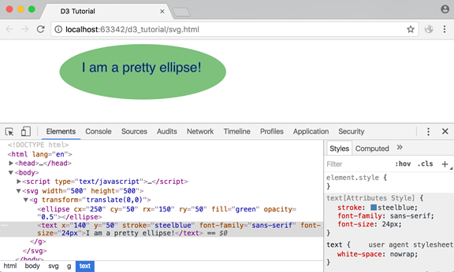
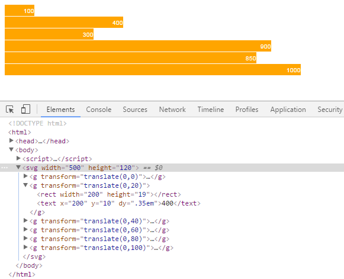
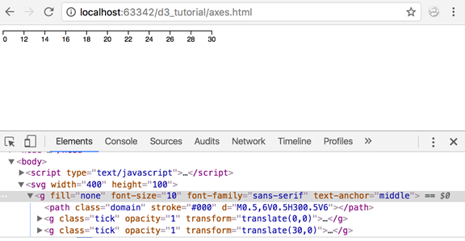

# D3 Graphics

> Spring 2018 | Geography 4/572 | Geovisualization: Geovisual Analytics
>
> **Instructor:** Bo Zhao  **Location:** WITH 205 | **Time:** TR 1100 - 1150


## Create SVG Elements using D3

We had briefly introduced Scalable Vector Graphics (SVG) in our web standards chapter. In this chapter, we will learn about creating SVG elements using D3.

SVG provides different shapes like lines, rectangles, circles, ellipses etc. Hence, designing visualizations with SVG gives you more flexibility and power in what you can achieve.

**What is SVG?**

- SVG is an image that is text-based.
- SVG is similar in structure to HTML
- SVG sits in the DOM
- SVG properties can be specified as attributes
- SVG should have absolute positions relative to the origin (0, 0)

The following example demonstrates a rectangle in SVG.

```xml
<svg width="500" height="500">
    <rect x="0" y="0" width="200" height="200"></rect>
</svg>
```

We have an `<svg>` tag here. Think of SVG as a canvas to paint on (and don't confuse it with HTML `<canvas>` - that's a different element!). You need to specify a width and height for your canvas. And all your SVG elements like `<rect>`, `<line>`, `<circle>`, `<text>` would go inside this `<svg>` tag.

Each SVG element has it's own properties - which includes both geometry and style properties. All properties can be set as attributes but generally, we provide geometry properties as attributes and styling properties as styles. And since SVG sits in the DOM, we can use attr() and append() just like we did for HTML elements.

Let's learn about some of the most used SVG elements in visualizations and how to create and apply styling to them using D3 library.

### Line

An SVG line element is represented by <line> tag.

A simple line can be defined as below:

```xml
<line x1="100" y1="100" x2="500" y2="100" />
```

A line's attributes are:

- x1: This is the x-coordinate of the first point
- y1: This is the y-coordinate of the first point
- x2: This is the x-coordinate of the second point
- y2: This is the y-coordinate of the second point

Consider the following example of line.

```xml
<svg width="500" height="500">
    <line x1="100" y1="50" x2="500" y2="50" stroke="black"/>
</svg>
```

As you can see, we have applied x1, x2, y1 & y2 attributes to line element. Additionally, there's an attribute 'stroke' to specify the line color. This will look like below:


We learned about [manipulating DOM elements](http://www.tutorialsteacher.com/d3js/dom-manipulation-using-d3js) using D3 in the previous section. Using the same manipulation methods, we can draw the svg line with D3 as shown below.

```html
<body>
<script>
    //We create variables for the SVG's width and height. It is good to have them in variables so that you can change them at one place without having to go through the entire code in case you decide to change your SVG's dimensions.
    var width = 500;
    var height = 500;
	
    //Create SVG element: Next, we select the body element and append our SVG element to it and set SVG's width and height. We store the reference of this SVG in a variable called svg, so that we can use it later.
    var svg = d3.select("body")
                .append("svg")
                .attr("width", width)
                .attr("height", height);

    //Create line element inside SVG: Then we append a line element to our SVG and provide it with the x1, y1 x2, y2 and stroke attributes using attr() function.
    svg.append("line")
       .attr("x1", 100)
       .attr("x2", 500)
       .attr("y1", 50)
       .attr("y2", 50)
       .attr("stroke", "black")
</script>
</body>
```

### Text on Ellipse

```html
<body>
<script>
var width = 500;
var height = 500;
    
var svg = d3.select("body")
            .append("svg")
            .attr("width", width)
            .attr("height", height);

var g = svg.append("g")
            .attr("transform", function(d, i) {
                return "translate(0,0)";
            });

var ellipse = g.append("ellipse")
                .attr("cx", 250)
                .attr("cy", 50)
                .attr("rx", 150)
                .attr("ry", 50)
                .attr("fill", "green")
                .attr("opacity", 0.5)

g.append("text")
 .attr("x", 140)
 .attr("y", 50)
 .attr("stroke", "steelblue")
 .attr("font-family", "sans-serif")
 .attr("font-size", "24px")
 .text("I am a pretty ellipse!");
</script>
</body>
```



Thus, we can create SVG elements using D3.js. Let's create SVG chart using D3 in the next section.

## Create SVG Chart using D3

Let's create a bar chart in SVG with D3.js. For the bar chart, we will use `<rect>` elements for the bars and `<text>` elements to display our data values corresponding to the bars. The following is a simple SVG bar chart HTML which we will create using D3.

```xml
<!doctype html>
<html>
<head>
    <script src="https://d3js.org/d3.v4.min.js"></script>
</head>
<style>
    svg rect {
        fill: orange;
    }

    svg text {
        fill:white;
        font: 10px sans-serif;
        text-anchor: end;
    }
</style>
<body>
    <svg class="chart" width="420" height="120">
        <g transform="translate(0,0)">
            <rect width="50" height="19"></rect>
            <text x="47" y="9.5" dy=".35em">5</text>
        </g>
        <g transform="translate(0,20)">
            <rect width="100" height="19"></rect>
            <text x="97" y="9.5" dy=".35em">10</text>
        </g>
        <g transform="translate(0,40)">
            <rect width="120" height="19"></rect>
            <text x="117" y="9.5" dy=".35em">12</text>
        </g>
    </svg>
</body>
</html>
```

The output of the above example in the browser:


Let's break down the explanation into two: 1) Geometry and 2) Styles

### Geometry

You may have noticed the group element `<g>` that we have introduced to hold our bars. Each group element here holds the corresponding bar and its text together.

If you look at these `<g>` elements, you will notice that we had to hardcode our element positions. This is because SVG needs absolute positions with respect to the origin. Origin is always (0, 0) starting from the top-left of your screen.

Notice the transform attribute: `transform="translate(0,20)"`

In our `<rect>` and `<text>` elements, we provided the width and height attributes. But we also need to provide where these elements would be located on our screen. For this we use a transformation called translate. It essentially provides position coordinates for the elements relative to the origin. Other transform definitions are scale, rotate, skewX, and skewY. Read more about the transform specifications from [w3.org](https://www.w3.org/TR/SVG/coords.html#TransformAttribute).

### Styles

When it comes to styles, we use classes to give styles to our elements. We use the below class to paint our bar `<rect>` elements orange.

```
svg rect {
        fill: orange;
    }
```

Also, use the below CSS class to apply styles to our data values. SVG has a `<text>` element that can be used to display text output.

```
svg text {
        fill: white;
        font: 10px sans-serif;
        text-anchor: end;
    }
```

As you can see, some of the properties used in SVG are different from the properties used in HTML. For example, fill is used to apply colors. text-anchor is used to position our text towards the right end of the bars. We will learn more about styling SVG in the future chapters.

Now, let's create this SVG bar chart with D3.

```xml
<html>
<head>
    <script src="https://d3js.org/d3.v4.min.js"></script>
    <style>
        svg rect {
            fill: orange;
        }

        svg text {
            fill:white;
            font: 10px sans-serif;
            text-anchor: end;
        }
    </style>
</head>
<body>
<script>
    var data = [5, 10, 12];

    var width = 200,
        scaleFactor = 10,
        barHeight = 20;

    var graph = d3.select("body")
                  .append("svg")
                  .attr("width", width)
                  .attr("height", barHeight * data.length);

    var bar = graph.selectAll("g")
                  .data(data)
                  .enter()
                  .append("g")
                  .attr("transform", function(d, i) {
                      return "translate(0," + i * barHeight + ")";
                  });

    bar.append("rect")
       .attr("width", function(d) {
           return d * scaleFactor;
       })
       .attr("height", barHeight - 1);

    bar.append("text")
       .attr("x", function(d) { return (d*scaleFactor); })
       .attr("y", barHeight / 2)
       .attr("dy", ".35em")
       .text(function(d) { return d; });

</script>
</body>
</html>
```


Let's walk through the code step by step:

`var data = [5, 10, 12];` defines our data array.

```
var width = 200,
    scaleFactor = 10,
    barHeight = 20;
    
```

The above code defines three variables to use later in our program:

- width : Width of the svg
- scalefactor: Since our data values are too small, they need to be scaled to a pixel value that is visible on the screen.
- barHeight: This is the static height of our horizontal bars.

```
var graph = d3.select("body")
              .append("svg")
              .attr("width", width)
              .attr("height", barHeight * data.length);
    
```

We first select the document body and create a new SVG element and append it. We will build our bar graph inside this SVG element. We then set the width and height of our SVG. Height is calculated as bar height * number of data values. We have taken 20 as bar height and data array length is 3. So SVG height would be 60 px.

```
var bar = graph.selectAll("g") 
               .data(data)
               .enter().append("g")
               .attr("transform", function(d, i) {
                   return "translate(0," + i * barHeight + ")";
               });
        
```

Next, we want to place each of our bars inside corresponding `<g>` elements. So here, we create our group elements. We also apply the translate transformation here. Each of our group elements needs to be positioned one below the other because we want to build a horizontal bar chart. So our translation formula will be (current element index * bar height).

```
bar.append("rect")
   .attr("width", function(d) {
       return d * scaleFactor;
   })
   .attr("height", barHeight - 1);
```

Now that we have our group elements ready, we will add the `<rect>` element for each bar. We have given it a width of (data value * scale factor) and height is (bar height - margin).

```javascript
bar.append("text")
   .attr("x", function(d) { return (d*scaleFactor); })
   .attr("y", barHeight / 2)
   .attr("dy", ".35em")
   .text(function(d) { return d; });
```

Finally, we want to display our data values as text on each bar. Width is defined as (data value * scalefactor) Text elements do not support padding or margin. For this reason, we need to give it a "dy" offset. This is used to align the text vertically.

### Scales

In our examples so far, when we wanted to draw shapes driven by our data values, we added a scaling factor to our data values. This was to ensure that our shapes are visible on the screen. Data values may not always correspond to pixel values on the screen. Some data values may be too large while others too small, to be used directly with pixel values.

D3 Scales provide a convenient solution to this. They map our data values to values that would be better represented in visualizations. D3 provides the following scaling methods for different types of charts.

| Scale Type         | Method                                                       | Description                                                  |
| ------------------ | ------------------------------------------------------------ | ------------------------------------------------------------ |
| Continuous         | d3.scaleLinear()                                             | Construct continuous linear scale where input data (domain) maps to specified output range. |
| d3.scaleIdentity() | Construct linear scale where input data is the same as output. |                                                              |
| d3.scaleTime()     | Construct linear scale where input data is in dates and output in numbers. |                                                              |
| d3.scaleLog()      | Construct logarithmic scale.                                 |                                                              |
| d3.scaleSqrt()     | Construct square root scale.                                 |                                                              |
| d3.scalePow()      | Construct exponential scale.                                 |                                                              |
| Sequential         | d3.scaleSequential()                                         | Construct sequential scale where output range is fixed by interpolator function. |
| Quantize           | d3.scaleQuantize()                                           | Construct quantize scale with discrete output range.         |
| Quantile           | d3.scaleQuantile()                                           | Construct quantile scale where input sample data maps to discrete output range. |
| Threshold          | d3.scaleThreshold()                                          | Construct scale where arbitrary input data maps to discrete output range. |
| Band               | d3.scaleBand()                                               | Band scales are like ordinal scales except the output range is continuous and numeric. |
| Point              | d3.scalePoint()                                              | Construct point scale.                                       |
| Ordinal            | d3.scaleOrdinal()                                            | Construct ordinal scale where input data includes alphabets and are mapped to discrete numeric output range. |

Let's say we have the following data that gives you the share value of a company over the past 6 years: `[100, 400, 300, 900, 850, 1000]`. In this case, our data values are too big to be displayed as pixels on the screen! To fix this, we may think of reducing the values by multiplying them with a factor such as 0.5 or 0.2. Instead, we can use d3.scaleLinear function to do this for us. This will create a quantitative linear scale. (d3.scaleLinear was introduced in version 4 of D3. In the earlier versions, it was denoted as d3.scale.linear.)

Before we use d3.scaleLinear function, we first need to understand two terms: **Domain** and **Range**.

**Domain**

Domain denotes minimum and maximum values of your input data. In our data `[100, 400, 300, 900, 850, 1000]`, 100 is minimum value and 1000 is maximum value.

So, our domain is [100, 1000]

**Range**

Range is the output range that you would like your input values to map to.

We may not have enough space to display a bar chart for the above values, if we map our data values to pixels. Let's say we want to display a chart in SVG within 500 px width. So, we would like our output range between 50 to 500, where minimum value will be mapped to 50 and maximum value will be mapped to 500 that is [50, 500]. That would mean, an input value of 100 would map to an output value of 50. And an input value of 1000 would map to an output value of 500. It means scaling factor is 0.5 and the data will be represented in pixels as: data value * 0.5.

100 -> 50

1000 -> 500

So, now if our input value is 300, the output value would be 150.

**Linear Scale**

Let's use d3.scaleLinear function now. We will work with the horizontal bar chart example from the previous chapter. We had used a scaling factor of 10 to increase the width of bars in pixels because data values were too small `var data = [5, 10, 12];`.

But now that we have learnt how to work with scales, instead of multiplying a scaling factor to the data values, we will use the d3.scaleLinear function.

Let's use the above dataset to create our bar chart: `var data = [100, 400, 300, 900, 850, 1000];` and use the d3.scaleLinear to do the scaling for us as shown below.

```
var data = [100, 400, 300, 900, 850, 1000];

var scale = d3.scaleLinear()
            .domain([100, 1000])
            .range([50, 500]);
```

Above, we created a linear scale variable with the domain values [100, 1000] where 100 is the minimum value and 1000 is the maximum value in our data array and the output range is [50, 500]. So, we mapped our minimum data value to the output value 50, and maximum alue 1000 to 500. The values between 100 to 1000 will be calculated automatically using the above scale function. Please note that a variable *scale* is a conversion function which will return output value according to the specified domain and range. We can pass any value between 100 to 1000 to scale function, and it will return the output value. For example, scale(200) will return 100 or scale(350) will return 175.

In the above example, instead of providing minimum and maximum value for our domain manually we can use built-in d3.min() and d3.max() functions which will return minimum and maximum values respectively from our data array.

```
var data = [100, 400, 300, 900, 850, 1000];

var scale = d3.scaleLinear()
            .domain([d3.min(data), d3.max(data)])
            .range([50, 500]);
```

Now, let's create a bar chart for our large data values using d3.scaleLinear() function as below.


```
<body>
<script>
    var data = [100, 400, 300, 900, 850, 1000]

    var width = 500,
        barHeight = 20,
        margin = 1;

    var scale = d3.scaleLinear()
                 .domain([d3.min(data), d3.max(data)])
                 .range([50, 500]);

    var svg = d3.select("body")
                  .append("svg")
                  .attr("width", width)
                  .attr("height", barHeight * data.length);

    var g = svg.selectAll("g")
                  .data(data)
                  .enter()
                  .append("g")
                  .attr("transform", function (d, i) {
                      return "translate(0," + i * barHeight + ")";
                  });

    g.append("rect")
       .attr("width", function (d) {
           return scale(d);
       })
       .attr("height", barHeight - margin)

    g.append("text")
       .attr("x", function (d) { return (scale(d)); })
       .attr("y", barHeight / 2)
       .attr("dy", ".35em")
       .text(function (d) { return d; });
```

The above example will display the following result in the browser.




In the above example, the following code snippet defines the scale for our chart.

```javascript
var data = [100, 400, 300, 900, 850, 1000];

var scale = d3.scaleLinear()
            .domain([d3.min(data), d3.max(data)])
            .range([50, 500]);
```

We then use this scale function to set the width of rectangle bars as below. The `scale(d)`function call will return an output value for each value in the array.

```javascript
g.append("rect")
    .attr("width", function (d) {
        return scale(d);
    })
    .attr("height", barHeight - margin)
```

### Axes

The axes renders human-readable reference marks for scales. Graphs have two axes: the horizontal axis or the x-axis and the vertical axis or the y-axis.

D3 provides functions to draw axes. An axis is made of lines, ticks and labels. An axis uses scale, so each axis will need to be given a scale to work with.

D3 provides the following functions to draw axes.

| Axis Method     | Description                           |
| --------------- | ------------------------------------- |
| d3.axisTop()    | Creates top horizontal axis.          |
| d3.axisRight()  | Creates vertical right-oriented axis. |
| d3.axisBottom() | Creates bottom horizontal axis.       |
| d3.axisLeft()   | Creates left vertical axis.           |

So far in our visualizations we haven't added any axes. Let's learn how to add x axis to a graph.

```html
<body>
<script>
    var width = 400,
        height = 100;

    var data = [10, 15, 20, 25, 30];
    
    // Append SVG 
    var svg = d3.select("body")
                .append("svg")
                .attr("width", width)
                .attr("height", height);

    // Create scale
    var scale = d3.scaleLinear()
                  .domain([d3.min(data), d3.max(data)])
                  .range([0, width - 100]);

    // Add scales to axis
    var x_axis = d3.axisBottom()
                   .scale(scale);

    //Append group and insert axis
    svg.append("g")
       .call(x_axis);

</script>
</body>
```

The above example will display the following result.




Let's walk through the above code:

`var width = 400, height = 100;` Like always, we have defined our SVG width and height as variables.

`var data = [10, 15, 20, 25, 30];` defines our dataset as an array.

```
var svg = d3.select("body")
            .append("svg")
            .attr("width", width)
            .attr("height", height);
```

Next, we create our SVG element and set its width and height.

```
 var scale = d3.scaleLinear()
               .domain([d3.min(data), d3.max(data)])
               .range([0, width - 100]);
```

We create a linear scale and specify our domain and range. Observe how we have used d3.min and d3.max functions to get the minimum and maximum values from our dataset. Min would be 10 and max would be 30.

`.range([0,width-100])` specifies the range [0,300]. So value 10 will be map to 0 and value 300 woill be map to 30.

```
 var x_axis = d3.axisBottom()
                .scale(scale);
```

We use d3.axisBottom to create our x-axis and provide it with the scale we defined earlier.

```
 svg.append("g")
    .call(x_axis);
```

And finally, we append a group element and insert x-axis.

Similarly, we can create a vertical axis using `d3.axisLeft()` function as shown below.

Example: y-axis

```
<body>
<script>
    var width = 400, height = 100;

    var data = [10, 15, 20, 25, 30];
    var svg = d3.select("body")
                .append("svg")
                .attr("width", width)
                .attr("height", height);

    var scale = d3.scaleLinear()
                  .domain([d3.min(data), d3.max(data)])
                  .range([height/2, 0]);

    var y_axis = d3.axisLeft()
                  .scale(scale);

    svg.append("g")
       .attr("transform", "translate(50, 10)")
       .call(y_axis);

</script>
</body>
```

This will draw y-axis in the browser as shown below.

[](http://www.tutorialsteacher.com/Content/images/d3js/y-axis.png)Y-Axis in D3

Let's understand the above example code.

```
var scale = d3.scaleLinear()
             .domain([d3.min(data), d3.max(data)])
             .range([height/2, 0]);
```

We created a linear scale and specified our domain and range using the data. We used d3.min and d3.max functions to get the minimum and maximum values from our dataset.

```
var y_axis = d3.axisLeft()
            .scale(scale);
```

We use d3.axisLeft to create our y-axis and provide it with the scale we defined above.

```
svg.append("g")
   .attr("transform", "translate(50, 10)")
   .call(y_axis);
```

Finally, we append a group element and call the y-axis function. So, all the components of the y-axis will be grouped under the group element. We then apply a translate transformation to align the y-axis to 50px right of the origin and 10px to the bottom of the origin. This ensures a better visual representation on the screen.

**Note**: The d3.axisBottom() and d3.axisLeft() functions have been introduced in the latest version of D3 i.e. version 4. Earlier versions used d3.svg.axis() with orient("left") and orient("bottom") for y-axis and x-axis respectively.

Let's get both the axes together now!

Example: Axes

```
<body>
<script>
    var width = 400, height = 100;

    var data = [10, 15, 20, 25, 30];
    var svg = d3.select("body")
                .append("svg")
                .attr("width", width)
                .attr("height", height);

    var xscale = d3.scaleLinear()
                   .domain([0, d3.max(data)])
                   .range([0, width - 100]);

    var yscale = d3.scaleLinear()
                   .domain([0, d3.max(data)])
                   .range([height/2, 0]);

    var x_axis = d3.axisBottom()
                   .scale(xscale);

    var y_axis = d3.axisLeft()
                   .scale(yscale);

    svg.append("g")
       .attr("transform", "translate(50, 10)")
       .call(y_axis);

    var xAxisTranslate = height/2 + 10;

    svg.append("g")
            .attr("transform", "translate(50, " + xAxisTranslate  +")")
            .call(x_axis)

</script>
</body>
```

And the grand output:

[](http://www.tutorialsteacher.com/Content/images/d3js/axes-in-d3.png)X & Y Axes


### Bar Chart

https://bl.ocks.org/mbostock/3885304

### Line Chart

https://bl.ocks.org/mbostock/3883245

### Pie Chart

https://bl.ocks.org/mbostock/3887235

## DashBoard

http://bl.ocks.org/NPashaP/96447623ef4d342ee09b
