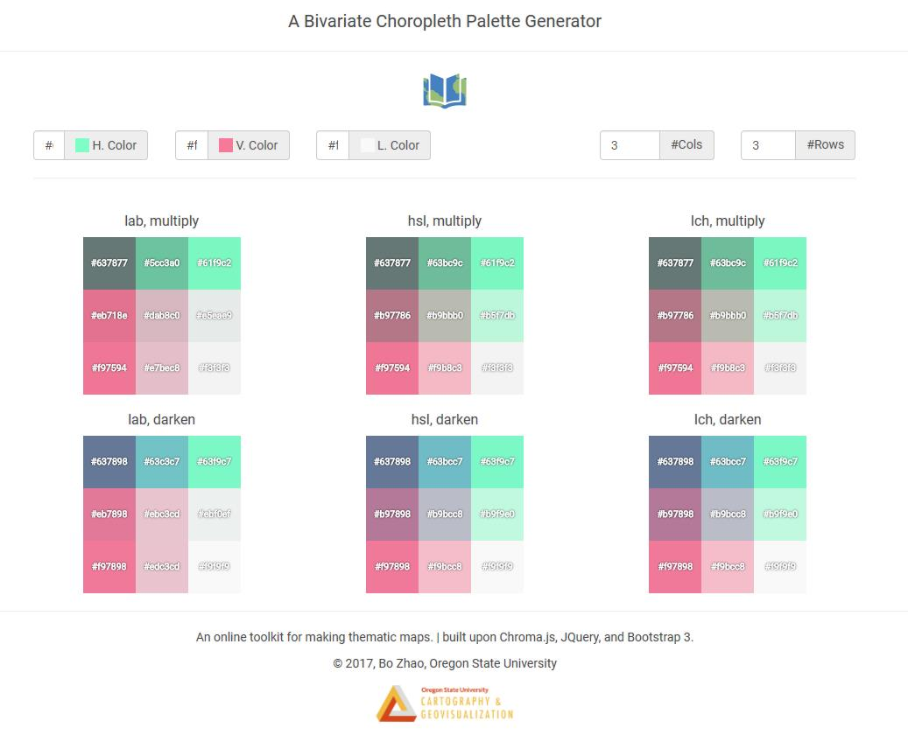
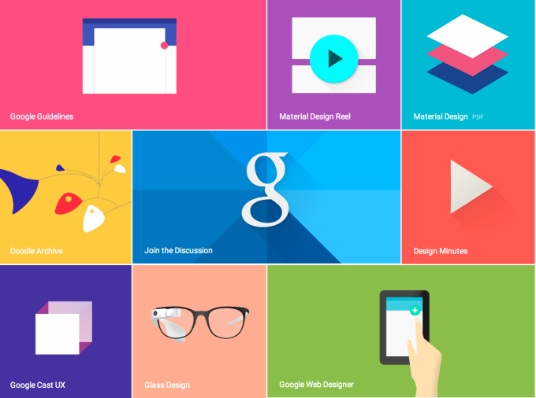

# Web Design Elements

> Spring 2019 | Geography 4/572 | Geovisual Analytics
>
> **Instructor:** Bo Zhao  **Location:** Wilkinson 210 | **Time:** TR 1600 - 1650

**Learning Objectives**

- Understand the different format of defining colors on the web;
- Make choropleth color ramps using chroma.js, and
- Understand how to use Google fonts.
- Apply icons for interactive web geovisualization.


## Color

Color is the visual perceptual property corresponding in humans to the categories called red, blue, yellow, green and others. Color derives from the spectrum of light (distribution of light power versus wavelength) interacting in the eye with the spectral sensitivities of the light receptors.

Color plays an important role in geospatial science and technology, especially in Cartography and Remote sensing, due to its ability to convey qualitative and quantitative information. Thus, the proper understanding and use of color is crucial to the creation of visual representations that clearly portray aspects of the real world with minimal confusion and misinterpretation.

**Color Values**

```css
rgb(255, 255, 255)
rgb(10%, 20%, 30%)
rgba(255, 255, 255, 0.4)
rgba(10%, 20%, 30%, 0.4)
hsl(120, 50%, 20%)
hsla(120, 50%, 20%, 0.4)
#ffeeaa
#fea
steelblue
```

**Hex triplet for color**

A hex triplet is a six-digit, three-byte hexadecimal number used in HTML, CSS, SVG, and other computing applications to represent colors. The bytes represent the red, green and blue components of the color. One byte represents a number in the range 00 to FF (in hexadecimal notation), or 0 to 255 in decimal notation. This represents the least (0) to the most (255) intensity of each of the color components. Thus web colors specify colors in the True Color (24-bit RGB) color scheme. The hex triplet is formed by concatenating three bytes in hexadecimal notation, in the following order:

- Byte 1: red value (color type red)
- Byte 2: green value (color type green)
- Byte 3: blue value (color type blue)

```css
.threedigit { color: #09C;    }
.sixdigit   { color: #0099CC; } /* same color as above, Shorthand hexadecimal form */
```

### Color spaces

#### RGB

RGB is designed for screens, where colours are generated by individual red, green and blue elements. The actual colour of RGB colours depends on the device being used, although the sRGB colour space exists as a standardised colour space that the web nominally uses, and all RGB colours here are treated as sRGB. RGB values are easy to work with mathematically (they're all values between 0 and 255), and all colours on this page end up being converted to RGB values to be displayed, but they suffer from the problem of not being perceptually uniform nor intuitive to work with (it's hard to imagine what sort of colour you have just from RGB values, and it's also hard to modify colours intuitively with RGB).


An RGB color value is specified with: `rgb(red, green, blue)`. Each parameter (red, green, and blue) defines the intensity of the color as an integer between 0 and 255. For example, `rgb(0,0,255)` is rendered as blue, because the blue parameter is set to its highest value (255) and the others are set to 0.

```css
div {
    background-color: rgb(0, 191, 255);
    color: rgb(255, 255, 255);
}
```

#### HSV and HSL


HSV and HSL are cylindrical versions of RGB, which are intended to be much more intuitive to use. HSV colours are represented by hue, saturation and value, while HSL colours are represented by, hue, saturation and lightness, except with different definitions of saturation. In HSL, a colour of maximum lightness will always be white, regardless of hue and saturation, while in HSV, a colour of maximum value will be the most intense colour given the hue and saturation (so pure red is a red hue with maximum saturation and value).

HSV and HSL suffer from RGB's lack of perceptual uniformity, so changing one dimension can result in apparent changes in other dimensions. For example, pure green and pure blue have the same saturation and lightness/value, but green appears to be a much lighter colour. Gradients interpolated in the HSV or HSL colour space are particularly prone to problems with this when they shift between many different hues. The is the problem that Lab and Lch overcome.

HSL color values are specified with: `hsl(hue, saturation, lightness)`.

```css
div {
    background-color: hsl(180, 50%, 50%);
    color: hsl(0, 0%, 100%);
}
```


>**Note:** CMYK Colors：is a combination of CYAN, MAGENTA, YELLOW , and BLACK.Computer screens display colors using RGB color values. Printers often presents colors using CMYK color values. CMYK is not supported in HTML, but it is suggested as a new standard in CSS4.

#### Lab

Lab (or CIE 1976 (L*, a*, b*), or CIELAB) is **a colour space that is designed for the human eye.** It is perceptually uniform, which means that the difference between two colour values correlates with the perceived degree of difference between the two colours (the difference between colours is measured by their Euclidean distance). Therefore, gradients between two colours using the Lab colour space will change very uniformly between the colours. L is the lightness of the colour, a is the position between green (negative values) and red/magenta (positive values), and b is the position between blue (negative values) and yellow (positive values). The idea is that colours cannot be both green and red, or blue and yellow, and that colours can be described by a combination of their green/redness and blue/yellowness, and the lightness.

Lab can describe all colours that the human eye can perceive, but also many beyond what can exist in the physical world (not to mention that computer displays can display a limited subset of real colours). One of the difficulties of Lab is that the valid ranges of L, a and b vary depending on the values of the other two values. L can be between 0 and 100, and a and b are normally within the range of -100 to 100, although a pure sRGB blue has a b of -108.

#### Lch

Lch (or CIELCH) is a cylindrical version of Lab, which means that the two opponent colour dimensions (a and b) are represented by a hue, h, and chroma, c (if a and b are Cartesian coordinates, h and c are polar coordinates). Gradients interpolated in the Lch colour space will transition between hues, so a gradient between yellow and blue (opposing colours in Lab) will transition via green (or red/magenta) in Lch, but via grey in Lab.


### Color Scheme

**1\. Color Brewer schemes (supported by both chroma.js and d3.js)**


**2\. [bivariate color palette](http://geoviz.ceoas.oregonstate.edu/storymap/color.html)**



**3\.Web Site Color Scheme**

Refer to https://www.w3schools.com/colors/colors_schemes.asp


## 2\. Web Typography


Typography is the art and technique of arranging type to make written language legible, readable, and appealing when displayed. The arrangement of type involves selecting typefaces, point sizes, line lengths, line-spacing (leading), and letter-spacing (tracking), and adjusting the space between pairs of letters (kerning). The term typography is also applied to the style, arrangement, and appearance of the letters, numbers, and symbols created by the process. Type design is a closely related craft, sometimes considered part of typography; most typographers do not design typefaces, and some type designers do not consider themselves typographers. Typography also may be used as a decorative device, unrelated to communication of information.


The `font-family` property specifies the font for an element. The font-family property can hold several font names as a ***"fallback"*** system. If the browser does not support the first font, it tries the next font.

There are two types of font family names:

`family-name` - The name of a font-family, like "times", "courier", "arial", etc.

`generic-family` - The name of a generic-family, like "serif", "sans-serif", "monospace".

Start with the font you want, and always end with a generic family, to let the browser pick a similar font in the generic family, if no other fonts are available.


```css
p.a {
    font-family: "Times New Roman", Times, serif;
}

p.b {
    font-family: Arial, Helvetica, sans-serif;
}
```

**Note:** Separate each value with a comma.

**Note:** If a font name contains white-space, it must be quoted. Single quotes must be used when using the "style" attribute in HTML.


### Difference Between Serif and Sans-serif Fonts


`Serif` -  Serif fonts have small lines at the ends on some characters, like "Times New Roman", "Georgia".

`Sans-serif` - "Sans" means without - these fonts do not have the lines at the ends of characters, like "Arial", "Verdana". **On computer screens, sans-serif fonts are considered easier to read than serif fonts.**

`Mobospace`  - All monospace characters have the same width, like "Courier New", "Lucida Console".

### Font Style, Size and Weight

The **font-style** property is mostly used to specify italic text.

This property has three values:

normal - The text is shown normally
italic - The text is shown in italics
oblique - The text is "leaning" (oblique is very similar to italic, but less supported)

```css
p.normal {
    font-style: normal;
}

p.italic {
    font-style: italic;
}

p.oblique {
    font-style: oblique;
}
```


The **font-size** property sets the size of the text.

Being able to manage the text size is important in web design. However, you should not use font size adjustments to make paragraphs look like headings, or headings look like paragraphs.

Always use the proper HTML tags, like <h1> - <h6> for headings and <p> for paragraphs.

The font-size value can be an absolute, or relative size.

```css

body {
    font-size: 100%;
}

h1 {
    font-size: 40px;
}

h2 {
    font-size: 30px;
}

p {
    font-size: 14px;
}
```

The **font-weight** property specifies the weight of a font:

```css
p.normal {
    font-weight: normal;
}

p.thick {
    font-weight: bold;
}
```

```html
<h1 style="font-size:10vw">Hello World</h1>
```


### Responsive Font Size

The text size can be set with a vw unit, which means the "viewport width".

That way the text size will follow the size of the browser window:

### Popular Font Alternatives

In this section, I listed the google web font alternative to the commonly used commerical fonts.


| Commonly Used Commercial Fonts | Google Web Fonts |
| ------------------------------ | ---------------- |
| Helvetica                      | Sans Source Pro  |
| Century Gothic                 | Questrial        |
| Calibri                        | Droid Sans       |
| Garamond                       | Merriweather     |
| Avenir Next Rounded            | Nunito           |
| Frutiger                       | Istok Web        |
| Adobe Caslon Pro               | Lusitana         |
| Futura Condensed               | Oswald           |
| Rockwell                       | Arvo             |
| Impact                         | Anton            |


### commonly used font combinations

**Serif Fonts**

- Georgia, serif

- "Palatino Linotype", "Book Antiqua", Palatino, serif

- "Times New Roman", Times, serif


**Sans-Serif Fonts**

- Arial, Helvetica, sans-serif

- "Arial Black", Gadget, sans-serif

- "Comic Sans MS", cursive, sans-serif

- Impact, Charcoal, sans-serif

- "Lucida Sans Unicode", "Lucida Grande", sans-serif

- Tahoma, Geneva, sans-serif

- "Trebuchet MS", Helvetica, sans-serif

- Verdana, Geneva, sans-serif

**Monospace Fonts**

- "Courier New", Courier, monospace

- "Lucida Console", Monaco, monospace

### Use a Google Web Font


Google Fonts (previously called Google Web Fonts) is a library of over 800 libre licensed fonts, an interactive web directory for browsing the library, and APIs for conveniently using the fonts via CSS and Android.

The Google Fonts directory is intended to enable font discovery and exploration, and the service is used extensively with over 17 trillion font served, which means that each of its 877 fonts has been downloaded over 19 billion times, which means that each person on Earth has, on average, downloaded each font at least 2 or 3 times. Popular fonts include `Open Sans`, `Roboto`, `Lato`, `Slabo 27px`, `Oswald` and `Lobster`.

To use google font, Looking up the font families on [Google Web Fonts](https://fonts.google.com/), and generate the font css for the following html elements, including `html`, `body`, `h1` to `h6`, and other elements you think is necessary.

The library is maintained through Google Fonts' GitHub repository at [github.com/google/fonts](github.com/google/fonts), where all font files can be obtained directly. Source files for many of the fonts are available from git repositories within the github.com/googlefonts Github organization, along with libre software tools used by the Google Fonts community.

To use a google font in your web application, you should include the font link in the head element as shown below:

```html
    <link href='//fonts.googleapis.com/css?family=Sofia' rel='stylesheet'>
```

Apply a google font for a specific div. For example, the code below applies the sofia font to all the texts inside of the body div.

```css
 <style>
        body {
            font-family: 'Sofia';font-size: 22px;
        }
    </style>
```


> **Note:** regarding the header elements, perhaps your project will not use al the six headers, please only list those are important.

```html
<!DOCTYPE html>
<html>
<head>
    <title>Font Template Page</title>
    <link href='//fonts.googleapis.com/css?family=Sofia' rel='stylesheet'>
    <style>
        body {
            font-family: 'Sofia';font-size: 22px;
        }
    </style>
</head>
<body>

<h1>Sofia</h1>
<p>Lorem ipsum dolor sit amet, consectetuer adipiscing elit.</p>
<p>123456790</p>
<p>ABCDEFGHIJKLMNOPQRSTUVWXYZ</p>
<p>abcdefghijklmnopqrstuvwxyz</p>

</body>
</html>
```


## 3\. Icons for Web Uses

Icon is an important feature for geovisualization. It is simple, concrete and informative. Sometimes, a  icon is more than thousands of words or a well-designed map. In this section, we will talk about how to include icons in web pages.

There are several major icon libraries for web use. To name a few, such as [font awesome icons](https://fontawesome.com/icons?d=gallery), [Google material icons](https://material.io/icons/), [open icons](https://useiconic.com/open) and etc. To insert an icon to a web page, you will first include the icon library to the `<head>` tag, and then insert the `icon class` of the specific icon, sometimes associated with text, to the html elment you would like to visualize. The `<i>` and `<span>` elements are widely used to add icons. Here, Font Awesome Icons and Google Material Icons are introduced as follow.

### 1\.1 Font Awesome Icons

Font Awesome is a font and icon toolkit based on CSS and LESS. It was made by Dave Gandy for use with Twitter Bootstrap, and later was incorporated into the BootstrapCDN. Font Awesome has a 20% market share among those websites which use third-party Font Scripts on their platform, ranking it second place after Google Fonts.

Font Awesome 5 was released on December 7, 2017 with 1,278 icons. Version 5 comes in two packages: Font Awesome Free and the proprietary Font Awesome Pro (available for a fee). The free versions (all releases up to 4 and the free version for 5) are available under SIL Open Font License 1.1, Creative Commons Attribution 4.0, and MIT License.


To use the Font Awesome icons, add the following line inside the <head> section of your HTML page:

```html
 <link rel="stylesheet" href="https://use.fontawesome.com/releases/v5.0.12/css/all.css">
```

Below shows some examples on using font awesome icons in web page.

```html
<p><i class="fas fa-user"></i>
    <i class="far fa-user"></i>
    <!--brand icon-->
    <i class="fab fa-github-square"></i>
</p>
<p>
    <i class="fab fa-github fa-xs"></i>
    <i class="fab fa-github fa-sm"></i>
    <i class="fab fa-github fa-lg"></i>
    <i class="fab fa-github fa-2x"></i>
    <i class="fab fa-github fa-3x"></i>
    <i class="fab fa-github fa-5x"></i>
    <i class="fab fa-github fa-7x"></i>
    <i class="fab fa-github fa-10x"></i>
</p>
```

### 1\.2 Google Material Icons

In a bid to create a new "visual language" for users, Google is taking the design of its Android, Chrome OS and web properties back to basics with its new "Material Design." According to Google, Material Design is intended to make better use of available space, and bring a consistent user experience whether viewed on a smartphone, tablet or desktop. Google's apps will be updated to reflect this change, as you may have seen in early Gmail and Calendar app leaks and in the latest version of the Google+ app on Android.

```html
<link rel="stylesheet" href="https://fonts.googleapis.com/icon?family=Material+Icons">
```

Below shows some examples on using material icons in web page. above all, you will need to define the styles in a `<style>` tag.

```css
<style>
    .red {
        color: red;
    }

    .large {
        font-size: 5vw;

    }

    .extra-large {
        font-size: 8vw;
    }
</style>
```

And then you can apply the styles to the icons. As you might notice, you need to insert a short text to indicate the specific icon to use. It is a little different from font awesome icons.

```html
<p>
    <span> <i class="material-icons">info</i></span>
    <span> <i class="material-icons red">face</i></span>
    <span> <i class="material-icons large">room</i></span>
    <span> <i class="material-icons extra-large">favorite</i></span>

</p>
```




## References

[1] https://www.canva.com/font-combinations/gesta/

[2] https://developers.google.com/fonts/docs/getting_started

[3] http://www.joshuastevens.net/cartography/make-a-bivariate-choropleth-map/

[4] http://davidjohnstone.net/pages/lch-lab-colour-gradient-picker

[5] https://www.w3schools.com/colors/default.asp
