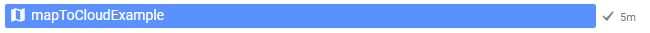
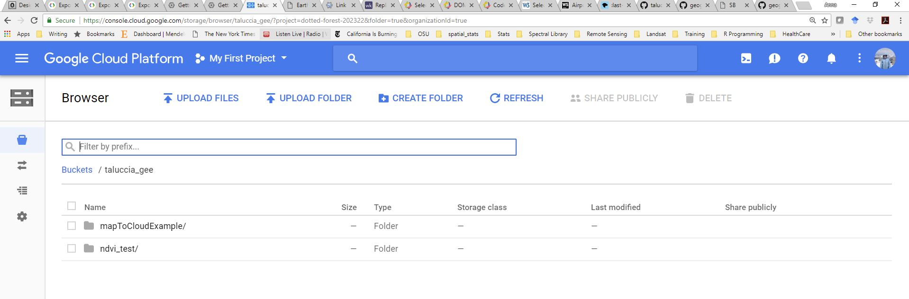
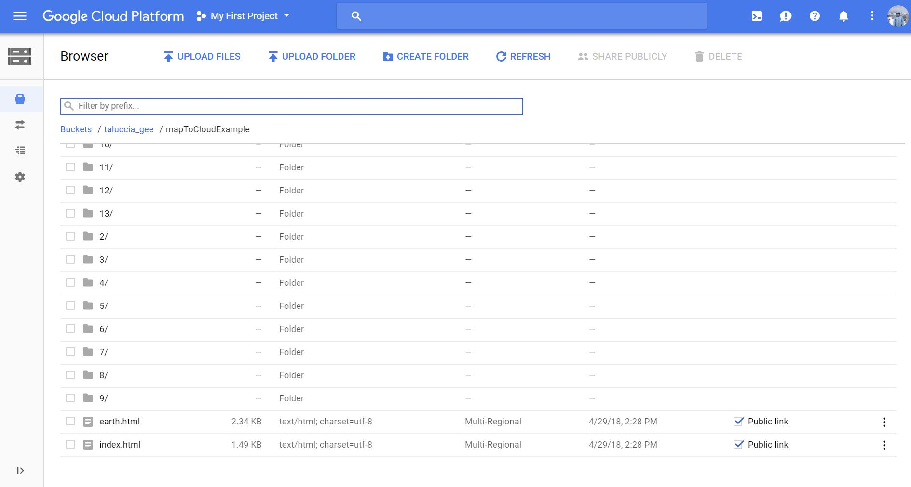
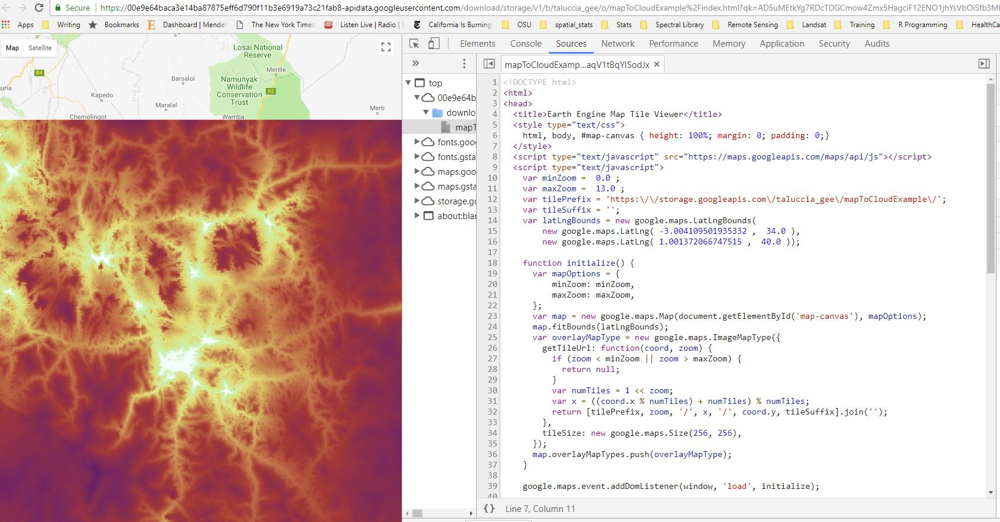
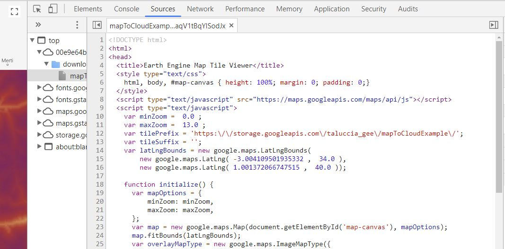
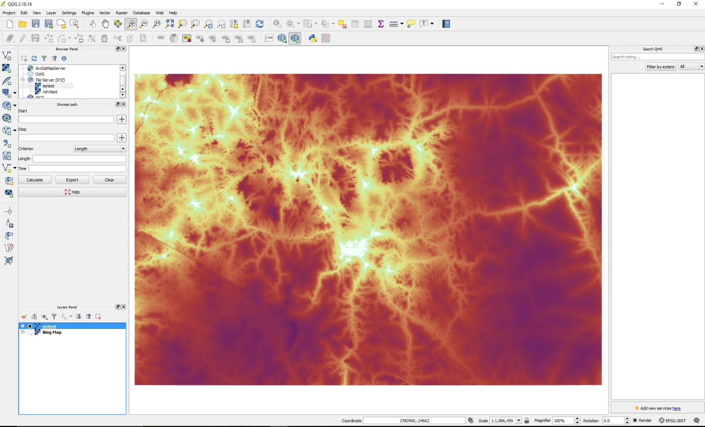
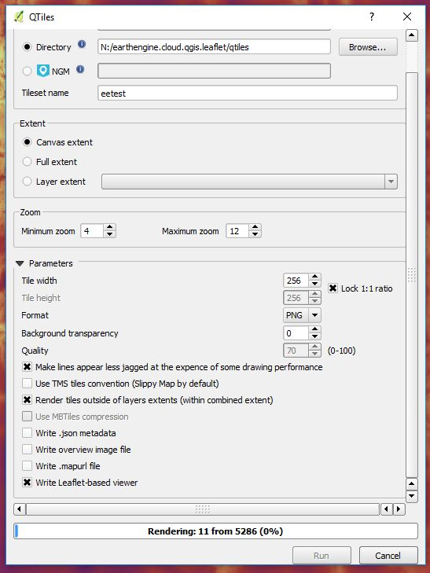
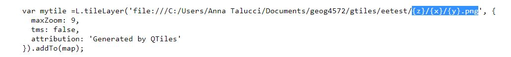
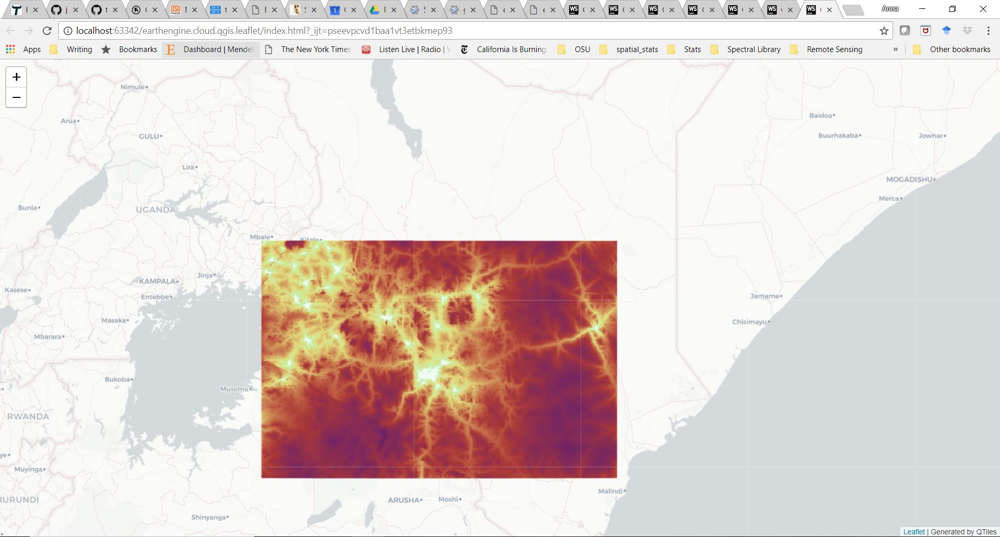

# Integrating Google Earth Engine, Google Cloud, QGIS, and Leaflet

> Spring 2018 | Geography 4/572 | Geovisualization: Geovisual Analytics
>
> **Instructor:** Bo Zhao  **Location:** WITH 205 | **Time:** TR 1100 - 1150
>
> **Contributors:** [Hannah Friedrich](https://github.com/hannahfriedrich), [Brain Katz](https://github.com/briangkatz)


**Objectives**:

- Integrate Remote Sensing applications from Google Earth Engine (GEE)
- Use Google Cloud Platform to save tiles from GEE outputs 
- Use QGIS to take Tiles from bucket in Google Cloud Platform and generate QTiles 
- Use Leaflet to integrate QTiles in html


## 1 Set-up and Log-ins

We will begin by setting up Google Earth Engine and Google Cloud.

### 1.1 Google Earth Engine (GEE) Log-in

New to Google Earth Engine (GEE), create a log-in by clicking **'SIGN UP'** in the upper right corner of the GEE page,  **[here](https://earthengine.google.com/)**. If you are a gmail user you can use your gmail log-in information. Already a GEE user you can also click on the **'SIGN UP'** in the upper right corner of GEE page,  **[here](https://earthengine.google.com/)**, to log-in.

### 1.2 Google Cloud Platform Access Create an Account / Log-in

This should be the same account that you are using with GEE.

### 1.3 Redeem Education Grant

If you have not redeemed your education grant, click **[here](https://google.secure.force.com/GCPEDU/?cid=d0GOdFV%2BTF1xdIizooBa1z8ehdyk91t3C51Dsuzk3BOlTJYPq0BfaE4gxD7ysKNK/)**. Use your OSU email to redeem the coupon. Make sure you are logged into the Cloud Platform with the same log-in as GEE. Then follow the instructions  **[here](https://console.cloud.google.com/education)** to redeem the coupon.

## 2 Google Earth Engine 

GEE is *'a planetary-scale platform for Earth science data and analysis'*. Cloud based platform to query and process remotely sensed imagery such as Landsat, MODIS, Sentinel. Explore **[here](https://earthengine.google.com/)**.

### 2.1 Access GEE

To access GEE interface you will want to type in the following URL (or click it to redirect)  **[https://code.earthengine.google.com/](https://code.earthengine.google.com/)**

### 2.3 Code

GEE operates with javascript.

### 2.2 Resources and Tools

GEE offers a number of resources and tools including code for certain tasks. Check out *'Get Started with Earth Engine'*,  **[here](https://developers.google.com/earth-engine/getstarted)**. 

## 3 Google Earth Engine to Cloud

### 3.1 Generating Data in EE

Let's look at an example fro GEE.  We will use GEE code from an API example **[here](https://developers.google.com/earth-engine/exporting)**. You can copy and paste from the API site. For now we will go to a saved code page for the example:

https://code.earthengine.google.com/e6ad8ac8a45a2e25c2cf976e0f372cc0

Once we are in the GEE code interface, we will run the code by clicking the run button. 

On the right hand side of the GEE interface there are 3 tabs, Inspector, Console, Tasks. The **Tasks** tab turns orange when we run the code to tell us there is something there that needs our attention.  Click on the **Tasks** tab. Our 'mapToCloudExample' appears here. In order to to actually send the output to the cloud we need to click the run button next to 'mapToCloudExample'. This may take a few minutes.

If it successfully exports to the cloud 'mapToCloudExample' will be highlighted blue and have check mark next to it.



### 3.2 Cloud

Let's look at the data in the cloud.



The bucket is where the map tiles from GEE engine appear.




This is essentially a temporary transfer in order to extract data that is generated in GEE and transfer it to QGIS where we can generated to tiles to use for geovisulaization purposes.

## 4 Tiles Overview

In the mid-2000s, after Google Maps, Microsoft Virtual Earth (now Bing Maps), and other popular mapping applications hit the web, **people started to realize that maybe they didn't need the ability to tinker with the properties of every single layer**. These providers had started fusing their vector layers together in a single rasterized image that was divided into 256 x 256 pixel images, or tiles. These tiles were pregenerated and stored on disk for rapid distribution to clients. This was done out of necessity to support hundreds or thousands of simultaneous users, a burden too great for drawing the maps on the fly.

The figure below shows how a tiled map consists of a "pyramid" of images covering the extent of the map across various scales. Tiled maps typically come with a level, row, and column numbering scheme that can be shared across caches to make sure that tile boundaries match up if you are overlaying two tile sets.


> Tiled web maps take the form of a pyramid where the map is drawn at a progressive series of scale levels, with the smallest (zoomed out) scales using fewer tiles.

Cartographers loved the tiled maps, because now they could invest all the tools of their trade into making an aesthetically pleasing web map without worrying about performance. Once you had created the tiles, you just had a set of images sitting on disk, and the server could retrieve a beautiful image just as fast as it could retrieve an ugly one. And because the tiled map images could be distributed so quickly by a web server, Google and others were able to employ **asynchronous JavaScript and XML (AJAX)** programming techniques to retrieve the tiles with no page blink as people panned.

### 4.1 Things to think about

Tiles are not layers in terms of how we typically think about raster and vector layers when working in a GIS platform. Tiles need a base map to reference themselves. 


## 5 QGIS

QTiles is a plugin for QGIS - it only works with QGIS versions 2.0-2.99 - recommend version 2.18.19 (most stable). QGIS is an open source platform and is freely available. QGIS can be down loaded **[here](https://qgis.org/en/site/forusers/download.html#)**.

Open QGIS. 

### 5.1 Install Plugins

#### 5.1.1 QTiles Plugin

Make sure the QTiles plugin is enabled. Click the plugins drop down menu. QTiles should be listed at the bottom. If not then click the 'Manage and install Plugins...' and add QTiles.

#### 5.1.2 QuickMapServices Plugin

Make sure the QuickMapServices plugin is installed. Check this by clicking on the Web drop down menu If you are installing QuickMapServices Plugin, you will install, and then click on the Web tab, navigate to QuickMapServies and select Settings and then the tab for More Services. Then click **'Get Contibuted Pack'**. Click 'OK' for the pop-up window and then click 'Save.' Open a Reference Map (e.g., Bing).

### 5.2 Tile Server

We now want to add our bucket from Google Cloud to the Tile Server. To do this open the browser panel in QGIS. Scroll Down to the **'Tile Server'**, right click, and click **'New Connection'**. A pop-up window should appear.

In order to enter the tile layer we will navigate back to our bucket in Google cloud. Open the bucket. We need to open the index.html file, which is the last item in the bucket. Click index.html.

A new tab opens with a map and the tiles generated from GEE. Click on the settings in the upper right (3 vertical dots). Click **'More tools'**. Then click **'Developer tools'**. 

We need to open the source code. To do this make sure the source tab is selected and open the index.html so we can look at the code. 

We want to copy and paste the URL from the var tilePrefix (See Images Below).






We will need to edit the URL slightly so it looks like this https://storage.googleapis.com/taluccia_gee/mapToCloudExample/{z}/{x}/{y}


Then Click OK. The tile server then appears in the Browser Window. 

Add your tiles by right clicking the tile server, in the example here we would right click the **'eetest'**, and select add layer to add it to our map.

### 5.3 View Tiles

Add a base map and zoom on the base map to you tile location. The **'zoom to layer'** function will not work on the tiles. Make sure you turn the base map off once you have located your tiles.  

### 5.4 Canvas Extent

Zoom into your tiles so that they fill most of the canvas space, see image below. The canvas is the extent we will use to generate QTiles. 



### 5.5 Tile Server to QTiles

Now we need to take out tiles from Google Cloud and generate QTiles. 

The raster you are working with needs to occupies the extent of the canvas (area of visualization in Qgis). Zoom in or out as needed.

Click the Plugins drop down, hover over QTiles to open the menu and select QTiles. The QTiles screen pops up.  Name the directory where you want to save your QTiles and provide a name for the Tileset. Select Canvas Extent and Zoom levels. In the Parameters make the **'Background transparency'** clear by changing the value to zero and make sure to select **'Write Leaflet-based viewer'**. Click Run.




> Note: the runtime is dependent on the size and number of zoom levels.


The file directory will contain your QTiles and an HTML document that can be integrated with leaflet. 

Additional help with QTiles can be found **[here](http://felix.rohrba.ch/en/2017/easily-add-tilemap-layers-qgis/)**.

### 5.6 Navigate to QTiles folder

Navigate to the output file after QTiles finishes running. In this folder will be your sub folders of tiles arranged by zoom level and an html document, in this example it is called eetest.html.

Open the html and look at the source code. Copy the L.tilelayer variable that corresponds to your tile. 



This can be inserted into a new index.html with base map code to visualize.

## 6 Leaflet

Starting with a basic leaflet html add in your tile layer that you copied in the above step. Make sure it is added to your map variable.

For web mapping and geovisualization applications, the QTiles folder generated above in QGIS should become your assets folder on github. In the code you will need to adjust absolute pathnames to relative path names. 

```javascript
var mymap = L.map('map', {
    center: [0.03, 38.0],
    zoom: 7,
    maxZoom: 10,
    minZoom: 6,
    detectRetina: true // detect whether the sceen is high resolution or not.
});

// 2. Add a base map.
L.tileLayer('http://{s}.basemaps.cartocdn.com/light_all/{z}/{x}/{y}.png').addTo(mymap);


var mytile =L.tileLayer('assets/tiles/{z}/{x}/{y}.png', {
    maxZoom: 9,
    tms: false,
    attribution: 'Generated by QTiles'
}).addTo(mymap);
 ```




Here is what the final output looks like **[here](http://jakobzhao.github.io/lectures/lec11/index.html)**

