# Icons, Illustrator and Scalable Vector Graphics (SVG)

> Spring 2018 | Geography 4/572 | Geovisualization: Geovisual Analytics
>
> **Instructor:** Bo Zhao  **Location:** WITH 205 | **Time:** TR 1100 - 1150

**Learning Objectives**

- Apply icons for interactive web geovisualization;

- Use gravit (or illustrator) for basic design needs;

- Generate Vector graphics through raster images; and

- Create a Favicon for web pages.

## 1\. Icons for Web Uses

Icon is an important feature for geovisualization. It is simple, concrete and informative. Sometimes, a  icon is more than thousands of words or a well-designed map. In this section, we will talk about how to include icons in web pages.

There are several major icon libraries for web use. To name a few, such as [font awesome icons](https://fontawesome.com/icons?d=gallery), [Google material icons](https://material.io/icons/), [open icons](https://useiconic.com/open) and etc. To insert an icon to a web page, you will first include the icon library to the `<head>` tag, and then insert the `icon class` of the specific icon, sometimes associated with text, to the html elment you would like to visualize. The `<i>` and `<span>` elements are widely used to add icons. Here, Font Awesome Icons and Google Material Icons are introduced as follow.

### 1\.1 Font Awesome Icons

Font Awesome is a font and icon toolkit based on CSS and LESS. It was made by Dave Gandy for use with Twitter Bootstrap, and later was incorporated into the BootstrapCDN. Font Awesome has a 20% market share among those websites which use third-party Font Scripts on their platform, ranking it second place after Google Fonts.

Font Awesome 5 was released on December 7, 2017 with 1,278 icons. Version 5 comes in two packages: Font Awesome Free and the proprietary Font Awesome Pro (available for a fee). The free versions (all releases up to 4 and the free version for 5) are available under SIL Open Font License 1.1, Creative Commons Attribution 4.0, and MIT License.


To use the Font Awesome icons, add the following line inside the <head> section of your HTML page:

```html
 <link rel="stylesheet" href="https://use.fontawesome.com/releases/v5.0.12/css/all.css">
```

Below shows some examples on using font awesome icons in web page.

```html
<p><i class="fas fa-user"></i>
    <i class="far fa-user"></i>
    <!--brand icon-->
    <i class="fab fa-github-square"></i>
</p>
<p>
    <i class="fab fa-github fa-xs"></i>
    <i class="fab fa-github fa-sm"></i>
    <i class="fab fa-github fa-lg"></i>
    <i class="fab fa-github fa-2x"></i>
    <i class="fab fa-github fa-3x"></i>
    <i class="fab fa-github fa-5x"></i>
    <i class="fab fa-github fa-7x"></i>
    <i class="fab fa-github fa-10x"></i>
</p>
```

### 1\.2 Google Material Icons

In a bid to create a new "visual language" for users, Google is taking the design of its Android, Chrome OS and web properties back to basics with its new "Material Design." According to Google, Material Design is intended to make better use of available space, and bring a consistent user experience whether viewed on a smartphone, tablet or desktop. Google's apps will be updated to reflect this change, as you may have seen in early Gmail and Calendar app leaks and in the latest version of the Google+ app on Android.

```html
<link rel="stylesheet" href="https://fonts.googleapis.com/icon?family=Material+Icons">
```

Below shows some examples on using material icons in web page. above all, you will need to define the styles in a `<style>` tag.

```css
<style>
    .red {
        color: red;
    }

    .large {
        font-size: 5vw;

    }

    .extra-large {
        font-size: 8vw;
    }
</style>
```

And then you can apply the styles to the icons. As you might notice, you need to insert a short text to indicate the specific icon to use. It is a little different from font awesome icons.

```html
<p>
    <span> <i class="material-icons">info</i></span>
    <span> <i class="material-icons red">face</i></span>
    <span> <i class="material-icons large">room</i></span>
    <span> <i class="material-icons extra-large">favorite</i></span>

</p>
```


## 2\. Scalable Vector Graphics (SVG)

Scalable Vector Graphics (SVG) is an XML-based vector image format for two-dimensional graphics with support for interactivity and animation. The SVG specification is an open standard developed by the World Wide Web Consortium (W3C) since 1999.

SVG images and their behaviors are defined in XML text files. This means that they can be searched, indexed, scripted, and compressed. As XML files, SVG images can be created and edited with any text editor, as well as with drawing software.

All major modern web browsers—including Mozilla Firefox, Internet Explorer, Google Chrome, Opera, Safari, and Microsoft Edge—have SVG rendering support.

SVG allows three types of graphic objects: vector graphic shapes such as paths and outlines consisting of straight lines and curves, bitmap images, and text. Graphical objects can be grouped, styled, transformed and composited into previously rendered objects. The feature set includes nested transformations, clipping paths, alpha masks, filter effects and template objects. SVG drawings can be interactive and can include animation, defined in the SVG XML elements or via scripting that accesses the SVG Document Object Model (DOM). SVG uses CSS for styling and JavaScript for scripting. Text, including internationalization and localization, appearing in plain text within the SVG DOM enhances the accessibility of SVG graphics.


> **Note:** This image illustrates the difference between bitmap and vector images. The bitmap image is composed of a fixed set of pixels, while the vector image is composed of a fixed set of shapes. In the picture, scaling the bitmap reveals the pixels while scaling the vector image preserves the shapes.


### 2\.1 Creating a vector using Gravit Design

in this section, we will illustrate how to create an illustator using Gravit Design. This illustrator is generated by SVG.

Above all, pleasee execute the `step4.html` under `labs/lab04/step4.html` in webstorm. Or you can click [here](http://jakobzhao.github.io/geog4572/labs/lab04/step4.html)


Assuming you open this web page by Google Chrome, please open up the inspector, and then select the code under the `<svg>` tag on the right panel.

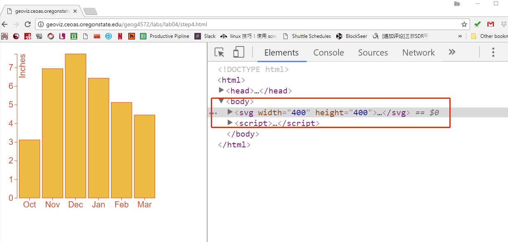

Right click on the `<svg>` tag, on the poped up menu, click `copy` --> `copy element`.


Create a new file under the folder of the `lec13`, name it `barchat.svg`. Paste the copied content to the newly created file.

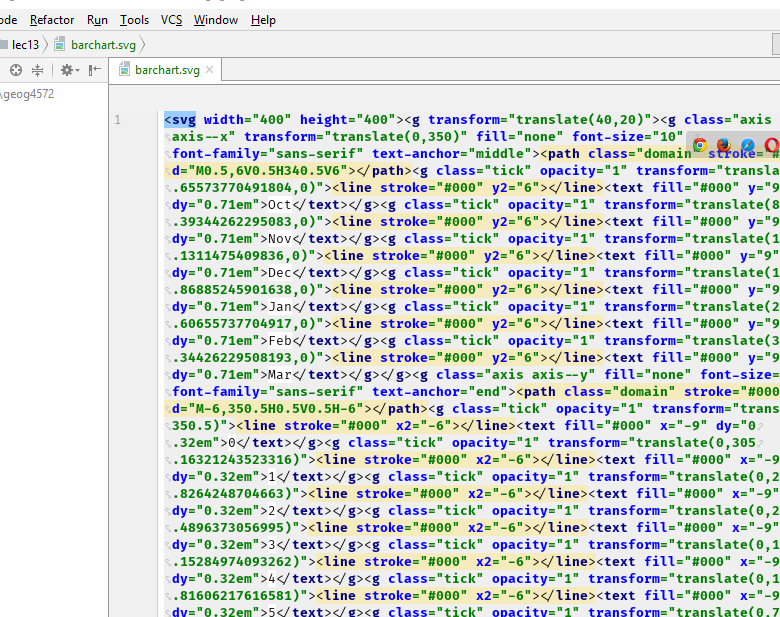

Visit `[https://www.designer.io/](https://www.designer.io/)`, and click the button `Use it Online` on the top right.

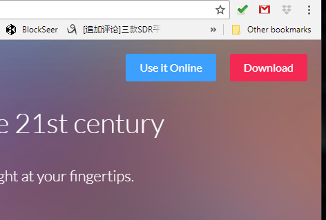

Create a template in 400px width adn 400px height.

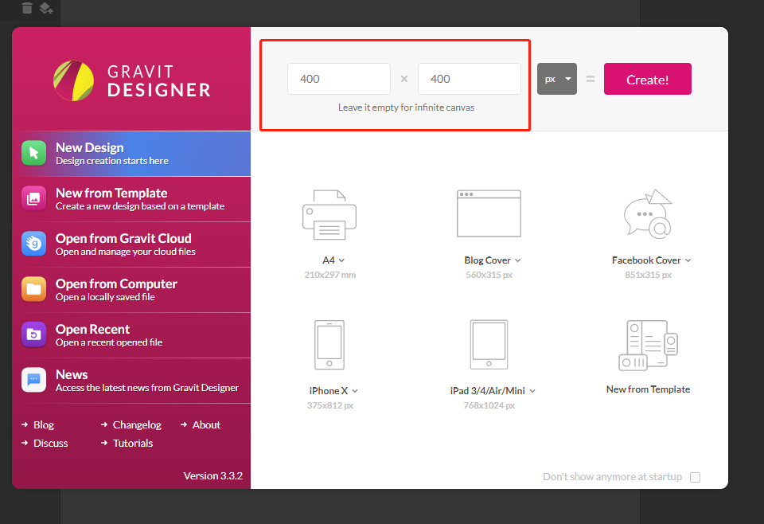


To better align the SVG image, we open up the rulers and guide lines by clicking `View-->Show Rulers` and `View-->Show Guide Lines`. Below shows the editor with rulers and guide lines visible.

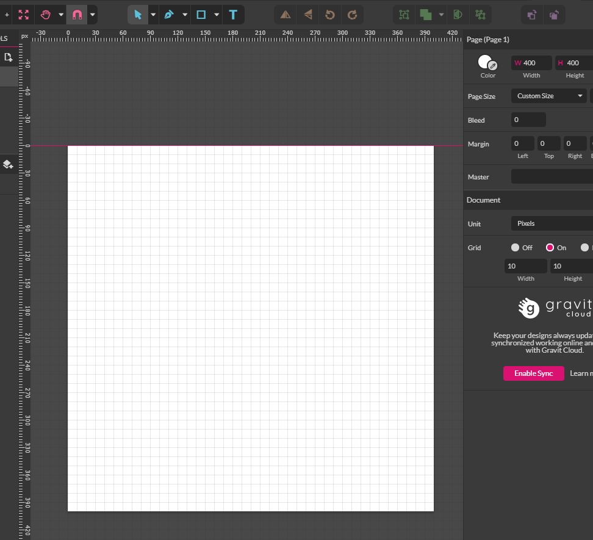

According to the scheme provided in Lab 4, we drag guide lines from both the horizontal and vertical rulers on the side. So, make sure the guide lines away from a distance to the edge of the white drawing board according to the suggestion of the scheme. 

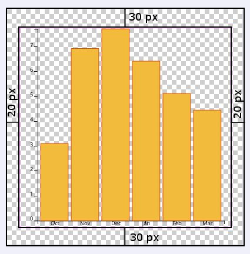

Here shows the drawing board with guide lines. 

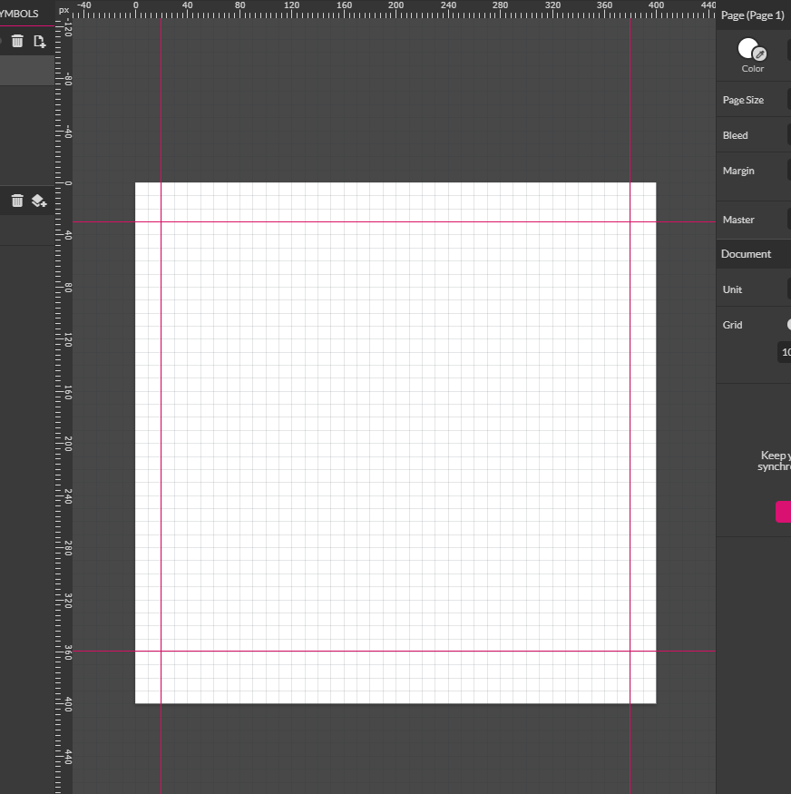

And then drag the file `barchart.svg` and drop to the editor. As you may see, the bar chart is a little larger than the area bounded by the guide lines. So we can change the width to `360 px` (400-20-20), and height to `340 px` (400 -30 - 30). And then we drag the image to the center of the drawing board.

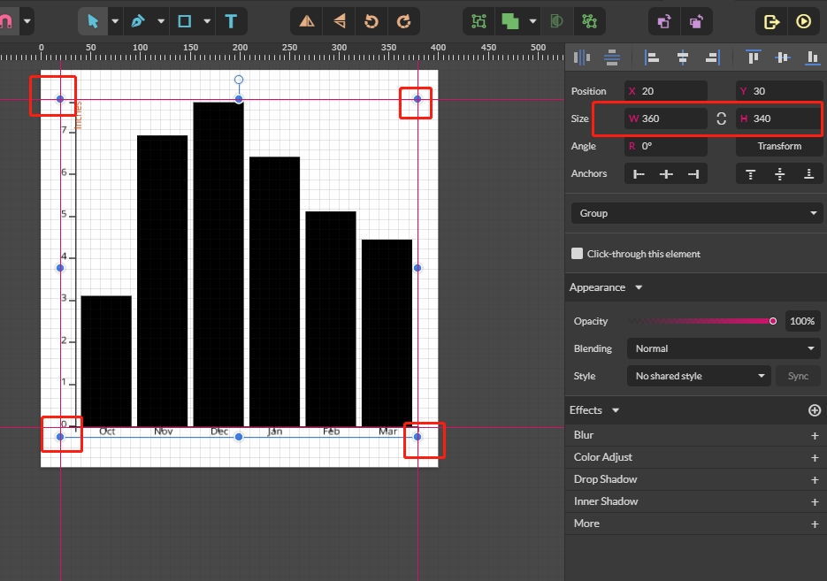

Now, we start to change the color and size of the labels and charts. On the right side of the widow, you will see a layer panel, on that layer, you will see a lot of different elements, which point to the `<svg>` element. For example, `group` indicates `<g>` element, `text` indicates `<text>` element, `Rectangle` indicates `<rect>` element. So we select the text element one by one, and change its color to dark orange `#dc4404` and  the font size to `18 px`, and the font family to `Open Sans`.

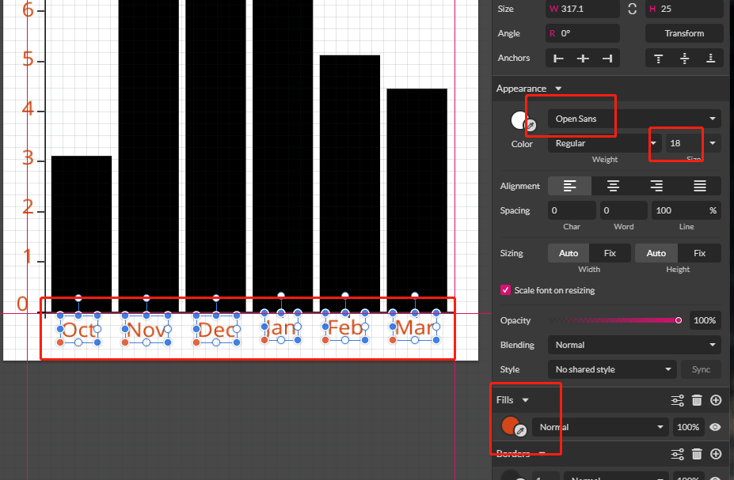

Similarly, we change the color of the bar to `#f3bb3b`, and the color of the bar to `#dc4404`, and the size of the border to `1px`.


Now, we select all the elements of the bar chat, resize its size, and make sure the width equals to `340px`, and the height equals to `360px`. Also, make sure the elements are aligned well. You can use the alignment and distribution toolkits.

In the end, export the svg file by click `File` on the top menu, and the click `Export --> svg`, and name the svg file as `styled-barchat.svg`. Moreover, export another png file `styled-barchat.png`

Here is styled bar chart in svg.


and the bar chart in png

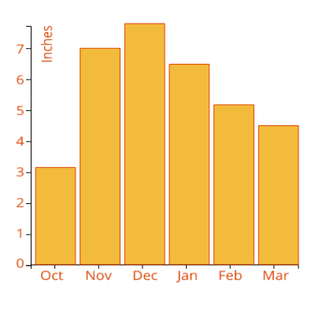

Here, we have gone over the basics of using Gravit Design. You can do the same task in `Adobe illustrator`. For more information about how to use Gravit Design, please check the following two tutorials.

[1] https://medium.com/gravitdesigner/design-a-professional-logo-using-gravit-835408f7fd9d

[2] https://medium.com/gravitdesigner/gravit-designer-tips-tricks-ee6a1353aa3

### 2\.2 Vectorizing a raster image using Illustrator

With the introduction of the improved Image Trace function in Adobe Illustrator CS6 and later upgrades, a whole world of possibility opened up to users of graphics software who want the ability to trace line art and photos and turn them into vector images. Now users can turn bitmap to vectors and PNG files into SVG files using Illustrator with relative ease.

#### 2.2.1\. Getting Started

This process works best with an image with a subject that stands out clearly against its background, such as the cow in the image above.

To add an image to trace, select `File > Place` and locate the image to be added to the document, Or just drag a image to illustrator. Please use the image named "`dh.jpg`" under the path `lectures/lec13/assets/`. This image is an photo of a well-known Post-Marxist Geographer David Harvey. In this section, we would like to generate a portrait of him, and make the background transparent.

When converting an image to vectors, the areas of contiguous colors are converted to shapes. The more shapes and vector points, such as in the village image above, the larger the file size and the greater CPU resources required as the computer works to map all of those shapes, points, and colors to the screen.

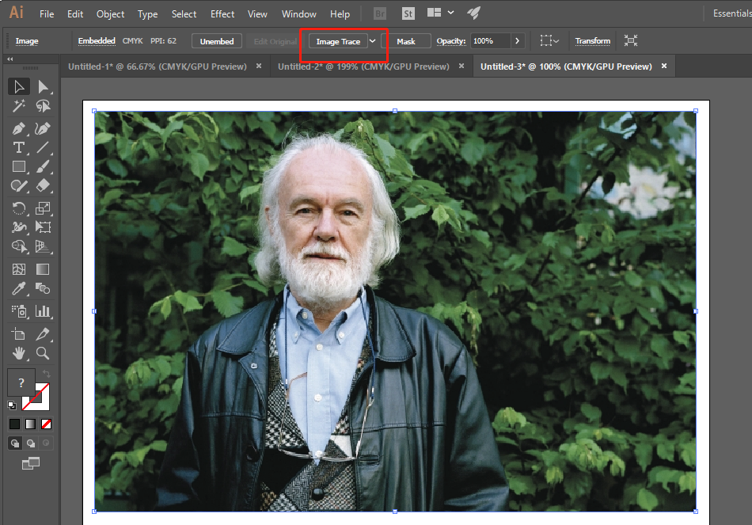

#### 2.2.2\. Types of Tracing

With the image in place, the most obvious starting point is the Image Trace dropdown in the Illustrator Control Panel. There are a lot of choices that are aimed at specific tasks; you may wish to try each one to see the result. You can always return to your starting point by pressing Control-Z (PC) or Command-Z (Mac) or, if you really messed up, by selecting `File > Revert`. 

When you choose a Trace method, you will see a progress bar showing you what is going on. When it finishes, the image is converted to a series of vector paths. In our case, we choose `High Fidelity Photo`.

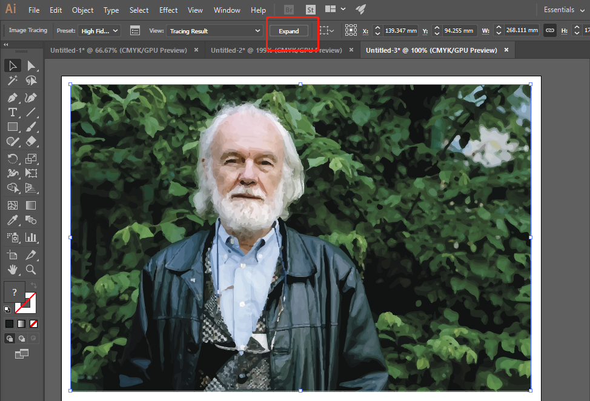


#### 2.2.3\. View and Edit

If you select the tracing result with either the Selection Tool or the Direct Selection Tool, the entire image is selected. To see the paths themselves, click the `Expand` button in the Control Panel. The tracing object is converted to a series of paths.

In the case of the above image, we can select the trees and leaves and delete them.

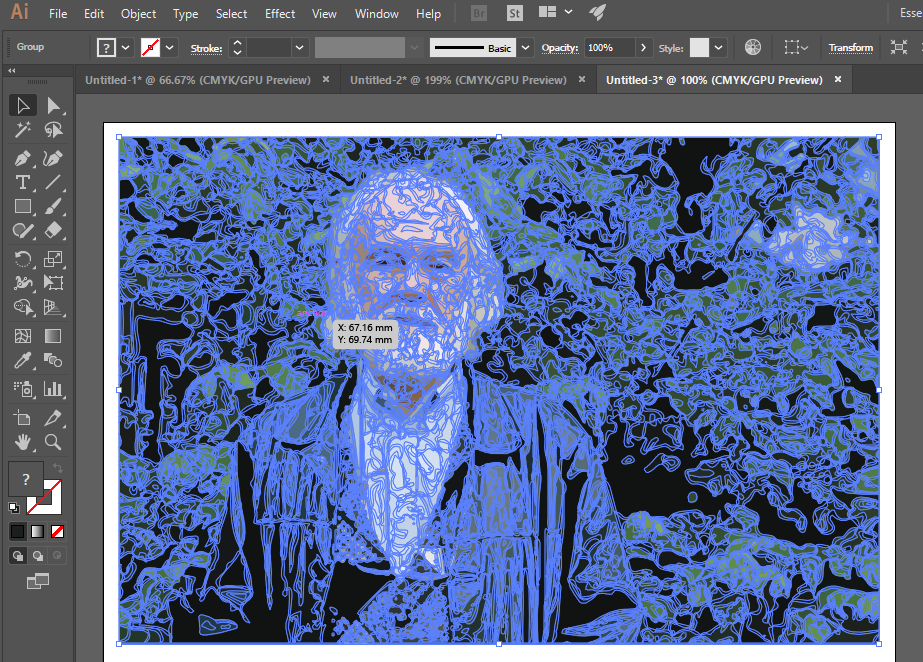

To further simplify the image, we can select `Object > Path > Simplify` and use the sliders in the Simplify panel to reduce the number of points and curves in the traced image. In our case, we choose the Curve Precision `100%`, and check the `straight lines` option.

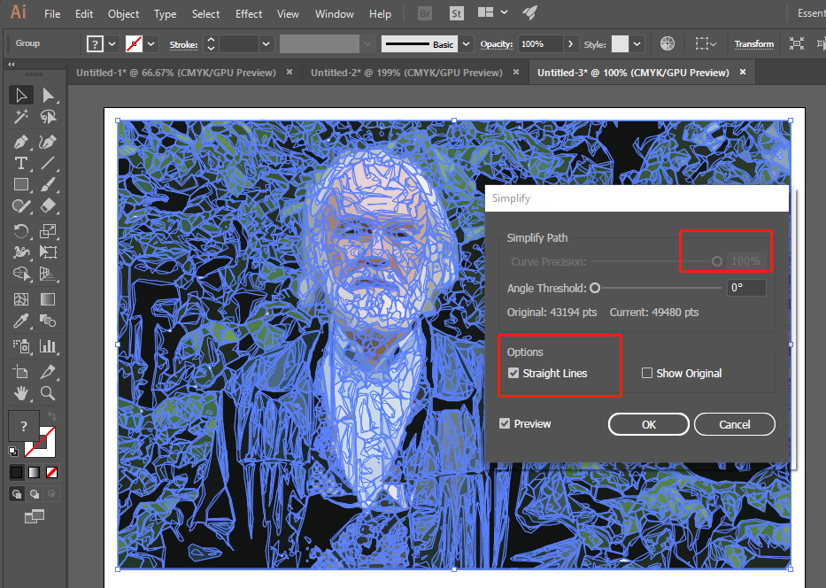

#### 2.2.4\. Edit a Traced Image

With the trace completed, you may want to remove portions of it. In this example, we wanted just the portrait of David Harvey, and without the trees and leaves. 

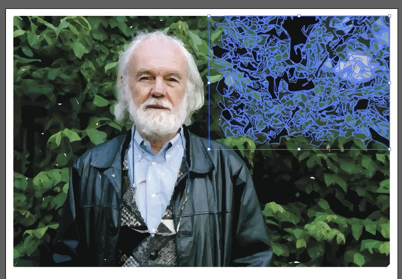


To edit any traced object, right-click on the image, on the opened-up menu, choose `Ungrouop`. Then you can directly select the polygons of the trees and leaves, and press the `delete` key to delete these polygons. 

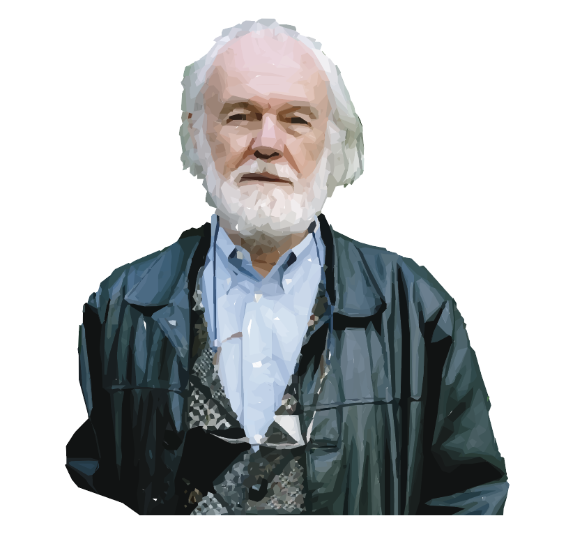

#### 2.2.5\. Export as a SVG file

Once having the portrait of David Harvey, we save it as a svg file. To do that, click the `File` button on the top menu, and then `Export--> Export As...` In the export window, please choose `svg`, and name it "`dh.svg`". In addition, please export another `png` file.  Now, you can see that the background of either the `svg` or the `png` image is transparent. Certainly, you can also add on more features on the portrait to make it as an illustrator. For example, add on David Harvey's name on the image, Please think about how you can use this vectorization to generate illustrator or cartoonish images for your geovisualization or storymap. 

## 3\. Favicons for web pages

A favicon (short for favorite icon), also known as a shortcut icon, website icon, tab icon, URL icon, or bookmark icon, is a file containing one or more small icons,associated with a particular website or web page. A web designer can create such an icon and upload it to a website (or web page) by several means, and graphical web browsers will then make use of it. Browsers that provide favicon support typically display a page's favicon in the browser's address bar (sometimes in the history as well) and next to the page's name in a list of bookmarks. Browsers that support a tabbed document interface typically show a page's favicon next to the page's title on the tab, and site-specific browsers use the favicon as a desktop icon.

To add a favicon, you need to creat one using an image editor, such as illustrator or photoshop. Or, you can find an open source one from google image search. Regarding the images found from the Internet, please refer to or credit the author's efforts in your web map application.

For example, I search "oregon icon" on [Google Images](https://images.google.com/)


I find an png image, and then convert the image to ico from http://convertico.com/.


I downloaded the converted file, named it as **favicon.ico**, and then put it in the `img` folder.

To properly show the favicon, I added one line in the `head` tag of the `index.html` file.

```html
<!--add favicon for the web page-->
<link rel="shortcut icon" href="img/favicon.ico" type="image/x-icon">
```

 If everything works correctly, you will see an icon showing on the web page tab on your Google Chrome browser.

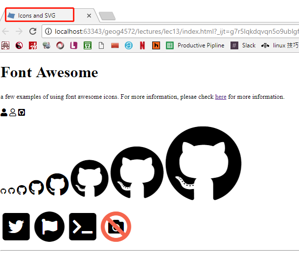


## References

[1] https://www.flaticon.com/

[2] https://mangomap.com/blog/3-more-free-map-icon-packs/

[3] https://fontawesome.com/how-to-use/web-fonts-with-css

[4] https://www.lifewire.com/use-image-trace-in-adobe-illustrator-cc-2017-4125254

