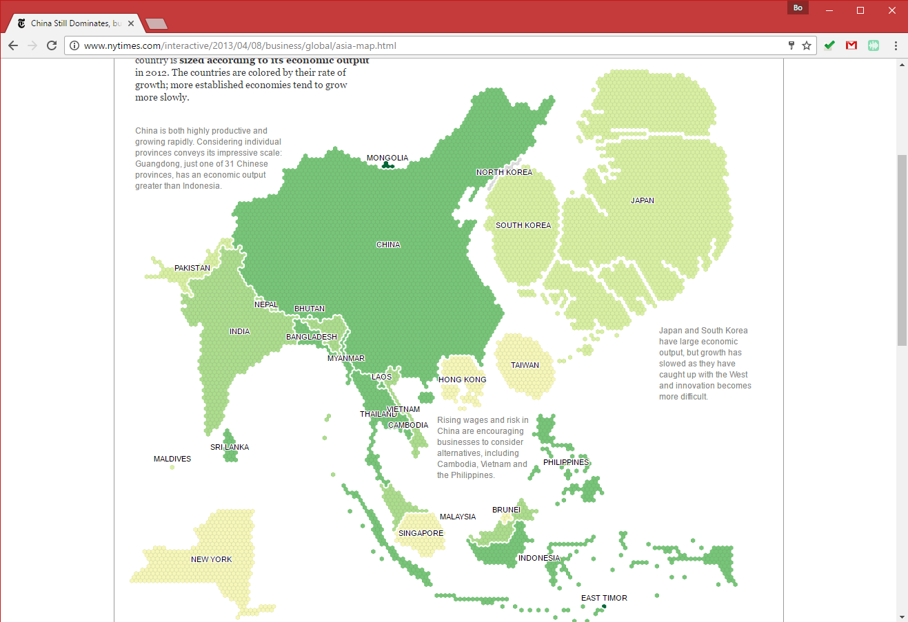

# Course Project: Brainstorm

> Spring 2017 | Geography 472/572 | Geovisualization: Geovisual Analytics
>
> Instructor: Bo Zhao | TA: Kyle R. Hogrefe | Location: LINC 368 | Time: Tuesday 18-19:50am

> Assigned: 04/04/2017 | Due: `04/05/2017 by Noon ` | Points Available = 10

Welcome to Geog 4/572: Geovisual Analytics! In this course, you will learn the theories on geovisualization, some advanced geovisual analytical methodologies, and then work collaboratively on a real-world problem using geovisual analytical tools. This handout starts with an brief introduction to the lab (Digital lab @OSU) and the software setup. To find the geovisualization of your interests and the topic for the course project, this handout also lists some typical geovisualizations and some potential topics. Students are expected to submit their homework by the noon April 5th.

- Get to know the Digital Earth Lab @ OSU.
- Get familiar with the major types of geovisualization via trendy examples.
- Reflect on which specific geovisual analytical method(s) are of your interests. 

## 1. Introduction

Let's first explore the Lab environment and the software setup for this course.

### 1.1 Digital Earth Lab @ Oregon State University

Digital Earth Lab is a teaching facility primarily for GIS, remote sensing, cartography, numerical analysis, and scientific visualization. The classroom is a facility of the OSU College of Earth, Ocean, and Atmospheric Science and is supported by the OSU Media Services. The lab was originally funded by a NASA infrastructure grant to Sherm Bloomer (professor & Dean, College of Science) and Nick Pisias (professor & former associate dean of COAS). Digital Earth is located in 210 Wilkinson Hall and is one of the most advanced teaching facilities on the Oregon State campus. We have been operational since the beginning of Spring term, 1999.

The lab generally opens 8am-5pm , a detailed schedule can be found at http://dusk.geo.orst.edu/de/de_teach.html. The manager of the facility is Cory Langhoff. If you need afterhours access, contact Cory Langhoff langhofc@oregonstate.edu, or dial 7-2532 to make arrangements. Please ahead of time.

### 1.2 Software Setup

This course relies on a series of professional software and web applications to make, debug, and browse web maps, including:

- **Webstorm:** A web mapping programming development environment;
- **MapBox:** An integrated platform for web mapping services;
- **QGIS:** An open source GIS desktop;
- **Chrome:** A Web browser;
- **Google Earth Pro:** A three-dimensional virtual globe with various geospatial data.

## 2\. Geovisualization Examples

This section introduces some major types of interactive geovisual applications. Regarding the course project, you are expected to work as a team to make a similar geovisual application. By viewing the following geovisual applications, you would get sense how geovisual skills can be applied for illustrating real-world problems.   

### 2.1 Storymap

Esri Story Maps let you combine authoritative maps with narrative text, images, and multimedia content. They make it easy to harness the power of maps and geography to tell your story. 

**[A River Reborn](http://storymaps.esri.com/stories/2015/river-reborn/)**

Please pay attention to how the author uses the 2D map, 3D virtual environment and multi-media (e.g., video, images, etc.).

**[California's Getting Fracked](http://www.facesoffracking.org/data-visualization/)**

Please pay attention to the use of map elements, and how the window scrolling behavior triggers the map events.

### 2.2 Virtual Globe

**[World Population](https://globe.chromeexperiments.com/)**

**[Noise Complaints in New York City](rawgit.com/jakobzhao/noise_complaints/master/index.html)**

Please pay attention to how virtual globe is used to demonstrate thematic features.

**[Cesium-VR](https://github.com/NICTA/cesium-vr)**

Enable the geovisualization with the capability of virtual reality. Also, please reflect on how to overlay map and 3d model collected by UAV on to a geovisual application.

### 2.3 Spatial Data Platform

**[National Map of Australia](http://nationalmap.gov.au/)**

please pay attention to the use of virtual globe, and how different types of geospatial data (especially **maps made by UAV**) are overlain in the same visualization environment. 

### 2.4 Data-driven Geovisualization

**[Stweet](http://www.we-love-the.net/Stweet/index.php?location=Portland,US)**

Please pay attention to how heterogeneous types of data are mashed up. 

**[Trendsmap](img/trendsmap.png)**

Geo-tagged tweets are real-timely collected and stored in a remote database, a **word cloud** of geo-tagged hashtags are visualized. Please reflect on the multiple dimensions of a real-world issue. Can we clearly describe a phenomena merely based on one type of geovisual analytical method?

**[Climate Proxies Finder](http://climateproxiesfinder.ipsl.fr/)**

> This application allows you to select different paleo-oceanographic proxies collected at LSCE according to various dimensions (spatial position, depth, age, archive, material type and chronological information).

One data source, and multiple visual analytical ways.

**[Global temporal change](http://blogs.reading.ac.uk/climate-lab-book/files/2016/05/spiral_optimized.gif)**

**[Electric Generation in Spain](http://energia.ningunaparte.net/en/)**

Connect the idea of infographics with the data-driven visualization.

### 2.5 Advanced Geovisual Analytics

**[Economic Output of Asian Countries - New York Times](http://www.nytimes.com/interactive/2013/04/08/business/global/asia-map.html)**

> In this map, geography is distorted so that each country is **sized according to its economic output** in 2012. The countries are colored by their rate of growth; more established economies tend to grow more slowly.

The use of cartogram.

**[TrumpLand vs. Clinton Archipelago](http://www.vividmaps.com/2016/12/trumpland-and-clinton-archipelago.html)**

The use of isoline maps.

**[Migrations Map](http://migrationsmap.net/#/COD/arrivals)**

**[Small Arms and Ammunition - Import & exports](https://armsglobe.chromeexperiments.com/)**

**[A Graph of the History of Philosophy](http://www.designandanalytics.com/philosophers-gephi/)**

Please pay attention to how (social) network is implemented to visualize connectivity.

## 3\. Project Topics (TBD...)

This section lists some potential topics for the course projects. 

### 3.1 Benton County Thriving Communities Initiative (TCI) 2040: Visualizing Community Values and Development Goals (Jenna Tilt)

The project would help the Benton County Thriving Communities Council (TCC) interpret,visualize, and present to the public results from their 2040 TCI survey ([https://www.co.benton.or.us/2040](https://www.co.benton.or.us/2040)) by building on the work done by another OSU course (Geog451/551: Planning principles and practices for resilient communities).  From September 2016 through March 2017 the TCC conducted the 2040 TCI survey through a web survey and community events,which asked three questions (paraphrased):

- What do you like about Benton County?
- What is your vision for Benton County in 2040?
- What needs to happen to accomplish your vision?

The survey garnered over 5000 responses which have been “coded” into over 25 community value categories, such as “Economy/Business”, “Localism”,“Transportation/Mobility”, and “Biking/Walking”.  During winter term 2017, Dr. Tilt led the Geog451/551 students in creating development goals from the 2016 survey responses in these 4 “coded categories” and create a data model (using ArcGIS Model Builder) to show how these development priorities might play out across Benton County.  The model we came up with(full disclosure) is a really cool Multiple Utility Analysis (MUA) that conducts weighted analyses of raster grids representing different development priorities as the data flows upward from sub objectives to the SOI goal (Figures1 and 2).  The model will be used as template by the TCC as they move forward to create development goals for the county using all coded categories from the (now) complete TCI survey results.  

Your mission, should you choose this project, will be to develop an interface through which the public can interact with the model (for example: choosing different development priorities to compare, changing weighted MUA values), to further investigate/display the 2040TCI Survey Data to analyze spatial patterns of responses, and to get as innovative as possible with other ways to visualize the survey data.  Last term the TCC was great to work with and I got the sense that both our expertise and effort were truly needed and appreciated.   This project would be a great way for us (individuals, class, OSU) to give back to our community and positively influence its future. (For more info, please download the [whole document](assets/tcc.pdf))

### 3.2 PPGIS for King County residents (Jenna Tilt)

I have a fairly large PPGIS dataset showing favorite outdoor recreation places for King County residents (Seattle, Wa area).  I have one shapefile containing 1700 points and attribute data:  location name, types of activities engaged in at the location, duration of the visit, frequency of visits, distance from participants' cross-streets to the outdoor location.  I also have another shapefile (approx. 475 points) of participants' cross-streets, demographic data and survey information (mostly regarding residential location preferences). I would love to be able to show this information in a better way than just loads of points on a map.  For example, illustrating high diversity activity areas, high diversity of respondents in particular location areas, etc.

### 3.3 Sea Level Rise and Real Estate Market (David Wrathall)

Norfolk, Virginia is ground-zero for climate-induced sea level rise. It will be inundated sooner and greater magnitudes than any other region of the United States, beginning before the end of the 21st century.  Sea level rise risk, more than any other climate hazard, has the greatest potential to disrupt global society. We will visualize the consequences of sea level rise to Norfolk, VA using 1) current and historical home price data on more than 60,000 homes in Norfolk, VA; 2) multiple flood risk mapping products from various US agencies; 3) sea level rise scenarios for the 21st century; and 4) county-to-county migration data. As rising seas and increased frequency of sea level extremes render coastal areas uninhabitable and unavailable for agricultural and industrial uses, affected populations will migrate elsewhere. Forty percent of the global population – nearly 3 billion people – are concentrated in settlements within 100km of the coast, much of that on islands and on fertile low-lying flood plains and river deltas. The United States reflects this tendency of concentration on the coastlines with roughly 50% of the population in coastal counties. This means that as Norfolk, VA becomes uninhabitable, cities like Atlanta, where those populations are most likely to seek housing, jobs and public services, will encounter substantial planning and policy problems. Extreme sea levels associated with Hurricane Katrina and the resulting migration from New Orleans clearly demonstrated that the institutions that we would rely on for disaster preparedness, response and long-term adaptation planning around sea level rise are woefully inadequate. Moreover, the consequences of this event were relatively minor in comparison to the scope of those anticipated from future sea level rise. We will make this case with visualizations from Norfolk, Virginia.

### 3.4 MIT Disobedience

MIT Media Lab are now accepting nominations for the first-ever MIT Media Lab Disobedience Award, which carries a $250,000 cash prize, no strings attached.

**This award will go to a person or group engaged in what we believe is an extraordinary example of disobedience for the benefit of society.**

What does this mean? Societies and institutions lean toward order and away from chaos. While necessary for functioning, structure can also stifle creativity, flexibility, and productive change–and ultimately, society's health and sustainability. This is true from academia, to corporations, governments, the sciences, and our local communities. 
With this award, we honor work that impacts society in positive ways, and is consistent with a set of key principles. These principles include non-violence, creativity, courage, and taking responsibility for one’s actions. This disobedience is not limited to specific disciplines; examples include scientific research, civil rights, freedom of speech, human rights, and the freedom to innovate.

The MIT Media Lab Disobedience Award seeks to highlight effective, responsible, ethical disobedience across disciplines, and around the world. Disobedience Award objectives are to build awareness and support of disobedience-robust work being done, and to promote role models for younger people.

### 3.5 The Network of Geographic thoughts (Larry Becker)

The group of geography graduate students who took the History & Philosophy of Geography course last fall seemed especially interested.  You could show them this graphic of the history of philosophy and ask them if they have an interest in pursuing a graphic related to geographic thought. If they are interested, I'd be happy to meet with them.

> please refer to [A Graph of the History of Philosophy](http://www.designandanalytics.com/philosophers-gephi/)

## 4\. Homework

The purpose of this handout is to help you brainstorm and identify the geovisualization you would like to work on. Regarding the homework, please submit a word or pdf document to canvas, it should contain 

(1) **a url link of the geovisualization**;

(2) a short description of the specific geovisual analytical skills you are interested; and 

(3) you can also list the potential topics you would like to work on. **Think bold!** In the meantime, please keep in mind that this course is more about honing the geovisual analytical skills other than concentrating on a specific topic. 

**In the lecture this Thursday (4/6)**, you are required to present one geovisualization of your interest to the class.  You should submit the homework **by noon April 5th**.

Once you finish this homework, you need to submit it to **Canvas Dropbox**. On the assignment tab,  check the item of this homework, press the `Submit Assignment` button to submit. Please contact the instructor or TA if you have any difficulty. Note: only submit your homework in Word or PDF format.