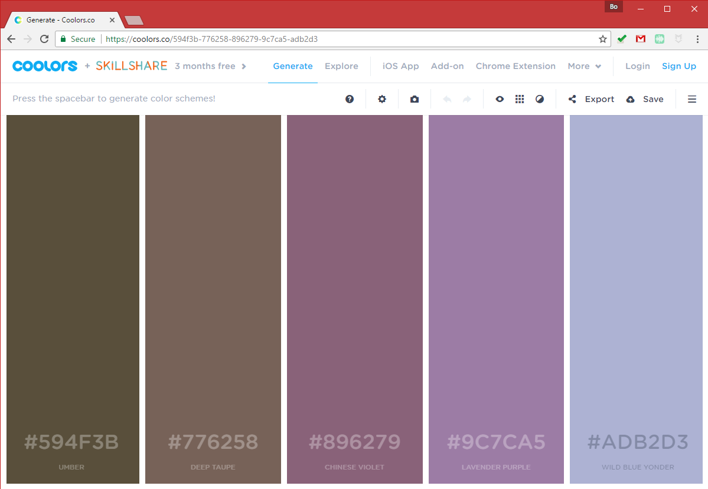
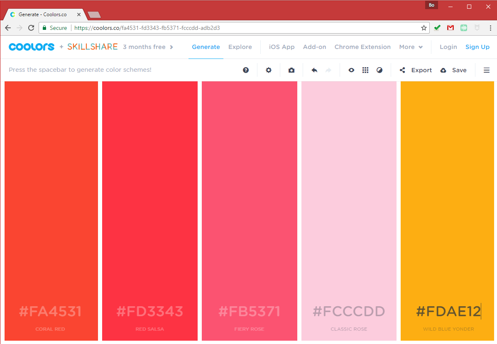
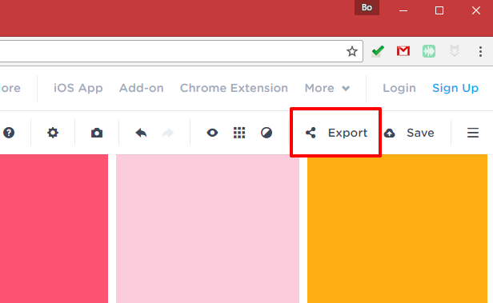
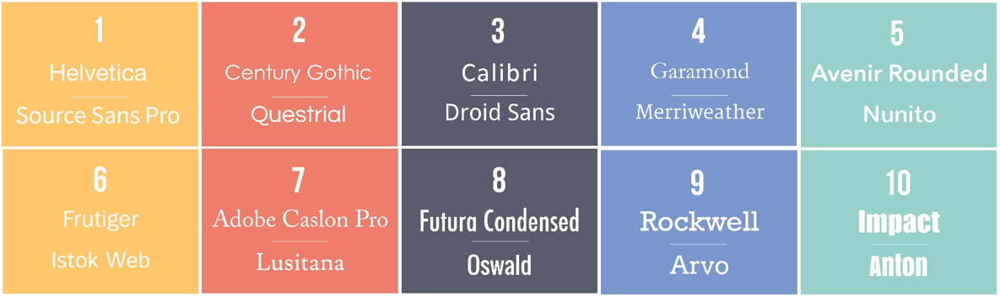

# Design Scheme

In this week, you are expected to submit our design scheme of your final project. This assignment provides you an opportunity to design the color use, icon styel, fonts and other multip-media you planned to use.

For sumbission, we want like to see a new design scheme section on the `readme` file of your final project repository on github. In this section, you are expected to have the following items:

1\. Color palette 
2\. Fonts
3\. Web Icons
4\. Multimedia (landing page video? image?)

To generate these four items, please refer to the consponding sections listed below. For submission, please only submit the url of the repository to canvas.


## 1. Color Palette

To draw the color palette, you could rely on the following tools:
- Find all the trendy and cool color schema from [http://www.colorhunt.co](http://www.colorhunt.co).

- Determine a color scheme based on a photo (refer to [http://www.canva.com/color-palette](https://www.canva.com/color-palette/)), or just simply a keyword (refer to [http://palettr.com](http://palettr.com)).

- Determine a color scheme by an integrated color palette generator from [http://paletton.com](http://paletton.com)

- Generate a color scheme through javascript codes by [chroma.js](https://gka.github.io/chroma.js/). And check the predefined color scheme at [https://github.com/gka/chroma.js/wiki/Predefined-Colors](https://github.com/gka/chroma.js/wiki/Predefined-Colors).

- Determine the color scheme for map symbolization through [colorbrewer2.org](colorbrewer2.org).


Once you get a series of colors from the above tools, open [https://coolors.co/app](https://coolors.co/app) on your web browser.



Fill in the valued (e.g., hex value, RGB, HSV, etc) of the chosen colors in the color column.



Export both the url and png version of your color palette by pressing the **Export** Button.




Then, whil designing the geovisualization, you can easily open or calibrate your color palette through the url, or quickly refer to the palette through the png image. For example, the generated url is [https://coolors.co/fa4531-fd3343-fb5371-fcccdd-fdae12](https://coolors.co/fa4531-fd3343-fb5371-fcccdd-fdae12), and the png picture is:


## 2. Fonts

### 2.1 Popular Font Alternatives

In this section, I listed the google web font alternative to the commonly used commerical fonts.



> From [http://www.designsellout.com/google-web-font-alternatives-2/](http://www.designsellout.com/google-web-font-alternatives-2/)

| Commonly Used Commercial Fonts | Google Web Fonts |
| ------------------------------ | ---------------- |
| Helvetica                      | Sans Source Pro  |
| Century Gothic                 | Questrial        |
| Calibri                        | Droid Sans       |
| Garamond                       | Merriweather     |
| Avenir Next Rounded            | Nunito           |
| Frutiger                       | Istok Web        |
| Adobe Caslon Pro               | Lusitana         |
| Futura Condensed               | Oswald           |
| Rockwell                       | Arvo             |
| Impact                         | Anton            |


### 2.2 commonly used font combinations

**Serif Fonts**

- Georgia, serif

- "Palatino Linotype", "Book Antiqua", Palatino, serif

- "Times New Roman", Times, serif


**Sans-Serif Fonts**

- Arial, Helvetica, sans-serif

- "Arial Black", Gadget, sans-serif

- "Comic Sans MS", cursive, sans-serif

- Impact, Charcoal, sans-serif

- "Lucida Sans Unicode", "Lucida Grande", sans-serif

- Tahoma, Geneva, sans-serif

- "Trebuchet MS", Helvetica, sans-serif

- Verdana, Geneva, sans-serif


**Monospace Fonts**

- "Courier New", Courier, monospace

- "Lucida Console", Monaco, monospace

### 2.3 Use a Google Web Font

To use a google font in your web application, you should include the font link in the head element as shown below:

```html
    <link href='//fonts.googleapis.com/css?family=Sofia' rel='stylesheet'>
```

Apply a google font for a specific div. For example, the code below applies the sofia font to all the texts inside of the body div.

```css
 <style>
        body {
            font-family: 'Sofia';font-size: 22px;
        }
    </style>
```

### 2.4 Font Template
Look for the font families on [Google Web Fonts](https://fonts.google.com/), and generate the font css for the following html elements, including `html`, `body`, `h1` to `h6`, and other elements you think is necessary.

> **Note:** regarding the header elements, perhaps your project will not use al the six headers, please only list those are important.

```html
<!DOCTYPE html>
<html>
<head>
    <title>Font Template Page</title>
    <link href='//fonts.googleapis.com/css?family=Sofia' rel='stylesheet'>
    <style>
        body {
            font-family: 'Sofia';font-size: 22px;
        }
    </style>
</head>
<body>

<h1>Sofia</h1>
<p>Lorem ipsum dolor sit amet, consectetuer adipiscing elit.</p>
<p>123456790</p>
<p>ABCDEFGHIJKLMNOPQRSTUVWXYZ</p>
<p>abcdefghijklmnopqrstuvwxyz</p>

</body>
</html>
```

## 3. Icons

Bootstrap includes 260 glyphs from the [Glyphicons](http://getbootstrap.com/components/#glyphicons) Halflings set. Glyphicons Halflings are normally not available for free, but their creator has made them available for Bootstrap free of cost. As a thank you, you should include a link back to [Glyphicons](http://getbootstrap.com/components/#glyphicons) whenever possible. You can use Use glyphicons in text, buttons, toolbars, navigation, or forms.

To use the glyphicons, you need to include the css stylesheet and javascript library of Bootstrap in the head element.

```html
<head>
    <link rel="stylesheet" href="https://maxcdn.bootstrapcdn.com/bootstrap/3.3.7/css/bootstrap.min.css">
    <script src="https://maxcdn.bootstrapcdn.com/bootstrap/3.3.7/js/bootstrap.min.js"></script>
</head>
```

Find the Bootstrap Icon at [http://getbootstrap.com/components/](http://getbootstrap.com/components/)

Copy the class name of the icon, and apply the name in the `class` property.

```html
<p>Envelope icon: <span class="glyphicon glyphicon-envelope"></span></p>
<p>Search icon: <span class="glyphicon glyphicon-search"></span></p>
<p>Print icon: <span class="glyphicon glyphicon-print"></span></p>
```

Other than Bootstrap Glyphicons, another popular one is [Font Awesome](http://fontawesome.io/). The way to use font awesome is similar to Glyphicons.

In order to apply animation to icons or any other html elements, you can use [animate.css](https://daneden.github.io/animate.css/). To use his css, we need to inlcude its css stylesheet in the head element.

```html
<head>
  <link rel="stylesheet" href="https://cdnjs.cloudflare.com/ajax/libs/animate.css/3.5.2/animate.min.css">
</head>
```

For example, the following code will make the `search icon` continously bounce.

```html
<p>Search icon: <span class="animated infinite bounce glyphicon glyphicon-search"></span></p>
```

If you want to apply any advanced animation features, please refer to [https://github.com/daneden/animate.css](https://github.com/daneden/animate.css). Below is the full code.

```
<!DOCTYPE html>
<html>
    <head>
        <link rel="stylesheet" href="https://maxcdn.bootstrapcdn.com/bootstrap/3.3.7/css/bootstrap.min.css">
        <link rel="stylesheet" href="https://maxcdn.bootstrapcdn.com/bootstrap/3.3.7/css/bootstrap.min.css">
        <link rel="stylesheet" href="https://cdnjs.cloudflare.com/ajax/libs/animate.css/3.5.2/animate.min.css">
        <script src="https://maxcdn.bootstrapcdn.com/bootstrap/3.3.7/js/bootstrap.min.js"></script>
    </head>
    <body>
        <p>Envelope icon: <span class="glyphicon glyphicon-envelope"></span></p>
        <p>Search icon: <span class="glyphicon glyphicon-search"></span></p>
        <p>Search icon: <span class="animated infinite bounce glyphicon glyphicon-search"></span></p>
        <p>Print icon: <span class="glyphicon glyphicon-print"></span></p>
    </body>
</html>
```


## 4. Multi-media

You can always shoot video and images by yourself, or find those under open-source or free license. ***If you use any proprietary multi-media, you need to credit their authors' contribution to your project in your about page.***

Find Free high resolution photos and video at

- [https://pixabay.com/](https://pixabay.com/)
- [https://unsplash.com/](https://unsplash.com/)
- [http://nothingtochance.co/](http://nothingtochance.co/)


