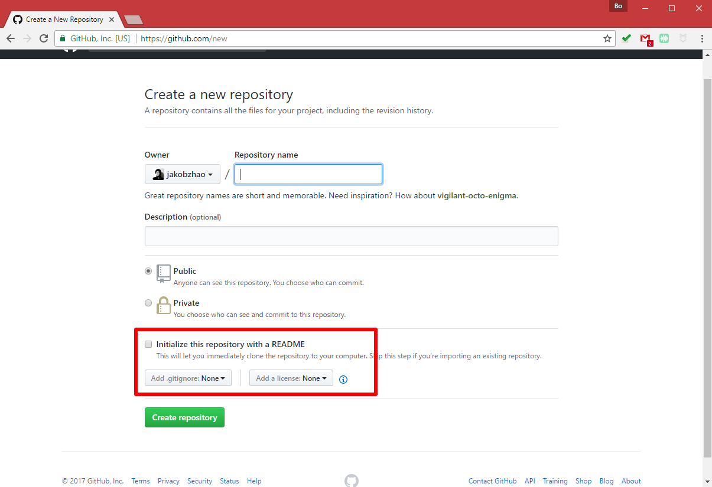
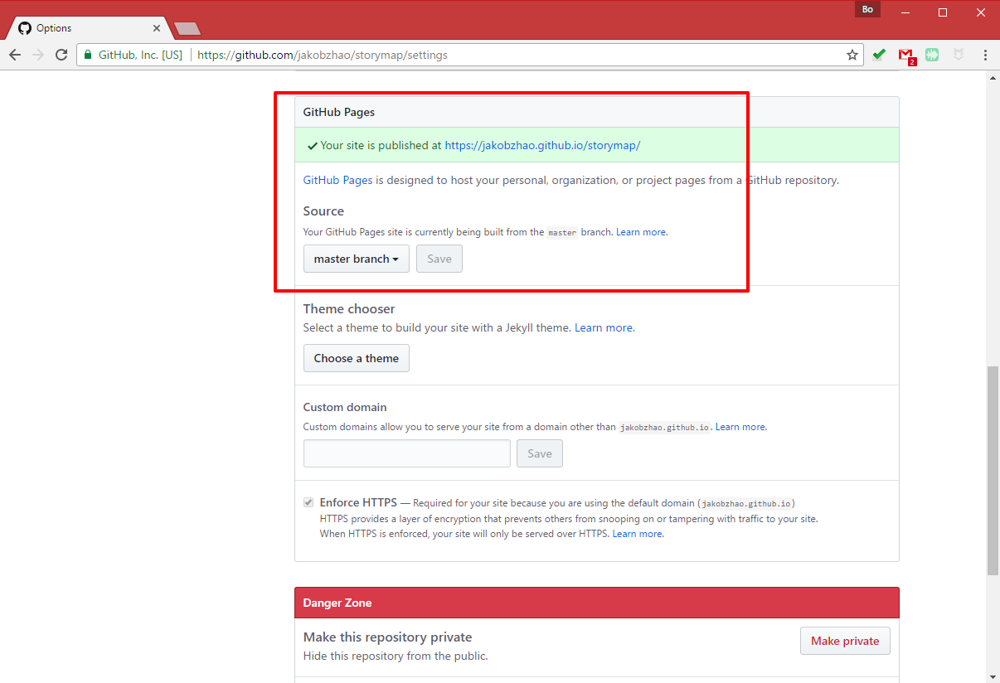
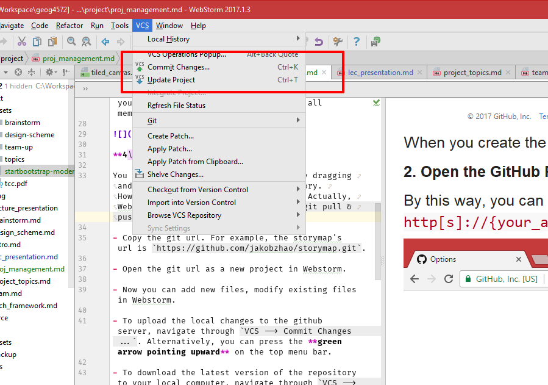
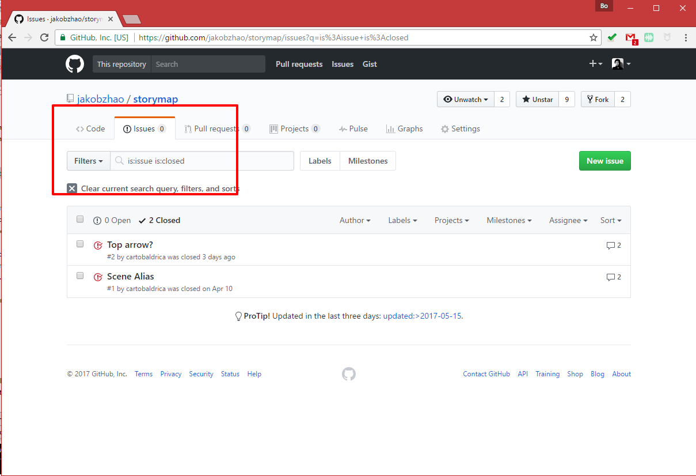
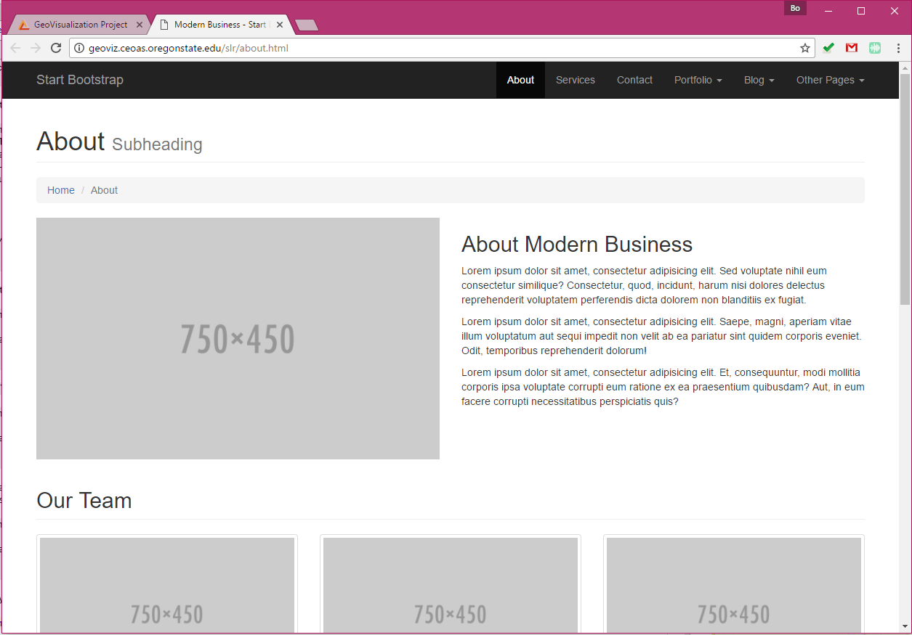
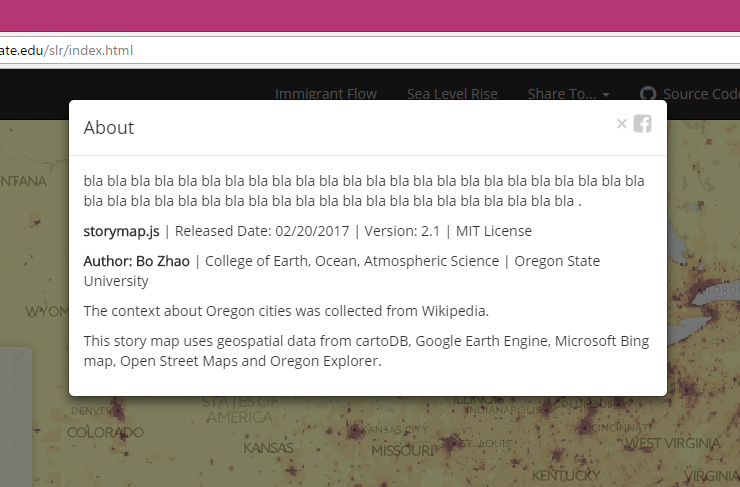

# Course Project: Project Management and Q&A

> Spring 2017 | Geography 472/572 | Geovisualization: Geovisual Analytics
>
> Instructor: Bo Zhao, zhao2@oregonstate.edu | Office Hours: 3-4pm T or by appointment @ strand 347
>
> TA: Kyle R. Hogrefe, hogrefek@oregonstate.edu| Office Hours: 1-2pm MF @ WLKN 257 and 2-4pm W @ WLKN 210

This tutorial introduces the basic steps about how to design and manage a dynamic geovisualization project.

## Project Management Flows

**1\. Create a github repository**



When you create the repository, Please make sure to **initialize the `README.MD`** file. By doing that, you can drag files from your local computer and directly drop to the repository on github.com.

Also, and as a course project, please initialize your repository under an open source license.

**2\. Activate the GitHub Page Support**

By doing this, you can convert your repository as a web site.



**3\. Add your Team Members**

Navigate through `Settings --> Collaborators` on your repository main page to add your team members.

Once added (authorize the read and write rights), all members can contribute to this project.


**4\. Update Repository**

You can always update your repository by simply dragging and dropping your codes to the repository on github.com. However, it is tedious and not stable. Actually, Webstorm can help you easily update your repository via (`git pull & push`).



- Copy the git url. The example's url is `https://github.com/jakobzhao/slr.git`.

- To initialize your git repository to your local computer, you will need to `git clone` the url in the command prompt (if you are on a windows system) or in the Terminal (if you are on a Mac OSX or Linux). For example, To initialize [the sample code](https://github.com/jakobzhao/slr), you will need to run the following code snippet:

 ```powershell
 $ git clone https://github.com/jakobzhao/slr.git
 ```

- Now you can add new files, and further edit existing files in Webstorm.

- In Webstorm, to upload the local changes to the github server, navigate through `VCS --> Commit Changes ...`. Alternatively, you can press the **green arrow pointing upward** on the top menu bar. Once updated, you can go to the repository main page to check whether the changes have been applied or not.

- To download the latest version of the repository to your local computer, navigate through `VCS --> Update Project...`. Alternatively, you can press the **blue arrow pointing downward** on the top menu bar.

> **Note:** When a team working on the same repository, all the members should be careful when upload the local changes. If there is a conflict, please carefully read through the conflicted codes and merge them together.

**5\. Open Issues**

On your main page of github repository, please use the `Issues` tab to submit questions, fix bugs, and work on the wish list.



**6\. Download and Add Bootstrap Template**

You can easily find a Bootstrap template at [https://startbootstrap.com/](https://startbootstrap.com/). Here we will use the Modern Business Template at [https://startbootstrap.com/template-overviews/modern-business/](https://startbootstrap.com/template-overviews/modern-business/). Or, you can download from [here](assets\startbootstrap-modern-business-gh-pages.zip).


Once downloaded, you can extract all the files and put the useful ones to the repository on your local computer.

**7\. Make an Basic Web Map**

In this step, we will walk through how to create a basic web map.

- build the index html skeleton;

```html
<!DOCTYPE html>
<html>
    <head>
        <title>GeoVisualization Project</title>
    </head>
    <body>
    </body>
</html>
```

- add prerequisite stylesheets and libraries in the `head` element;

```html
<!--add required stylesheets-->
<link rel="stylesheet" href="https://unpkg.com/leaflet@1.0.3/dist/leaflet.css" />

<!--add required libraries-->
<script src="https://unpkg.com/leaflet@1.0.3/dist/leaflet.js"></script>
```

- add map container `div` element;

```html
<body>
    <!--map container-->
    <div id="map"></div>
</body>
```

- add map object and anchor it to the map container `div` element; and

```javascript
// construct a leaflet map object.
var map = L.map("map", {zoomControl: false}).setView([40,-100], 5); // deactivate the zoomControl
```

- add necessary map layers - base map, thematic layers and interactive features.

```javascript
// construct a base map in light color.
L.tileLayer('http://{s}.basemaps.cartocdn.com/light_all/{z}/{x}/{y}.png').addTo(map);

// add a population density layer
L.tileLayer.wms(
    "http://sedac.ciesin.columbia.edu/geoserver/wms",
    {layers: 'gpw-v3:gpw-v3-population-density_2000', opacity: 0.5}
).addTo(map);

//add a sea level rise layer. The sea level rises 2 feet. the data is retrieved from https://coast.noaa.gov/slr/ 0 to 6ft
L.tileLayer('http://maps2.coast.noaa.gov/arcgis/rest/services/dc_slr/slr_2ft/MapServer/tile/{z}/{y}/{x}').addTo(map);
```

**8\. Layout Preparation**

- add Bootstrap stylesheet and library in order to design the layout;

```html
<head>
    <!--add required stylesheets-->
    <link rel="stylesheet" href="https://maxcdn.bootstrapcdn.com/bootstrap/3.3.7/css/bootstrap.min.css">
    ... ...
     <script src="https://ajax.googleapis.com/ajax/libs/jquery/3.1.1/jquery.min.js"></script>
     <script src="https://maxcdn.bootstrapcdn.com/bootstrap/3.3.7/js/bootstrap.min.js"></script>
    ... ...
</head>
```

- add a favicon

```html
<link rel="icon" href="img/favicon.ico" type="image/x-icon" />
```

- add Google fonts

```html
<link href="https://fonts.googleapis.com/css?family=Open+Sans" rel="stylesheet">
```

Then, in the main.css,

```html
<link rel="stylesheet" href="css/main.css" />
```

Apply the font-family for relevant textual elements.

```css
font-family: 'open Sans','Helvetica Neue','Helvetica','Arial',sans-serif;
```

- add Font Awesome icons

```html
    <link rel="stylesheet" href="https://cdnjs.cloudflare.com/ajax/libs/font-awesome/4.7.0/css/font-awesome.min.css">
```

**9\. Add a Navigation Bar**


In this step, we will walk through how to add a basic layout component.

- a basic navigation bar consists of two basic elements, a brand and a link group;

```html
<div class="navbar navbar-inverse navbar-fixed-top navbar-toggleable-md" role="navigation">
    <div class="container">
        <div class="navbar-header"></div>
        <div class="collapse navbar-collapse"></div>
    </div>
</div>
```

- add a brand;

a textual brand:

```html
<div class="navbar-header">
   <a class="navbar-brand" href="#">GeoVisualization</a>
</div>
```

an image brand:

```html
<div class="navbar-header">
    <a class="navbar-brand" href="#" title="GeoVisualization Example">
        <!--convert the style value to a class and then add the class to the css file.-->
        
    </a>
</div>
```

- add the skeleton of link groups;

```html
<div class="collapse navbar-collapse">
    <ul class="nav navbar-nav navbar-right">
        <li>
            <a href="immigrants.html">Immigrant Flow</a>
        </li>
        <li>
            <a href="slr.html" target="_blank">Sea Level Rise</a>
        </li>
    </ul>
</div>
```

- in the link group, add a drop-down menu;

```html
<li class="dropdown">
    <a href="#" class="dropdown-toggle" data-toggle="dropdown" role="button" aria-haspopup="true" aria-expanded="false">Share To... <span class="caret"></span></a>
    <ul class="dropdown-menu">
        <!--use font awesome icons-->
        <li><a href="#"> <i class="fa fa-facebook-square" aria-hidden="true"></i> Facebook</a></li>
        <li><a href="#"> <i class="fa fa-twitter-square" aria-hidden="true"></i> Twitter</a></li>
        <li><a href="https://alturl.com/kni7r"> <i class="fa fa-link" aria-hidden="true"></i> ShortUrl</a></li>
    </ul>
</li>
```

- in the link group, add an icon to associate with a link.

```html
<li>
    <a href="about.html"> <i class="fa fa-github fa-lg" aria-hidden="true"></i>&nbsp;&nbsp;<span>Source Codes</span></a>
</li>
```

- an `about` page



```html
<li>
    <a href="about.html" target="_blank">About</a>
</li>
```

Find an about page template in the **bootstrap template package**. If a template html is directly copied to your repository, make sure all the included links and scripts are valid.

```html
<li>
    <a data-toggle="modal" data-target="#about-window">About Popup</a>
</li>
```

- Or you can add an `about` model



```html
<!--the info page-->
<div class="modal fade" id="about-window" role="dialog">
    <div class="modal-dialog modal-md">
        <div class="modal-content">
            <div class="modal-header">
                <button type="button" class="close" data-dismiss="modal">&times; <i class="fa fa-facebook-square" aria-hidden="true"></i></button>
                <h4 class="modal-title">About</h4>
            </div>
            <div class="modal-body">
                <p> bla bla bla bla bla bla bla bla bla bla bla bla bla bla bla bla bla bla bla bla bla bla bla bla bla bla bla bla bla bla bla bla bla bla bla bla bla bla bla bla bla bla bla bla bla .</p>
                <p><b>storymap.js</b> | Released Date: 02/20/2017 | Version: 2.1 | MIT License </p>
                <p><b>Author: Bo Zhao</b> | College of Earth, Ocean, Atmospheric Science | Oregon State University </p>
                <p>The context about Oregon cities was collected from Wikipedia.</p>
                <p>This story map uses geospatial data from cartoDB, Google Earth Engine, Microsoft Bing map, Open Street Maps and Oregon Explorer.</p>
            </div>
        </div>
    </div>
</div>
```

**10\. Make the Info Panel**


- construct the html skeleton of an info panel;

```html
<!--info panel-->
<div class="info-panel">
    <h4> Map Title </h4>
    <p><b> Subtitle of the map </b></p><br/>
    <!-- legend patch items -->
    <i style="background: #bd0026"></i> <p> 1200+ </p>
    <i style="background: #f03b20"></i> <p> 651 to 1200 </p>

    <!--place holder-->
    <br/>
    <br/>
    <p> </p>
    <p> </p>
    <p> </p>

</div>
```

- code the stylesheet of the info panel;

```css
.info-panel {
    line-height: 16px;
    width: 280px;
    position: absolute;
    z-index: 1000;
    left: 10px;
    bottom: 10px;
    color: #070707;
    padding: 6px 8px;
    background: rgba(243, 243, 243, 0.73);
    box-shadow: 0 0 15px rgba(0,0,0,0.2);
    border-radius: 5px;
}


.info-panel i {
    width: 16px;
    height: 16px;
    line-height: 16px;
    float: left;
    margin-right: 8px;
    opacity: 0.7;
}

.info-panel p {
    font-size: 12px;
    line-height: 16px;
    margin: 0;
}

```

- a basic Legend patch;

```html
<i style="background: #f03b20"></i> <p> 651 to 1200 </p>
```

- a basic legend patch for **No Data** area;

```html
<i><svg width="16" height="16" data-reactid=".0.1.1.0.0.1:$=11:$1.0.0.$masked.0">
    <pattern id="diagonalHatch" patternUnits="userSpaceOnUse" width="4" height="4">
        <path d="M-1,1 l2,-2
       M0,4 l4,-4
       M3,5 l2,-2" style="stroke:black; stroke-width:0.5" />
    </pattern>
    <rect x="0" y="0" width="100%" height="100%" fill="url(#diagonalHatch)"/>

</svg></i> <p> No data </p>

```

- a legend for point feature;

```html
<i class="glyphicon glyphicon-flag" style="color:red"> </i> <p> a point feature </p>
```

- a legend for polyline feature;

You can edit the polyline and/or polygon features using an online svg editor [http://jxnblk.com/paths/](http://jxnblk.com/paths/).

```html
<i><svg width="16" height="16">
        <path d='M0 16 L16 16 L16 0 L8 10 L0 0 Z' style="stroke:blue; stroke-width:2;"></path>
    </svg></i> <p> a polyline feature </p>
```

- a legend for polygon feature.

```html
<!--svg editor http://jxnblk.com/paths/-->
<i><svg width="16" height="16">
    <path d='M0 16 L16 16 L16 0 L8 10 L0 0 Z' style="stroke:blue; stroke-width:2;fill:red"></path>
</svg></i> <p> a polygon feature </p>
```

**11\. Visit the web page**

The url address will be `http[s]://{your_account_name}.github.io/{your_git_repository}/{web_page_name.html}`

> **Note:** If you meet any error or warning (e.g., **the http[s] conflict issues**), please debug your geovisualizatin by viewing the codes in the internal inspector.

**12\. Credit the Cartography and Geovisualization Group**

Once you finish your project, please credit any contributions which were made by any other parties.

As a course project, you are expected to credit the [Cartography and Geovisualiztion Group](http://geoviz.ceoas.oregonstate.edu), you can download the logos at [here](../wk08/wk08_1_lec15).


  </img>

   </img>

  </img>


## References

[1] Bootstrap Tutorials [http://getbootstrap.com/components/](http://getbootstrap.com/components/) or [https://www.w3schools.com/bootstrap/default.asp](https://www.w3schools.com/bootstrap/default.asp)
