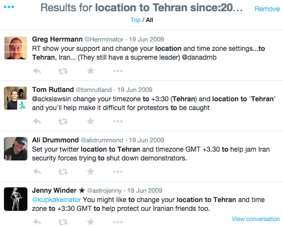

# Course Project: Topics

> Spring 2017 | Geography 472/572 | Geovisualization: Geovisual Analytics
>
> Instructor: Bo Zhao, zhao2@oregonstate.edu | Office Hours: 3-4pm T or by appointment @ strand 347
>
> TA: Kyle R. Hogrefe, hogrefek@oregonstate.edu| Office Hours: 1-2pm MF @ WLKN 257 and 2-4pm W @ WLKN 210

After a week of heated discussion on the course project topics, we have nailed down four potential topics based on your [homework of the first lab](brainstorm.md). By 5pm this Thursday (April 13th), you are expected to submit a list of three project topics of the four you prefer to work on to canvas. The list should be in an order reflecting the level of your preference (1 indicates `most likely`, 2 indicates `very likely`, and 3 indicates `somewhat likely`). Below are the four project topics.

## 1\. Benton County Thriving Communities Initiative (TCI) 2040: Visualizing Community Values and Development Goals

**Co-advisor: Jenna Tilt**

The project would help the Benton County Thriving Communities Council (TCC) interpret,visualize, and present to the public results from their 2040 TCI survey ([https://www.co.benton.or.us/2040](https://www.co.benton.or.us/2040)) by building on the work done by another OSU course (Geog451/551: Planning principles and practices for resilient communities).  From September 2016 through March 2017 the TCC conducted the 2040 TCI survey through a web survey and community events,which asked three questions:

- What do you like about Benton County?
- What is your vision for Benton County in 2040?
- What needs to happen to accomplish your vision?

The survey garnered over 5000 responses which have been *coded* into over 25 community value categories, such as *Economy/Business*, *Localism*, *Transportation/Mobility*, and *Biking/Walking*.  During winter term 2017, Dr. Tilt led a group of students in creating development goals from the 2016 survey responses in these 4 *coded categories* and create a data model (using ArcGIS Model Builder) to show how these development priorities might play out across Benton County.  The model we came up with (full disclosure) is a really cool Multiple Utility Analysis (MUA) that conducts weighted analyses of raster grids representing different development priorities as the data flows upward from sub objectives to the SOI goal (Figures1 and 2).  The model will be used as template by the TCC as they move forward to create development goals for the county using all coded categories from the (now) complete TCI survey results.

Your mission, should you choose this project, will be to develop an interface through which the public can interact with the model (for example: choosing different development priorities to compare, changing weighted MUA values), to further investigate/display the 2040TCI Survey Data to analyze spatial patterns of responses, and to get as innovative as possible with other ways to visualize the survey data.  Last term the TCC was great to work with and Dr. Tilt got the sense that both our expertise and effort were truly needed and appreciated. This project would be a great way for us (individuals, class, OSU) to give back to our community and positively influence its future. (For more info, please download the [whole document](assets/tcc.pdf)).

## 2\. Climate-induced Sea Level Rise In Norfolk Virginia

**Co-advisor: David Wrathall**

Norfolk, Virginia is ground-zero for climate-induced sea level rise. It will be inundated sooner and greater magnitudes than any other region of the United States, beginning before the end of the 21st century. Sea level rise risk, more than any other climate hazard, has the greatest potential to disrupt global society. We will visualize the consequences of sea level rise to Norfolk, VA using

- Current and historical home price data on more than 60,000 homes in Norfolk, VA;
- Multiple flood risk mapping products from various US agencies;
- Sea level rise scenarios for the 21st century; and
- County-to-county migration data.

As rising seas and increased frequency of sea level extremes render coastal areas uninhabitable and unavailable for agricultural and industrial uses, affected populations will migrate elsewhere. Forty percent of the global population – nearly 3 billion people – are concentrated in settlements within 100km of the coast, much of that on islands and on fertile low-lying flood plains and river deltas. The United States reflects this tendency of concentration on the coastlines with roughly 50% of the population in coastal counties. This means that as Norfolk, VA becomes uninhabitable, cities like Atlanta, where those populations are most likely to seek housing, jobs and public services, will encounter substantial planning and policy problems. Extreme sea levels associated with Hurricane Katrina and the resulting migration from New Orleans clearly demonstrated that the institutions that we would rely on for disaster preparedness, response and long-term adaptation planning around sea level rise are woefully inadequate. Moreover, the consequences of this event were relatively minor in comparison to the scope of those anticipated from future sea level rise. We will make this case with visualizations from Norfolk, Virginia.

## 3\. Location Spoofing - A Disobedient Geographical Practice for the Benefit of Society

**Advisor: Bo Zhao**

**What is Location Spoofing?**

Location spoofing refers to the act of intentionally falsifying one’s actual locational information. The proliferation
of location spoofing in recent years has stirred debate about the reliability and convenience of user-generated geospatial contents and the use of location spoofing as an effective countermeasure to protect individual geo-privacy and national security.

**Recent Cases**

1\. Twitter users spoofed their locations to protect against the Dakota Access Pipeline Project

[The Dakota Access Pipeline Project](https://www.usnews.com/news/us/articles/2016-09-03/oil-pipeline-protest-turns-violent-in-southern-north-dakota) has sparked protests over its proximity to sacred Native American sites and potential to contaminate drinking water, and efforts opposing it are gaining steam. The North Dakota pipeline project led to the largest gathering of Native Americans in 100 years. And the movement snowballed further Tuesday when Green Party presidential candidate [Jill Stein reportedly spray-painted a bulldozer](https://www.usnews.com/news/articles/2016-09-07/stein-gets-noticed-for-allegedly-vandalizing-a-worksite) at a pipeline work site. Sioux tribal leaders also say construction crews have destroyed [Native American cultural and burial sites](https://www.usnews.com/news/us/articles/2016-09-04/tribal-chairman-urges-avoiding-bismarck-after-pipeline-clash). Hashtags have sprung up on Twitter to protest the pipeline, such as [#NoDAPL](https://twitter.com/search?q=%23nodapl&src=tyah), [#RezpectOurWater](https://twitter.com/search?q=%23RezpectOurWater&src=tyah) (a play on "reservations"), and [#StandWithStandingRock:](https://twitter.com/search?q=%23standwithstandingrock&src=tyah)

2\. Occupying Tehran

Twitter users spoofed their locations to prevent the local protesters in Tehran not be ambushed by Iran cyber polices.

In reaction to the 2009 presidential election in Iran,dissatisfied voters who believed the election was hijacked by the Green Movement,organized several protests to take place around major squares in Tehran as well as online. Some of these online demonstrations were supported by Twitter users who established fake locations in Tehran through spoofing, rather than actually traveling there.

The government of Iran regularly monitors all activities on social media (Ansari 2012).During the campaign, social network sites were suddenly blocked and online political activity became the target for harsh criticism and reprisals from the government. In order to prevent this surveillance as well as protect the online protestors, many internationally based Green Movement supporters spread disinformation over Twitter to mislead foreign observers. Foreign supporters who were not in Iran decided to set their online locations to Tehran in order to protect those who were tweeting from Tehran.This strategy may have helped some Iranian opposition leaders avoid persecution,but it also made it impossible to understand the real impacts of Twitter on the situation of the demonstrations on the ground.

> An image clipped from Bo Zhao's dissertation

**The disobedient aspects of location spoofing for the benefit of society**

- A less/non-violent way to protest;
- A way to confuse the cyber police who wants to ambush the local protester.

**The initial ideas for geovisualization**

- The interface will be built on three.js or d3.js;
- Visualize different cases of location spoofing or focusing on one unique case (the pipeline case);
- Visualize the word cloud (as well as other text analytics) of what the participated social media users were talking about; 
- Collect real-time social media streams and store historical the data in MongoDB;
- Visualize the real-time location spoofing cases;
- Visualize polylines/curves between where the social media user locate and where the locational information is spoofed to;
- Possible virtual reality scene of the local environment of the location where gathers a lot of location spoofings;
- A possible entry point for social media users who want to spoof their online locational information in order to remotely join in the demonstration (a less violent way). 

> *“You don’t change the world by doing what you’re told.” — Joi Ito, Director, MIT Media Lab*

[MIT Media Lab Disobedience Award](https://www.media.mit.edu/disobedience/) will go to a person or group engaged in what we believe is an extraordinary example of disobedience for the benefit of society.

What does this mean? Societies and institutions lean toward order and away from chaos. While necessary for functioning, structure can also stifle creativity, flexibility, and productive change–and ultimately, society's health and sustainability. This is true from academia, to corporations, governments, the sciences, and our local communities.
With this award, we honor work that impacts society in positive ways, and is consistent with a set of key principles. These principles include *non-violence, creativity, courage, and taking responsibility for one’s actions*. This disobedience is not limited to specific disciplines; examples include scientific research, civil rights, freedom of speech, human rights, and the freedom to innovate.

The MIT Media Lab Disobedience Award seeks to highlight effective, responsible, ethical disobedience across disciplines, and around the world. Disobedience Award objectives are to build awareness and support of disobedience-robust work being done, and to promote role models for younger people.

## 4\. Visualizing Forest in Oregon

**Co-advisor: TBD**

Using UAV imagery and 3D photography for visualizing the forest.

Another geovisual concept is 4-D Statistical Surfaces. Please take a quick look at[ these figures](http://ieeexplore.ieee.org/document/6837425/all-figures) from a publication authored by Helen Jenny. We could use this method to map many forest-related variables,[ such as these](https://lemma.forestry.oregonstate.edu/data/plot-database), which were created by the LEMMA Lab here at OSU.

Some of the functionality of the existing ["LTVis" website](http://ltweb.ceoas.oregonstate.edu/ltvis/) and discuss the 4-D Statistical Surfaces.