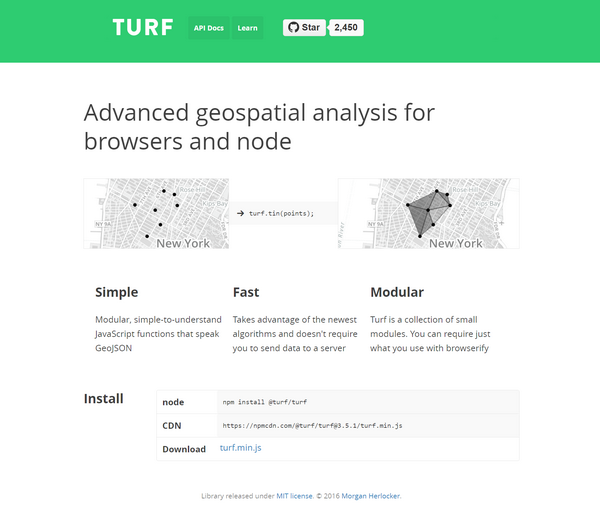
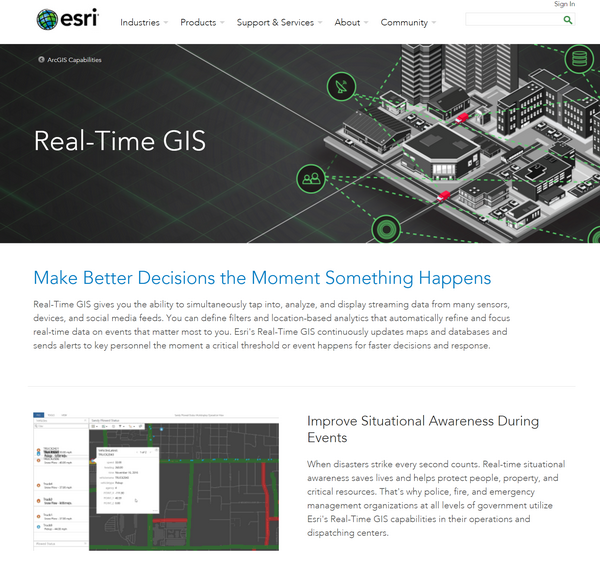
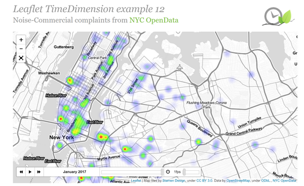
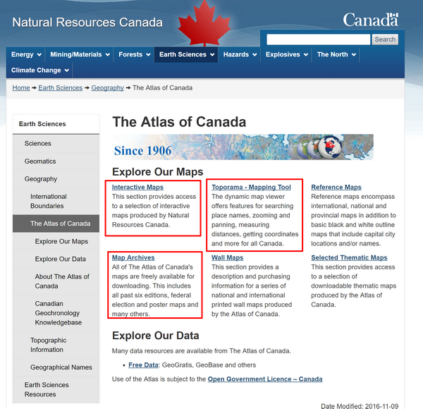
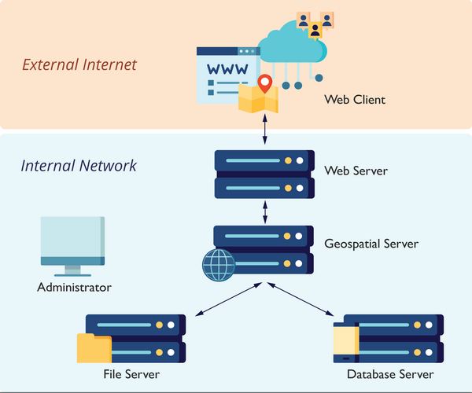

# Web Mapping Types, Architecture, and Data

> Spring 2017 | Geography 472/572 | Geovisualization: Geovisual Analytics
>
> Instructor: Bo Zhao | TA: Kyle R. Hogrefe | Location: LINC 368 | Time: Tuesday 9-9:50am

**Learning Objectives**

- Understand the basic concepts related to web mapping;
- Get to know web mapping libraries -  proprietary and open source ones;
- Understand the differences between file server and database server;
- Get to know the geospatial data types for web mapping; and
- Able to draw the web mapping architecture; and
- Able to read, edit, display, convert geojson files. 

## 1. Overview

Web mapping  (Internet Map, Internet mapping, Web GIS, Internet GIS)  is the process of using maps delivered by geographic information systems (GIS). A web map on the World Wide Web is both served and consumed, thus web mapping is more than just web cartography, it is a service by which consumers may choose what the map will show. Web GIS emphasizes geospatial data processing aspects more involved with design aspects such as data acquisition and server software architecture such as data storage and algorithms, than it does the end-user reports themselves.

The advent of web mapping can be regarded as a major new trend in cartography. Until recently cartography was restricted to a few companies, institutes and mapping agencies, requiring relatively expensive and complex hardware and software as well as skilled cartographers and GIS engineers.

Web mapping has brought many geographical datasets, including free ones generated by **OpenStreetMap** and proprietary datasets owned by **Navteq, Google, Waze,** and others. A range of free tools, such as **QGIS**, **GRASS**, and etc. have also been conceived and implemented alongside proprietary tools like **ArcGIS**. As a result, the barrier to entry for serving maps on the web has been lowered.

## 2. Types of web maps

A first classification of web maps has been made by Kraak in 2001. He distinguished static and dynamic web maps and further distinguished interactive and view only web maps. Today there an increased number of dynamic web maps types, and static web map sources. Below shows some examples of the major web map types.

### 2.1 Analytical web maps

Analytical web maps offer GIS analysis. The geospatial data can be a static provision, or needs updates. The borderline between analytical web maps and web GIS is fuzzy. Parts of the analysis can be carried out by the geospatial data server.



>  [Turf.js](http://turfjs.org/) -- A JavaScript library for spatial data analysis


> [Making Heatmap using Leaflet.js](https://www.patrick-wied.at/static/heatmapjs/plugin-leaflet-layer.html)

### 2.2 Animated and real-time

Real-time maps show the situation of a phenomenon in close to real-time or near real-time. They are usually animated. Data is collected by sensors and the maps are generated or updated at regular intervals or on demand. Animated maps show changes in the map over time by animating one of the graphical or temporal variables. 



> Real -Time GIS supported by ArcGIS Event



> [TimeDimension plugin for leaflet](http://apps.socib.es/Leaflet.TimeDimension/examples/example14.html)

### 2.3 Collaborative web maps

Collaborative maps are a developing potential. In proprietary or open source collaborative software, users collaborate to create and improve the web mapping experience, such as [OpenStreetMap](https://www.openstreetmap.org/), [WikiMapia](http://wikimapia.org/), etc.


> [OpenStreetMap (a provider preview)](https://leaflet-extras.github.io/leaflet-providers/preview/)

### 2.4 Online atlas

The traditional atlas goes through a remarkably large transition when hosted on the web. Atlases can cease their printed editions or offer printing on demand. Some atlases also offer raw data downloads of the underlying geospatial data sources.



> [Online Atlas of Canada](http://www.nrcan.gc.ca/earth-sciences/geography/atlas-canada)

### 2.5 Static web maps

Static web pages are view only without animation or interactivity. These files are created once, often manually, and infrequently updated. Typical graphics formats for static web maps are PNG, JPEG, GIF, or TIFF for raster files, SVG, PDF or SWF for vector files. These include scanned paper maps not designed as screen maps. 


> A static web map made by D3 + topojson, rendered by SVG (Mike Bostock 2012)

## 3. Web Mapping Libraries

Web mapping library is a framework that you can use to write a program. It provides a set of classes and functions that help you avoid writing all the low-level code to perform specific actions. For example, web mapping libraries typically include classes for maps and layers so that you don't have to write all the low-level code for displaying an interactive map image and drawing a new layer on it. Instead, you can just create a new map object, create a new layer object, and call some method. The library abstracts the complexity of the task and makes it easy for you to focus on the mapping aspects of your application, rather than spending time on the low-level logistics.

Libraries designed specifically for the purpose of making web maps include OpenLayers, Leaflet, the Google Maps API, the ArcGIS API for JavaScript and etc. The latter two are even more specific in that they are designed around particular proprietary platforms.

### 3.1 Open Source

**OpenLayers**

OpenLayers is a mature and richly featured JavaScript API for building web map applications. It has an extensive collection of documentation and samples, although some of the materials can be difficult for beginners to grasp. One of nicest things about OpenLayers is the large developer community using the API. This community has created a mass of tips and examples on forums such as GIS Stack Exchange. 

**Leaflet**

Leaflet is a younger web mapping API that is designed to be lightweight, mobile-friendly, and easy to get started with. It places heavy emphasis on the use of tiled maps and client-side vector graphics drawn from sources such as geojson. For basic maps that use these layer types, Leaflet is an excellent choice that has already endeared itself to many GIS developers.

**D3**

D3 is a Open source data visualization library that is frequently used for charting but also contains many map examples. It binds data elements to the page's document object model (DOM), allowing for interesting and flexible data animations and transitions. Although it has a steeper learning curve for newbies, D3 is a nice option for composing a web app with interactive maps and charts. It also offers examples for using non-Mercator projections.

**Cesium**

Cesium is an open-source JavaScript library for world-class 3D globes and maps. Our mission is to create the leading 3D globe and map for static and time-dynamic content, with the best possible performance, precision, visual quality, platform support, community, and ease of use.

**Storymap.js**

Storymap.js is a javascript map library to tell a story using web maps. Using this library, you can create a map that follows a storyline. For each paragraph, you can place a map alongside it, and manipulate the map by zooming, panning, and even adding more thematic layers. This map library follows the concept responsive design, meaning the stories can be shown on any Desktop or mobile devices. 

### 3.2 Commercial

**Google Maps and Bing Maps APIs**

The Google Maps API gives developers the opportunity to overlay their own data on top of tiled map layers from Google Maps. The overlayed data is typically supplied through KML files, and is displayed as interactive vector graphics drawn on the client side. These graphics can be restyled by the developer to use custom marker symbols, and can be bound to popups or tables to show additional information on a mouse click.

Applications that use the Google Maps API for free must be publicly accessible and **not incur over 25,000 map loads per day for 90 consecutive days**. Organizations whose applications that do not meet this and other criteria must purchase a Google Maps API for Business license.

Microsoft's Bing Maps (link is external), another large commercial maps provider, offers APIs for web and mobile applications that are similar in scope to Google's. Like Google, Bing Maps offers a free usage tier and an enterprise license that must be purchased under various usage circumstances. 

**ArcGIS APIs**

Esri has created web mapping APIs that fit into its ArcGIS platform, some of which are relatively rich in function compared to the Google Maps API and many of the FOSS APIs. The APIs support multiple languages and platforms, such as JavaScript, Flex, Silverlight, iOS, and Android. In theory, they are roughly equal in functionality, although, in practice, they have matured and thrived at different levels. The ArcGIS API for JavaScript (link is external) is one of the most fully featured and actively developed of these APIs.

The ArcGIS APIs are primarily designed to work with web services that you have published using ArcGIS Online, Portal for ArcGIS (link is external), or ArcGIS for Server. 

The APIs are free to use for development or educational use, but require a fee if you are selling the application or embedding advertising within it.

**Mapbox**

Mapbox is a large provider of custom online maps for websites such as Foursquare, Pinterest, Evernote, the Financial Times, The Weather Channel and Uber Technologies. Since 2010, it has rapidly expanded the niche of custom maps, as a response to the limited choice offered by map providers such as Google Maps and OpenStreetMap. Mapbox is the creator of, or a significant contributor to some open source mapping libraries and applications, including the MBTiles specification, the TileMill cartography IDE, the Leaflet JavaScript library, and the CartoCSS map styling language and parser.

## 4. Web mapping architecture

It can take several different physical machines to create, serve, and use a web map. These are often depicted in diagrams as separate levels, or tiers of architecture. 



>  Web mapping architecture
>

In some cases, your web map may be designed solely for the use of people within your organization and may never see the open web. In this scenario, client applications may also reside on these desktop workstation machines.
a database and/or file server holding all of your geospatial data. This machine might be equipped with redundant storage mechanisms and regular backup scripts that prevent the loss of data.

- **A data tier** could be as simple as several shapefiles sitting in a folder on your server machine, or it could be as complex as several enterprise-grade servers housing an ecosystem of standalone files and relational databases. 

- **A geospatial server** that has specialized software and processing power for drawing maps, responding to feature queries, and performing GIS analysis operations. 

- **A web server** that acts as a web entry point into your organization's network. This is also called a proxy server. It is protected by firewalls that shield malicious traffic into your internal network. It's also a place where you can put web application code (such as HTML and JavaScript files) for your web maps.


Many client applications that use the web map. These can be apps that run on your desktop workstation or they could be mobile apps. The clients may be based within your network, or you may allow them to come from outside your network. All clients must be able to make web requests through HTTP, and any client coming from outside your network must have an Internet connection. Mostly, you can use any modern web browser to test your apps and services. You can also use a mobile browser, such as Safari on the iPhone, to test the apps that you place on your personal web space.

>  **Note:** Again, when developing a web map, you can certainly use a single physical machine to play all these roles. This is a common practice that keeps things simple and more economic. When you work for a “real world” company with its own network and you are ready to deploy your web map, you will move your tested services and applications into a formal “production” environment where you have individual enterprise-grade machines.

## 5. Geospatial data for the web 

The **data tier** contains your datasets that will be included in the web map. Almost certainly, it will house the data for your thematic web map layers. It may also hold the data for your base maps, if you decide to create your own basemap and tile sets. Other times, you will pull in base maps, and quite possibly some thematic layers, from other peoples' servers, relieving yourself of the burden of maintaining the data. For example, some of the popular thematic base layers are from `Mapbox`, `Google maps`, `Bing maps` and `OpenStreetMaps`.

Some organizations are uneasy with the idea of taking the same database that they use for day-to-day editing and putting it on the web. There is justification for this uneasiness, for both security and performance reasons. If you are allowing web map users to modify items in the database, you want to avoid the possibility of your data being deleted, corrupted, or sabotaged. Also, you don't want web users' activities to tax the database so intensely that performance becomes slow for your own internal GIS users, and vice versa.

For these reasons, organizations will often create a copy or replica of their database and designate it solely for web use. If features in the web map are not designed to be edited by end users, this copy of the database is read-only. If, on the other hand, web users will be making edits to the database, it is periodically synchronized with the internal "production" database using automated scripts or web services. A quality assurance (QA) step can be inserted before synchronization if you would prefer for a GIS analyst to examine the web edits before committing them to the production database.

### 5.1 Files vs. Databases

When designing your data tier, you will need to decide whether to store your data in a series of simple files (such as shapefiles, KML, geojson) or in a database that incorporates spatial data support (such as PostGIS or SpatiaLite). A file-based data approach is simpler and easier to set up than a database if your datasets are not changing on a frequent basis and are of manageable size. File-based datasets can also be easier to transfer and share between users and machines.

Databases are more appropriate when you have a lot of data to store, the data is being edited frequently by different parties, you need to allow different tiers of security privileges, or you are maintaining relational tables to link datasets. Databases can also offer powerful native options for running SQL queries and calculating spatial relationships (such as intersections).

If you have a long-running GIS project housed in a database and you just now decided to expose it on the web, you will need to decide whether to keep the data in the database or extract copies of the data into file-based datasets.

### 5.2. Common open formats for spatial data

This section describes in greater detail some of the spatial data formats that have open specifications or are created by open source software. Note that these refer to files or databases that can stand alone on your hardware. We will cover open formats of web services streamed in from other computers in future lectures.

#### 5.2.1 Open data formats and proprietary formats

In this course, we will be using open data formats, in other words, formats that are openly documented and have no legal restrictions or royalty requirements on their creation and use by any software package. You are likely familiar with many of these, such as shapefiles, KML files, JPEGs, and so forth. In contrast, proprietary data formats are created by a particular software vendor and are either undocumented or cannot legally be created from scratch or extended by any other developer. The Esri file geodatabase is an example of a well-known proprietary format. Although Esri has released an API for creating file geodatabases, the underlying format cannot be extended or reverse engineered.

Some of the most widely-used open data formats were actually designed by proprietary software vendors who made the deliberate decision to release them as open formats. Two examples are the Esri shapefile and the Adobe PDF. Although opening a data format introduces the risk that open source alternatives will compete with the vendor's functionality, it increases the interoperability of the vendor's software, and, if uptake is widespread, augments the vendor's clout and credibility within the software community.

#### 5.2.2 Spatially-enabled databases

When your datasets get large or complex, it makes sense to move them into a database. This often makes it easier to run advanced queries, set up relationships between datasets, and manage edits to the data. It can also improve performance, boost security, and introduce tools for performing spatial operations.

Below are described two popular approaches for putting spatial data into open source databases. Examples of proprietary equivalents include Microsoft SQL Server, Oracle Spatial, and the Esri ArcSDE middleware (packaged as an option with ArcGIS for Server) that can connect to various flavors of databases, including open source ones.

**PostGIS**

PostGIS is an extension that allows spatial data management and processing within PostgreSQL (often pronounced "Postgress" or "Postgress SQL"). PostgreSQL is perhaps the most fully featured open source relational database management system (RDBMS). If a traditional RDBMS with relational tables is your bread and butter, then PostgreSQL and PostGIS are a natural fit if you are moving to open source. The installation is relatively straightforward: in the latest PostgreSQL setup programs for Windows, you just check a box after installation indicating that you want to add PostGIS. An importer wizard allows you to load your shapefiles into PostGIS to get started. The rest of the administration can be done from the pgAdmin GUI program that is used to administer PostgreSQL.

**SpatiaLite**

SpatiaLite is an extension supporting spatial data in the SQLite database. As its name indicates, SQLite is a lightweight database engine that gives you a way to store and use data in a database paradigm without installing any RDBMS software on the client machine. This makes SQLite databases easy to copy around and allows them to run on many kinds of devices. If you are familiar with Esri products, a SpatiaLite database might be thought of as similar to a file geodatabase.

SpatiaLite is not as mature as PostGIS, but it is growing in popularity, and you will see a button in QGIS called *Add SpatiaLite Layer*. SpatiaLite is a more self-contained and flexible choice than shapefiles, KML, etc., for this type of task.

### 5.3 File-based data

File-based data includes shapefiles, KML files, geojson, and many other types of text-based files. Each of the vector formats has some mechanism of storing the geometry (i.e., vertex coordinates) and attributes of each feature. Some of the formats such as KML may also store styling information.


Below are some of the file-based data formats you're most likely to encounter.

**Shapefiles**

The Esri shapefile is one of the most common formats for exchanging vector data. It actually consists of several files with the same root name, but with different suffixes. At a minimum, you must include the *.shp*, *.shx*, and *.dbf* files. Other files may be included in addition to these three when extra spatial index or projection information is included with the file. 

| File Type |         Usage          |
| :-------: | :--------------------: |
| LAYER.shp |   Feature geometries   |
| LAYER.shx | Feature geometry index |
| LAYER.dbf |   Feature attributes   |

Because a shapefile requires multiple files, it is often expected that you will zip them all together in a single file when downloading, uploading, and emailing them. See the [Wikipedia](https://en.wikipedia.org/wiki/Shapefile) for more details about this format.

**Geojson**

JavaScript Object Notation (JSON) is a structured means of arranging data in a hierarchical series of key-value pairs that a program can read. JSON is less verbose than XML and ultimately results in less of a "payload," or data size, being transferred across the wire in web applications.

Following this pattern, geojson is a form of JSON developed for representing vector features. The [geojson Specification](http://geojson.org/geojson-spec.html) gives some basic examples of how different entities such as point, lines, and polygons are structured.

you can use *.json* or *.geojson* as the extension of a geojson file, but you might as well choose to save geojson features into a *.js* (JavaScript) file that can be referenced by your web map. Other times, you may encounter web services that return geojson.


geojson is a widely-used data format for displaying vectors in web maps. It is based on JavaScript object notation, a simple and minimalist format for expressing data structures using syntax from JavaScript. In geojson, a vector feature and its attributes are represented as a JavaScript object, allowing for easy parsing of the geometry and fields.

geojson is less bulky than XML-based structures such as KML; however, geojson does not always contain styling information like KML does. geojson's simplicity and loading speed have made it popular, perhaps even trendy, among developers in the open source world. 

Here's what a piece of geojson looks like. geojson vectors are commonly bundled into a unit called a *FeatureCollection*. The *FeatureCollection* below holds the same data as the above kml does. The bulk of the geojson below contains the vertices that define the state outline, but you should also notice an attribute/property - *name*:

```json
{
  "type": "FeatureCollection",
  "features": [
    {
      "type": "Feature",
      "geometry": {
        "type": "Polygon",
        "coordinates": [
          [
            [ -123.2807596,44.5684594],
            [ -123.2807609,44.5683725],
            [ -123.281178, 44.5683677],
            [ -123.281166,44.5681575],
            [ -123.2806858,44.5681652],
            [ -123.2806805,44.5682569],
            [ -123.280604,44.5682569],
            [ -123.2805987, 44.5680314],
            [ -123.2801065,44.5680266],
            [ -123.2801172,44.568468],
            [ -123.2807596,44.5684594]
          ]
        ]
      },
      "properties": {
        "name": "Wilkinson Hall"
      }
    },
    {
      "type": "Feature",
      "geometry": {
        "type": "LineString",
        "coordinates": [
          [-123.2775182,44.5656571],
          [-123.2779312,44.5656457],
          [-123.2789344,44.5657527],
          [-123.2799214, 44.566238],
          [-123.2799482,44.5679617],
          [-123.2803291,44.5679502],
          [-123.2803345,44.5680305]
        ]
      },
      "properties": {
        "name": "Route 1"
      }
    },
    {
      "type": "Feature",
      "geometry": {
        "type": "Point",
        "coordinates": [-123.27734112739563,44.56562272511972]
      },
      "properties": {
        "name": "347 Strand Hall"
      }
    }
  ]
}
```

In the geojson above, notice the use of several JavaScript objects embedded within one another. At the lowest level, you have a Polygon object. The Polygon object is contained within a Feature object. The feature is part of a *FeatureCollection* object. The geojson specification gives precise details about how these objects are to be structured. It's important to be familiar with these structures, although you will rarely have to read or write them directly. You will typically use convenience classes or converter programs that have been developed to simplify the experience of working with geojson.

To view this block of geojson code, you can use geojson.io. To do that, you need to open [http://geojson.io](http://geojson.io), and then copy and paste the code into the right text panel. Instantly, you will see the corresponding map on the right panel. During this course, you will find geojson.io is a handy online tool for creating, editing and validating geojson files.


**Topojson**

Topojson is an extension of geojson that encodes topology. Rather than representing geometries discretely, geometries in topojson files are stitched together from shared line segments called arcs. Arcs are sequences of points, while line strings and polygons are defined as sequences of arcs. Each arc is defined only once, but can be referenced several times by different shapes, thus reducing redundancy and decreasing the file size. In addition, topojson facilitates applications that use topology, such as topology-preserving shape simplification, automatic map coloring, and cartograms.

A reference implementation of the [topojson specification]( https://github.com/topojson/topojson-specification) is available as a command-line tool to encode topojson from geojson (or ESRI Shapefiles) and a client side JavaScript library to decode topojson back to geojson again. topojson is also supported by the popular OGR tool as of version 1.11 and PostGIS as of version 2.1.0.

```json
{
   "type":"Topology",
   "objects":{
      "collection":{
         "type":"GeometryCollection",
         "geometries":[
            {
               "type":"Polygon",
               "properties":{
                  "name":"Wilkinson Hall"
               },
               "arcs":[
                  [
                     1
                  ]
               ]
            },
            {
               "type":"LineString",
               "properties":{
                  "name":"Route 1"
               },
               "arcs":[
                  0
               ]
            },
            {
               "type":"Point",
               "properties":{
                  "name":"347 Strand Hall"
               },
               "coordinates":[
                  9999, 0
               ]
            }
         ]
      }
   },
   "arcs":[
      [
         [ 9538,121],
         [ -1077,-40],
         [ -2614,376],
         [ -2572, 1705],
         [ -70, 6058],
         [ -993,-41],
         [ -14,283]
      ],
      [
         [ 1090,9969],
         [ -3,-306],
         [ -1087,-16],
         [ 31,-739],
         [ 1252, 27],
         [ 13,322],
         [ 200,0],
         [ 14, -792],
         [ 1282,-17],
         [ -28,1551],
         [ -1674,-30]
      ]
   ],
   "transform":{
      "scale":[ 3.837256330000159e-7, 2.84555943622992e-7],
      "translate":[ -123.281178, 44.56562272511972]
   },
   "bbox":[ -123.281178, 44.56562272511972, -123.27734112739563, 44.568468]
}
```


**Other text files**

Many GIS programs can read vector data out of other types of text files such as .gpx (popular format for GPS tracks) and various types of .csv (comma-separated value files often used with Microsoft Excel) that include longitude (X) and latitude (Y) columns. You can engineer your web map to parse and read these files, or you may want to use your scripting skills to get the data into another standard format before deploying it in your web map. This is where Python skills and helper libraries can be handy.

**Raster formats**

Most raster formats are openly documented and do not require royalties or attribution. These include JPEG, PNG, TIFF, BMP, and others. The GIF format previously used a patented compression format, but those patents have expired.

> GeoTIFF raster image is currently made available in GeoTIFF format with Deflate compression. See the [GeoTIFF Specification](https://trac.osgeo.org/geotiff/) for more details about this format.

## References:

[1] http://maptimeboston.github.io/web-maps-101/

[2] Kraak, Menno Jan (2001): *Settings and needs for web cartography*, in: Kraak and Allan Brown (eds), Web Cartography, Francis and Taylor, New York, p. 3–4. see also webpage. Accessed 2007-01-04.

[3] https://en.wikipedia.org/wiki/Web_mapping

[4] http://www.geog.ucsb.edu/~good/176c/pindefu.pdf

[5] geojson/topojson Converter: 

- http://geojson.io/
- http://shancarter.github.io/distillery/
- http://mapstarter.com/
- http://www.mapshaper.org/
- http://shpescape.com/mix/

[6] Spatial data on a diet: tips for file size reducation using topojson:
http://zevross.com/blog/2014/04/22/spatial-data-on-a-diet-tips-for-file-size-reduction-using-topojson/

