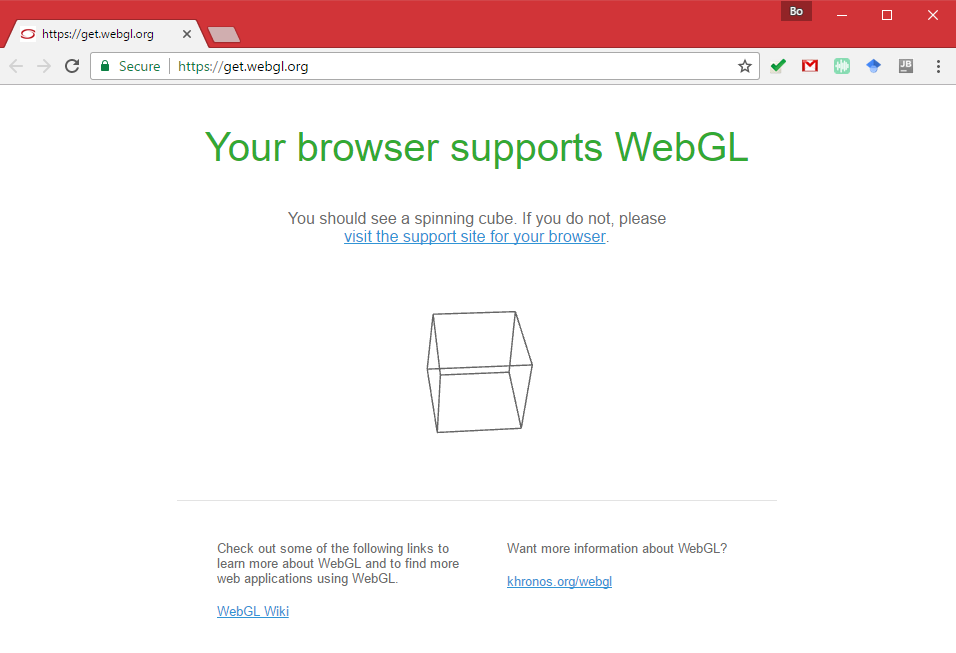
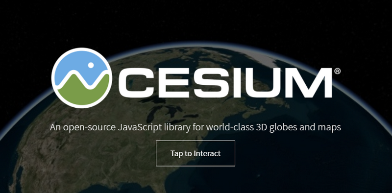
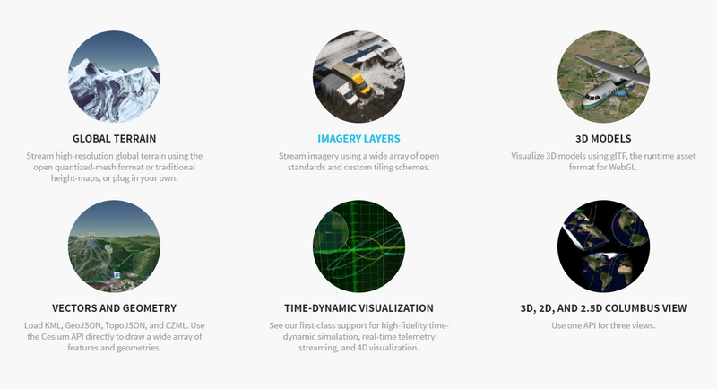
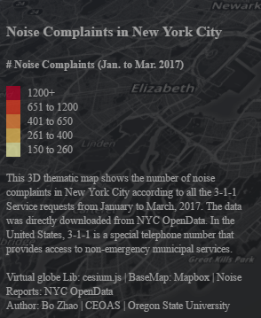

# Virtual Globe

> Spring 2017 | Geography 472/572 | Geovisualization: Geovisual Analytics
>
> Instructor: Bo Zhao | TA: Kyle R. Hogrefe | Location: LINC 368 | Time: Tuesday 9-9:50am

**Learning Objectives**

- Get to know the basics of 3D visualization on the Web; 
- Make the virtual globe library Cesium.js; 
- Overlay different map service providers and geojson data.
- Make a 3D thematic map.

## 1. WebGL

**WebGL (Web Graphics Library)** is a JavaScript API for rendering 3D graphics within any compatible web browser without the use of plug-ins. WebGL is integrated completely into all the web standards of the browser allowing GPU accelerated usage of physics and image processing and effects as part of the web page canvas. WebGL elements can be mixed with other HTML elements and composited with other parts of the page or page background. WebGL programs consist of control code written in JavaScript and shader code that is written in GLSL (a language similar to C/C++, and is executed on a computer's Graphics Processing Unit).


### 1.1 History

WebGL evolved out of the Canvas 3D experiments started by Vladimir Vukićević at Mozilla. Vukićević first demonstrated a Canvas 3D prototype in 2006. By the end of 2007, both Mozilla and Opera had made their own separate implementations.

In early 2009, the non-profit technology consortium Khronos Group started the WebGL Working Group, with initial participation from Apple, Google, Mozilla, Opera, and others. Version 1.0 of the WebGL specification was released March 2011. As of March 2012, the chair of the working group is Ken Russell.

Early applications of WebGL include Zygote Body. In November 2012 Autodesk announced that they ported most of their applications to the cloud running on local WebGL clients. These applications included Fusion 360 and AutoCAD 360.

Development of the WebGL 2 specification started in 2013. This specification is based on OpenGL ES 3.0.

### 1.2 Support

WebGL is widely supported in modern browsers. However its availability is dependent on other factors like the GPU supporting it. The official WebGL website offers [a simple test page](https://get.webgl.org/).



The following paragraph introduces how different browsers support WebGL.

- Google Chrome – WebGL has been enabled on all platforms that have a capable graphics card with updated drivers since version 9, released in February 2011. By default on Windows, Chrome uses the ANGLE (Almost Native Graphics Layer Engine) renderer to translate OpenGL ES to Direct X 9.0c or 11.0, which have better driver support. On Linux and Mac OS X the default renderer is OpenGL however. It is also possible to force OpenGL as the renderer on Windows. Since September 2013, Chrome also has a newer Direct3D 11 renderer, which however requires a newer graphics card.
- Mozilla Firefox – WebGL has been enabled on all platforms that have a capable graphics card with updated drivers since version 4.0. Since 2013 Firefox also uses DirectX on the Windows platform via ANGLE.
- Safari – Safari 6.0 and newer versions installed on OS X Mountain Lion, Mac OS X Lion and Safari 5.1 on Mac OS X Snow Leopard implemented support for WebGL, which was disabled by default before Safari 8.0.
- Opera – WebGL has been implemented in Opera 11 and 12, although was disabled by default in 2014.
- Internet Explorer – WebGL is partially supported in Internet Explorer 11. It initially failed the majority of official WebGL conformance tests, but Microsoft later released several updates. The latest 0.94 WebGL engine currently passes ~97% of Khronos tests. WebGL support can also be manually added to earlier versions of Internet Explorer using third-party plugins such as IE WebGL.
- Microsoft Edge – The initial stable release supports WebGL version 0.95 (context name: "experimental-webgl") with an open source GLSL to HLSL transpiler.

### 1.3 WebGL Libraries

The WebGL API may be too tedious to use directly without some utility libraries, which for example set up typical view transformation shaders (e.g. for view frustum). Loading scene graphs and 3D objects in the popular industry formats is also not directly provided for. JavaScript libraries have been built (or sometimes ported to WebGL) to provide the additional functionality. A non-exhaustive list of libraries that provide many high-level features includes `A-Frame (VR)`, `BabylonJS`, `PlayCanvas`, `three.js`, `OSG.JS` and `CopperLicht`. There also has been a rapid emergence of game engines for WebGL, including `Unreal Engine 4` and `Unity 5`. The Stage3D/Flash-based `Away3D` high-level library also has a port to WebGL via `TypeScript`. A more light-weight utility library that provides just the vector and matrix math utilities for shaders is `sylvester.js`. It is sometimes used in conjunction with a WebGL specific extension called `glUtils.js`. Although not very common, some 3D libraries, like the one used by `LAI4D`, can work with HTML5 canvas when WebGL is not supported.

There are also some 2D libraries built on top of WebGL like `Cocos2d-x` or `Pixi.js`, which were implemented this way for performance reasons, in a move that parallels what happened with the `Starling Framework` over `Stage3D` in the Flash world. The WebGL-based 2D libraries fall back to HTML5 canvas when WebGL is not available.

**X3D** also made a project called `X3DOM` to make X3D and VRML content running on WebGL. The 3D model will in XML tag `<X3D>` in HTML5 and interactive script will use JavaScript and DOM. **BS Content Studio** and **Instant Reality X3D exporter** can exported X3D in HTML and running by WebGL.

## 2. Intro to Cesium.js

**Cesium** is an open-source JavaScript library for world-class 3D globes and maps. It creates the leading 3D globe and map for static and time-dynamic content, with the best possible performance, precision, visual quality, platform support, community, and ease of use.



Cesium was founded by [AGI](http://www.agi.com/) (AGI) in 2011 as a cross-platform virtual globe for dynamic-data visualization in the space and defense industries. Since then, Cesium has grown into a 3D globe serving industries from geospatial and oil and gas to agriculture, real estate, entertainment, and sports. Currently, Cesium is lead by the Cesium Consortium, started by [Analytical Graphics, Inc.](http://www.agi.com/) and [Bentley Systems](https://www.bentley.com/). The consortium was started to accelerate open-source Cesium development and support long-term open-source Cesium sustainability.

AGI uses Cesium in many of its own applications, such as [ComSpOC](https://comspoc.com/) and [NORAD Tracks Santa](http://cesiumjs.org/demos/noradtrackssanta.html), and develops value-add products for Cesium including the [STK Terrain Server](http://www.agi.com/products/stk/terrain-server/).

### 2.1 Open Standards and Formats

A number of open 3D geospatial formats have grown out of Cesium. Open formats create interoperability for a full ecosystem of tools. [CZML](https://github.com/AnalyticalGraphicsInc/czml-writer/wiki/CZML-Guide), the Cesium Language, is a JSON schema for describing time-dynamic 3D scenes such as of satellites and aircraft. The [quantized-mesh](https://github.com/AnalyticalGraphicsInc/quantized-mesh) format enables efficient 3D terrain streaming and rendering. The Cesium team has worked closely with Khronos to create [glTF](https://www.khronos.org/gltf), the GL Transmission Format, which is the open-standard runtime asset format for WebGL engines. [3D Tiles](https://cesiumjs.org/2015/08/10/Introducing-3D-Tiles/) are a specification for streaming massive heterogeneous 3D geospatial datasets.

### 2.2 Dynamic Geospatial Visualization



- Visualize high-resolution global [terrain](http://cesiumjs.org/Cesium/Apps/Sandcastle/index.html?src=Terrain.html).
- [Layer imagery](http://cesiumjs.org/Cesium/Apps/Sandcastle/index.html?src=Imagery%20Layers.html) from multiple sources, including WMS, TMS, WMTS, Bing Maps, Mapbox, Google Earth Enterprise, OpenStreetMap, ArcGIS MapServer, standard image files, and custom tiling schemes. Each layer can be alpha-blended with the layers below it, and its brightness, contrast, gamma, hue, and saturation can be dynamically changed.
- Industry standard vector formats, such as [KML](http://cesiumjs.org/Cesium/Apps/Sandcastle/index.html?src=KML.html&label=DataSources), [GeoJSON, and TopoJSON](http://cesiumjs.org/Cesium/Apps/Sandcastle/index.html?src=GeoJSON%20and%20TopoJSON.html&label=DataSources), including terrain clamping.
- Draw [3D models](http://cesiumjs.org/Cesium/Apps/Sandcastle/index.html?src=3D%20Models.html) using glTF with animations and skins. Clamp models to terrain. Convert COLLADA and OBJ to glTF using the [online converter](http://cesiumjs.org/convertmodel.html). Use [KHR_binary_glTF](https://github.com/KhronosGroup/glTF/blob/master/extensions/Khronos/KHR_binary_glTF/README.md) and [WEB3D_quantized_attributes](https://github.com/KhronosGroup/glTF/blob/master/extensions/Vendor/WEB3D_quantized_attributes/README.md) extensions to reduce the file size.
- Create data-driven time-dynamic scenes using [CZML](http://cesiumjs.org/Cesium/Apps/Sandcastle/index.html?src=CZML.html).
- Draw and style a wide range of geometries:
- [Shadows](http://cesiumjs.org/Cesium/Apps/Sandcastle/index.html?src=Shadows.html&label=Showcases), including self-shadows and soft-shadows for terrain, 3D models, and geometries, based on the sun position.
- Draw the atmosphere, fog, sun, sun lighting, moon, stars, and water.
- [Camera](http://cesiumjs.org/Cesium/Apps/Sandcastle/index.html?src=Camera.html) navigation with mouse and touch handlers for rotate, zoom, pan with inertia, flights, free look, and terrain collision detection.
- Batching, culling, and JavaScript and GPU optimizations for performance.
- Precision handling for large view distances (avoiding [z-fighting](http://www.sjbaker.org/steve/omniv/love_your_z_buffer.html)) and large world coordinates (avoiding [jitter](http://blog.virtualglobebook.com/2010/11/vertex-transform-precision.html)).
- A 3D globe, 2D map, and Columbus view (2.5D) with the same API.

### 2.3 Widgets

- Timeline and animation widgets for controlling simulation time.
- Base layer picker widget for selecting imagery and terrain.
- Selection and info box widgets for highlighting objects and displaying information.
- Geocoder widget for flying to addresses and landmarks.
- Home view widget to fly to the default camera view.
- Scene mode picker widget to morph between 3D, 2D, and Columbus view.
- Fullscreen widget for toggling fullscreen mode.
- Navigation help widget for providing mouse and touch instructions.
- Performance watch dog for monitoring the frame rate.
- [Inspector widget](http://cesiumjs.org/Cesium/Apps/Sandcastle/index.html?src=Cesium%20Inspector.html) for advanced graphics debugging.
- [WebVR widget](http://cesiumjs.org/Cesium/Apps/Sandcastle/index.html?src=Cardboard.html) for viewing Cesium with VR devices like Google Cardboard.

## 3. Hands-on 

cesium.js is dedicated to make virtual globes. [TerriaJS](http://terria.io/) is an robust open-source geospatial platform built on cesium.js. It provides us with handy tools for navigating, editing and managing geospatial data. If you are interested in using cesium.js for an integrated web mapping application, I would highly recommend writing the codes of [TerriaJS](http://terria.io/) at GitHub. In this lecture, we will make a 3D thematic map using cesium.js. 

In New York City, the local government maintains an open data portal to share a lot of datasets about the city management and administration. Among all the datasets, the 3-1-1 Calls on noise complaints are openly accessible. Since each complaint record comes with locational information, it is possible to visualize them collectively on a web map. In this practical exercise, we will make a 3D bar map to visualize the concentrations of noise complaints in the city. The final web map, as shown below, can be viewed at [`http://rawgit.com/jakobzhao/GeovisualAnalytics/master/wk03/wk03_1_lec05/index.html`](http://rawgit.com/jakobzhao/GeovisualAnalytics/master/wk03/wk03_1_lec05/index.html).


In the map, each bar indicates a number of noise complaint cases from the region underneath. Each region is a square grid with a side of 0.2 miles. The number of complaint cases is illustrated both through the sequential color scheme (low=yellow, high=red) and through the bar heights. To make such a 3D thematic map, we will need to

- Select cesium.js as the map client library;
- Use the dark theme map from MapBox as the basemap; and 
- Import the georeferenced bars in geojson data format and visualize them.

Throughout the term, you have frequently used GitHub as a vehicle to sync geospatial data, work in teams, update a web site, and publish web mappings. In this lecture, we will synchronize the GitHub repository of course material to your local working space. To do that, you would use the following commands:

```PowerShell
$cd ~GeovisualAnalytics
$git checkout
$git pullPowerShell
```


The directory is located at [`https://github.com/jakobzhao/GeovisualAnalytics/tree/master/wk03/wk03_1_lec05`](https://github.com/jakobzhao/GeovisualAnalytics/tree/master/wk03/wk03_1_lec05), The file structure of this directory looks like the file tree below:

```PowerShell
wk03_1_lec05
├─assets
├  ├─── nyc_noise.geojson
├─css
├  ├─── style.css
├─img
├  ├─── ...
├─index.html
├─readme.md
├─LICENSE
```

After downloading the files to an appropriate working place, you will need to setup a web server. To do that, you can use the **Webstorm** or a python server by executing the following codes under the working directory:

```powershell
$python -m SimpleHTTPServer
```

###  3.2 HTML template

Above all, we will create an html page and include the necessary libraries. As shown, within the `body` div, we place two div elements - one for anchoring the virtual globe container and one for anchoring the legend. In addition, the style sheet locates at `css/style.css`. In order to make the local directory of the application more light-weight, we use external links to include cesium libraries from [http://cesiumjs.org/releases/1.31/Build/Cesium/Cesium.js](http://cesiumjs.org/releases/1.31/Build/Cesium/Cesium.js) and [http://cesiumjs.org/releases/1.31/Build/Cesium/Widgets/widgets.css](http://cesiumjs.org/releases/1.31/Build/Cesium/Widgets/widgets.css).

```html
<!DOCTYPE html>
<html lang="en">
<head>
    <meta charset="utf-8">
    <meta http-equiv="X-UA-Compatible" content="IE=edge">
    <meta name="viewport" content="width=device-width, initial-scale=1, maximum-scale=1, minimum-scale=1, user-scalable=no">
    <link rel="stylesheet" href="http://cesiumjs.org/releases/1.31/Build/Cesium/Widgets/widgets.css">
    <link rel="stylesheet" href="css/style.css">
    <script src="http://cesiumjs.org/releases/1.31/Build/Cesium/Cesium.js"></script>
    <title> Noise Complaints in New York City (Jan. to Mar. 2017)</title>
</head>
<div id="cesiumContainer"></div>
<div class="legend"></div>
</body>
</html>
```

Then, we create a `script` div to hold the javascript code. In the script, we begin with declaring the viewer. To help the users focus the web map, we turn off most of the extra features of a `Cesium.Viewer`.

```javascript
//create a cesium view, and use the mapbox dark map as the base map.
var viewer = new Cesium.Viewer('cesiumContainer', {
  ...
  vrButton: false,  // virtual reality support
  infoBox: false, // pick a feature and show its attributes
  sceneModePicker: false, // 2d, 2.5d and 3d
  navigationHelpButton: false,
  baseLayerPicker : false,
  fullscreenButton: false,
  geocoder: false,
  homeButton: false,
  animation: false,
  timeline: false
});
```

To help the thematic map stand out on a virtual globe, we change the base map by changing the **Imagery Provider** to `mapbox.dark`.

```javascript
var viewer = new Cesium.Viewer('cesiumContainer', {
  imageryProvider : new Cesium.MapboxImageryProvider({
    mapId : 'mapbox.dark',
    accessToken : 'pk.eyJ1IjoiamFrb2J6aGFvIiwiYSI6ImNpenh0dG41ZjAyY3gzMXFsdTJqbm5oNmwifQ.ucAGT19EfvxX2EUaHUwAxA'
  }),
   ...
});
```

> **Note:** Here are several MapBox imagery provider we can use, such as `mapbox.light`, `maobox.sattelite`, `mapbox.outdoor`, `mapbox.streets`.  Try them out!

### 3.3 Loading GeoJson data

Then we will load the geojson data and add it to the viewer object. After the data is added, we need to move the viewer by the `zoomTo` function.

The geojson data is stored in `assets/nyc_noise.geojson`, to load and post-process the data, we use the `Cesium.GeoJsonDataSource.load().then()` functions to make sure the data will only be processed after the geojson data is loaded. Then, we switch the map view to see the boundary of the geojson data using the `zoomTo` function.

```javascript
var dataSource = Cesium.GeoJsonDataSource.load('assets/nyc_noise.geojson').then(
  function(dataSource) {
    viewer.dataSources.add(dataSource);
    viewer.zoomTo(dataSource);
  }
);
```

Here, the file **nyc_noise.geojson** contains a set of polygons (circles). Each polygon contains two properties - `id` and `cnt`.

- `id` is a unique identification number; and
- `cnt` indicates the number of noise complaints that came from that region. **Please try to validate the geojson data from [geojson.io](file:///C:/Users/Andy/Downloads/geojson.io).**


Once the cesium successfully imports the geojson data, we will symbolize the polygons. 


First, we put all the entities in that geojson file in a loop.

```javascript
var dataSource = Cesium.GeoJsonDataSource.load('assets/nyc_noise.geojson').then(
  function(dataSource) {

    var p = dataSource.entities.values;

    for (var i = 0; i < p.length; i++) {
      ...
    }

    viewer.dataSources.add(dataSource);
    viewer.zoomTo(dataSource);
  }
);
```

For each of the entities, we want to de-visualize the outlines and extrude the entities based on the number of complaints. To set up the proper height, it is a matter of adjustment to find the right variable. Try
different values to find the best fit. In the end, we will choose *`complaint_number * complaint_number  * 0.004`*.

```javascript
p[i].polygon.outline = false;
p[i].polygon.extrudedHeight = p[i].properties.cnt * p[i].properties.cnt * 0.004;
```


Also, we will update the color of entities using a sequential color ramp. To do that, we open the geojson data in QGIS.


Then, categorize the data based on the `cnt` attributes – I personally prefer the `natural break` method, which gives a balanced visual experience. (Right-Click the **nyc_noise layer** on the Layer Panel, on the popped up panel, choose Properties, switch to the Style tab, and fill the blanks according to the following screenshot).


After classifying the entities, we will pick a color ramp. We’ll use a yellow to red sequential color ramp to visualize the data. This color ramp provides a useful visualization of how the noise volume increases
from low to high. 

Then, we can obtain the hexadecimal color value by clicking on the color patch. As shown, the light yellow color value is `#ffffb2`. Following the same steps, get the colors for all the patches.


> **Note:** In addition to QGIS, we can also choose a color ramp from [colorbrewer2.org](file:///C:/Users/Andy/Downloads/colorbrewer2.org).

Cesium has a complicated [color system](http://cesiumjs.org/releases/b30/Build/Documentation/Color.html), to be simple, we use the hexadecimal color which was mainly used in CSS. Here is the API for processing a hexadecimal color.

> **Color.fromCssColorString**: Creates a Color instance from a CSS color value.

| Name    | Type   | Description                              |
| ------- | ------ | ---------------------------------------- |
| `color` | String | The CSS color value in #rgb, #rrggbb, rgb(), rgba(), hsl(), or hsla() format. |

> **Returns:** The color object, or undefined if the string was not a valid CSS color.

Now, we make a function to determine the color based on the input number of noise complaints.

```javascript
// Set function for color ramp
function setColor(density){
  return density > 1200 ? '#bd0026' :
  density > 650 ?  '#f03b20' :
  density > 400 ?  '#fd8d3c' :
  density > 260 ?  '#fecc5c' :
  '#ffffb2' ;
}
```

Then, we can easily update the material parameter of each entity using the `setColor` function as shown below:

```javascript
p[i].polygon.material = Cesium.Color.fromCssColorString(setColor(p[i].properties.cnt));
```

### 3.4 Description and Legend Panel

Now, a 3D thematic map is made! In order to help users to read this map, we will add a legend and some descriptions. In general, we will put the content in a `div` and then capture the div using the class name, and style it by css stylesheet. Here, the class of the legend div is `legend`, as shown below.

```html
<h4> Noise Complaints in New York City </h4>
<p><b> # Noise Complaints (Jan. to Mar. 2017) </b></p><br/>
<i style="background: #bd0026"></i> <p> 1200+ </p>
<i style="background: #f03b20"></i> <p> 651 to 1200 </p>
<i style="background: #fd8d3c"></i> <p> 401 to 650 </p>
<i style="background: #fecc5c"></i> <p> 261 to 400 </p>
<i style="background: #ffffb2"></i> <p> 150 to 260 </p><br/>
```

And the stylesheet is.

```css
.legend {
    line-height: 16px;
    width: 280px;
    position: absolute;
    z-index: 1000;
    left: 10px;
    bottom: 10px;
    color: #a0a0a0;
    padding: 6px 8px;
    background: #000000;
    background: rgba(38, 38, 38, 0.5);
    box-shadow: 0 0 15px rgba(0,0,0,0.2);
    border-radius: 5px;
}


.legend i {
    width: 16px;
    height: 16px;
    float: left;
    margin-right: 8px;
    opacity: 0.7;
}

.legend p {
    font-size: 12px;
    line-height: 16px;
    margin: 0;
}
```

Someone may find the default cesium.js credit banner is kind of distracting. We can actually turn it off using the following code:


```javascript
document.getElementsByClassName("cesium-widget-credits")[0].style.visibility = "hidden";
```

In addition to the legend, you can add on more descriptive information about this web map. I added a title in the lobster font (which I really like), a short paragraph describing the map, and the proper credits.

```html
<div class="legend">
    <h4> Noise Complaints in New York City </h4>
    <p><b> # Noise Complaints (Jan. to Mar. 2017) </b></p><br/>
    <i style="background: #bd0026"></i> <p> 1200+ </p>
    <i style="background: #f03b20"></i> <p> 651 to 1200 </p>
    <i style="background: #fd8d3c"></i> <p> 401 to 650 </p>
    <i style="background: #fecc5c"></i> <p> 261 to 400 </p>
    <i style="background: #ffffb2"></i> <p> 150 to 260 </p><br/>
    <p> This 3D thematic map shows the number of noise complaints in New York City according to all the 3-1-1 Service requests from January to March, 2017. The data was directly downloaded from <a href="https://data.cityofnewyork.us/Social-Services/Noise-complaints-since-20151101-w-Unspecified-CB/vjav-8yz5">NYC OpenData</a>. In the United States, 3-1-1 is a special telephone number that provides access to non-emergency municipal services.</p><br/>
    <p> Virtual globe Lib: cesium.js | BaseMap: Mapbox | Noise Reports: NYC OpenData </p>
    <p> Author: <a href="http://ceoas.oregonstate.edu/profile/zhao/" target="_blank">Bo Zhao </a> | CEOAS | Oregon State University</p>
</div>
```



If everything works smoothly, you will see a 3D web map like this. Well done!


## 4\. Summary

This lecture introduces the current developments in web based visualization. A hand-out practice to make a 3D geovisualization is described step by step using cesium.js. The practice allows you to make a 3D thematic map to illustrate the noise complaints in New York City. If you are interested in making 3D thematic maps on the web, I would encourage you explore cesium.js and other javascript libraries which support WebGL.

## References

[1]. https://data.cityofnewyork.us/Social-Services/Noise-SRs-since-20151101/fqi4-uxkk

[2]. http://cesiumjs.org/releases/b30/Build/Documentation/Color.html

[3]. [http://cesiumjs.org/tutorials/Imagery-Layers-Tutorial/](http://cesiumjs.org/tutorials/Imagery-Layers-Tutorial/)

[4]. [http://cesiumjs.org/tutorials/cesium-up-and-running/](http://cesiumjs.org/tutorials/cesium-up-and-running/)

[5]. [https://en.wikipedia.org/wiki/WebGL](https://en.wikipedia.org/wiki/WebGL)
