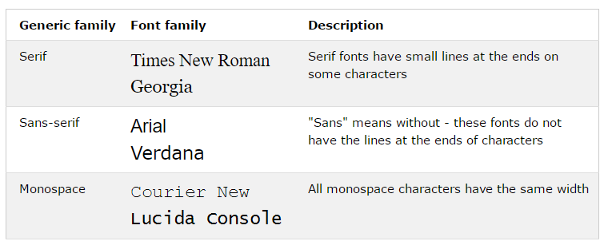

# Fonts

> Spring 2017 | Geography 472/572 | Geovisualization: Geovisual Analytics
>
> Instructor: Bo Zhao | TA: Kyle R. Hogrefe | Location: LINC 368 | Time: Tuesday 9-9:50am

**Learning Objectives**

- Get to know the fonts for the web based geovisualization;
- Manipulate fonts in Stylesheet; and
- Get familiar with Google Fonts.

## 1. Font

In metal typesetting, a **font** is a particular size, weight and style of a typeface. Each font was a matched set of type, one piece (called a "sort") for each glyph, and a typeface consisting of a range of fonts that shared an overall design.

In modern usage, with the advent of digital typography, **font** is frequently synonymous with **typeface**, although the two terms do not necessarily mean the same thing. In particular, the use of **vector** or **outline** fonts means that different sizes of a typeface can be dynamically generated from one design. Each style may still be in a separate "font file"— for instance, the typeface "Bulmer" may include the fonts "Bulmer roman", "Bulmer italic", "Bulmer bold" and "Bulmer extended"—but the term "font" might be applied either to one of these alone or to the whole typeface.

Regarding font on the web, its style is defined by CSS. A font's css properties mainly include the font family, boldness, size, and the style of a text.

In CSS, there are two types of font family names:

- generic family: a group of font families with a similar look (like "Serif" or "Monospace")
- font family: a specific font family (like "Times New Roman" or "Arial")



> **Note:** On computer screens, sans-serif fonts are considered easier to read than serif fonts.


> Difference Between Serif and Sans-serif Fonts

## 2. Fonts in the codes

The font family of a text is set with the font-family property.

The font-family property should hold several font names as a "fallback" system. If the browser does not support the first font, it tries the next font, and so on.

Start with the font you want, and end with a generic family, to let the browser pick a similar font in the generic family, if no other fonts are available.

> **Note:** If the name of a font family is more than one word, it must be in quotation marks, like: "Times New Roman".

More than one font family is specified in a comma-separated list:


```css
p {
    font-family: "Times New Roman", Times, serif;
}
```

Below are some [commonly used font combinations](https://www.w3schools.com/cssref/css_websafe_fonts.asp), organized by generic family:

**Serif Fonts**

- Georgia, serif
- "Palatino Linotype", "Book Antiqua", Palatino, serif
- "Times New Roman", Times, serif

**Sans-Serif Fonts**

- Arial, Helvetica, sans-serif
- "Arial Black", Gadget, sans-serif
- "Comic Sans MS", cursive, sans-serif
- Impact, Charcoal, sans-serif
- "Lucida Sans Unicode", "Lucida Grande", sans-serif
- Tahoma, Geneva, sans-serif
- "Trebuchet MS", Helvetica, sans-serif
- Verdana, Geneva, sans-serif

**Monospace Fonts**

- "Courier New", Courier, monospace
- "Lucida Console", Monaco, monospace


## 3. Font Properties

**Font Size**

The font-size property sets the size of the text.

Being able to manage the text size is important in web design. However, you should not use font size adjustments to make paragraphs look like headings, or headings look like paragraphs.

Always use the proper HTML tags, like <h1> - <h6> for headings and <p> for paragraphs.

The font-size value can be an absolute, or relative size.

Absolute size:

- Sets the text to a specified size
- Does not allow a user to change the text size in all browsers (bad for accessibility reasons)
- Absolute size is useful when the physical size of the output is known

Relative size:

- Sets the size relative to surrounding elements
- Allows a user to change the text size in browsers

```css
body {
    font-size: 100%;
}


h1 {
    font-size: 40px;
}

h2 {
    font-size: 35px;
}


p {
    font-size: 16px;
}
```

> **note:** If you do not specify a font size, the default size for normal text, like paragraphs, is 16px (16px=1em)

**Font Weight**

The font-weight property specifies the weight of a font:

```css
p.normal {
    font-weight: normal;
}

p.thick {
    font-weight: bold;
}
```

## 3. Google Fonts

Google Fonts (previously called Google Web Fonts) is an interactive directory of free hosted application programming interfaces for web fonts. Google Fonts is designed to provide a platform for users to discover fonts and is used extensively. Its example font faces include Lato, Raleway, and Lobster. There are over 800 fonts available through Google Fonts' main website. All of these font files are also accessible through Google Fonts' GitHub repository at [github.com/google/fonts](github.com/google/fonts).

To use a google font for your web application, here is [a quick html example](index.html):

```html
<!DOCTYPE html>
<html>
<head>
    <title>Google Font Test Page</title>>
    <link href='//fonts.googleapis.com/css?family=Sofia' rel='stylesheet'>
    <style>
        body {
            font-family: 'Sofia';font-size: 22px;
        }
    </style>
</head>
<body>

<h1>Sofia</h1>
<p>Lorem ipsum dolor sit amet, consectetuer adipiscing elit.</p>
<p>123456790</p>
<p>ABCDEFGHIJKLMNOPQRSTUVWXYZ</p>
<p>abcdefghijklmnopqrstuvwxyz</p>

</body>
</html>

```

In general, You can start using the Google Fonts API in just three steps:


1\. Search a google font at [https://fonts.google.com/](https://fonts.google.com/)


2\. Add a stylesheet link to request the desired web font(s):

```css
<link rel="stylesheet" type="text/css"
      href="https://fonts.googleapis.com/css?family=Font+Name"
```

3\. Style an element with the requested web font, either in a stylesheet:

```css
.css-selector {
  font-family: 'Font Name', serif;
}

```

or with an inline style on the element itself:

```html5
<div style="font-family: 'Font Name', serif;">Your text</div>
```

What's more, To request multiple font families, separate the names with a pipe character `|`.

For example, to request the fonts Tangerine, Inconsolata, and Droid Sans:

```http
https://fonts.googleapis.com/css?family=Tangerine|Inconsolata|Droid+Sans
```


> **Extended Reading on Google Fonts:** (Get Started with the Google Fonts API](https://developers.google.com/fonts/docs/getting_started)


## References:

[1]. https://www.w3schools.com/css/css_font.asp

[2]. https://www.w3schools.com/cssref/css_websafe_fonts.asp

[3]. https://fonts.google.com/

[4]. https://www.w3schools.com/howto/howto_google_fonts.asp