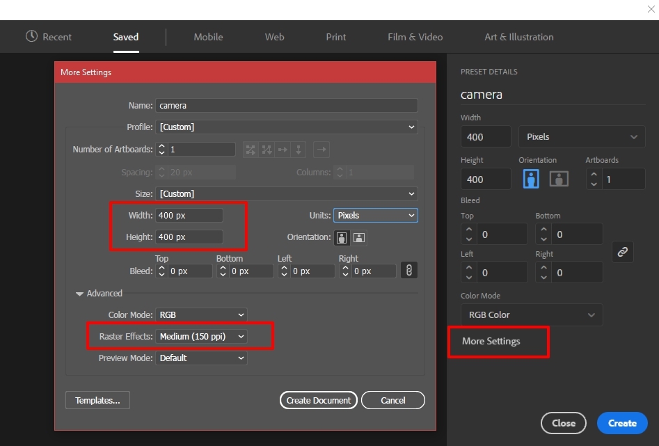
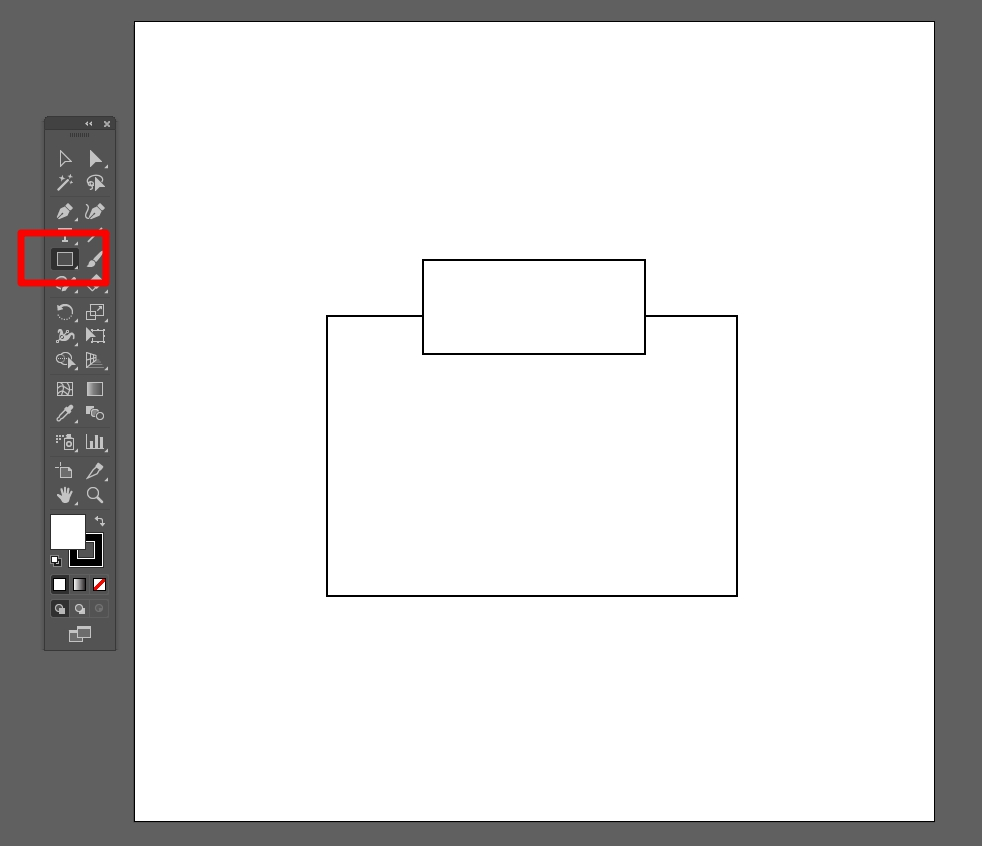
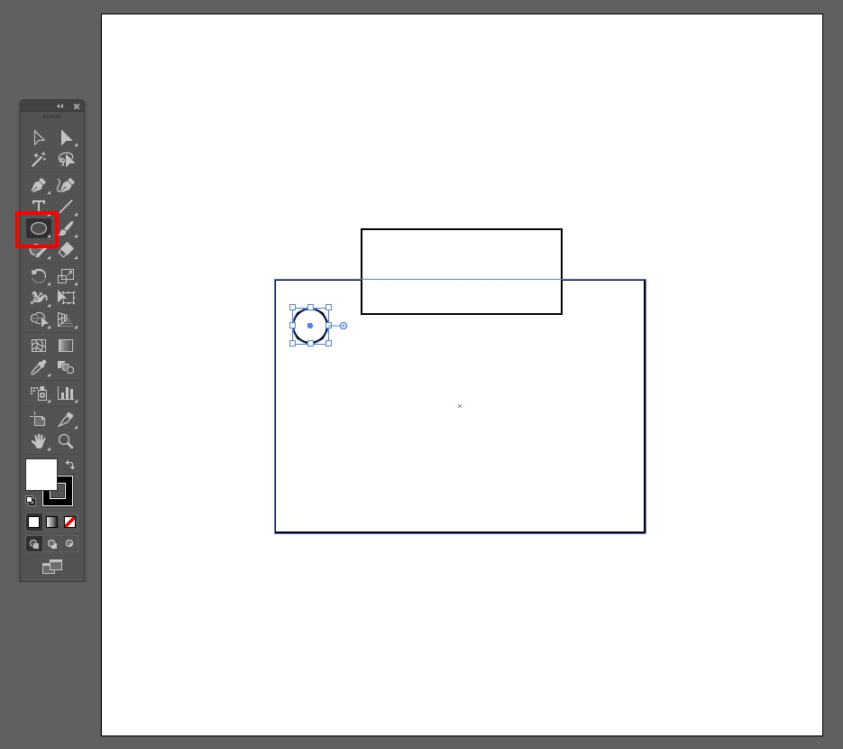
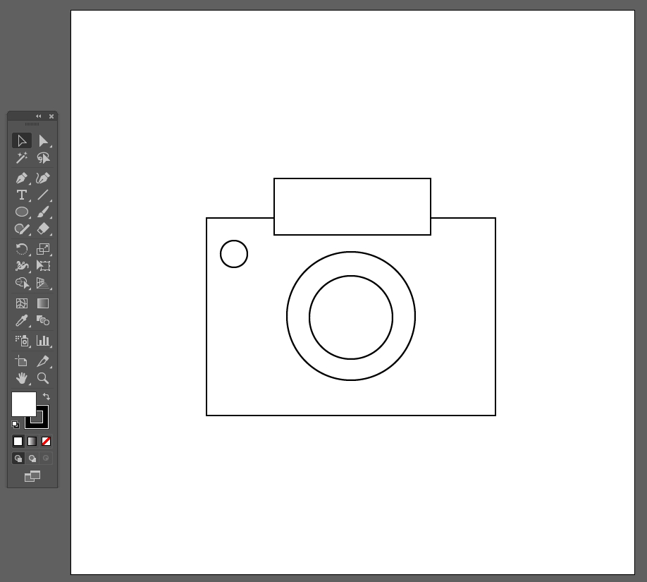
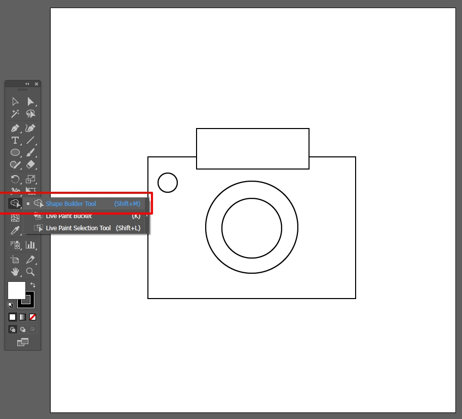
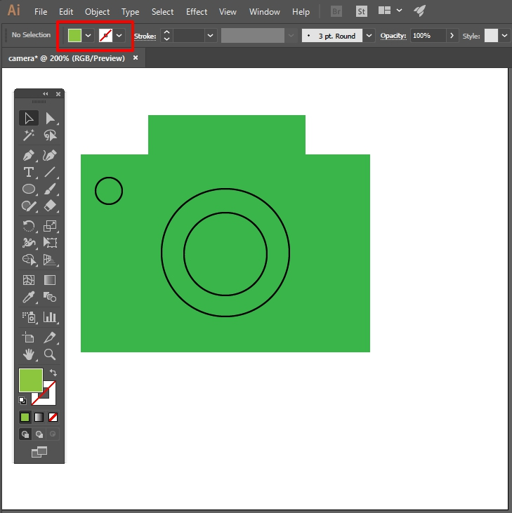
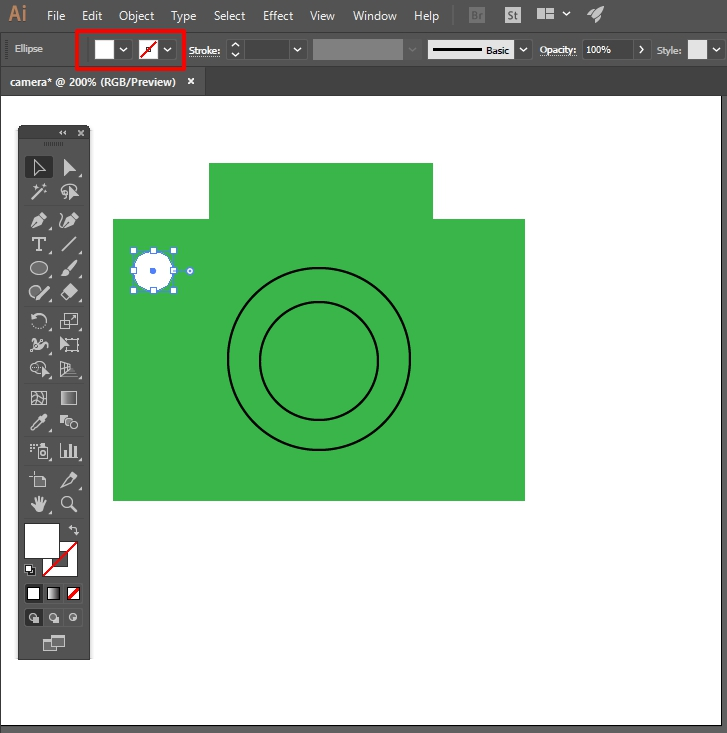
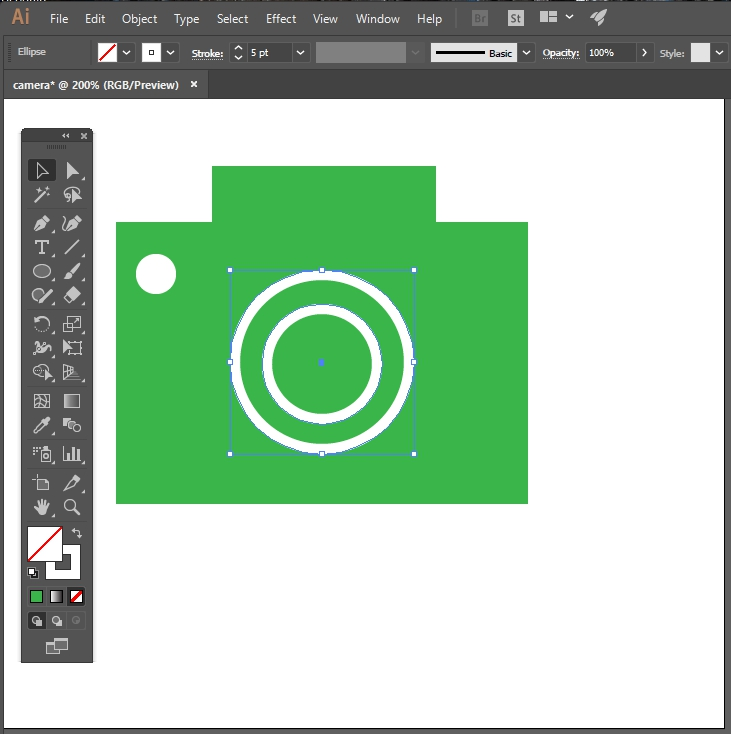
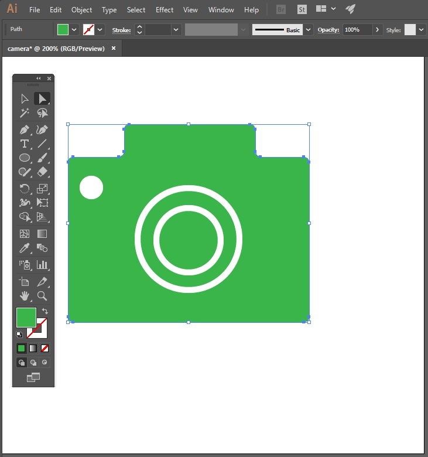

# Create an Icon

> Spring 2017 | Geography 472/572 | Geovisualization: Geovisual Analytics
>
> Instructor: Bo Zhao | TA: Kyle R. Hogrefe | Location: LINC 368 | Time: Thursday 9-9:50am

**Learning Objectives**

- Understand how to create a simple web icon.
- Tips in using illustrator.

In this lecture, we are designing a camera icon using Adobe Illustrator. Adobe Illustrator is a vector graphics editor developed and marketed by Adobe Systems. The latest version, Illustrator CC 2017, is the twenty-first generation in the product line. 

**The difference in strengths between Photoshop and Illustrator** became clear with the rise of the Internet, Illustrator was enhanced to support Web publishing, rasterization previewing, PDF, and SVG (Scalable Vector Graphics.) Adobe was an early developer of SVG for the web and Illustrator exported SVG files via the SVG File Format plugin. Using the Adobe SVG Viewer (ASV), introduced in 2000, allowed users to view SVG images in most major browsers until it was discontinued in 2009. Native support for SVG was not complete in all major browsers until Internet Explorer 9 in 2011.

In OSU's Digital Earth Lab, each computer has installed Adobe Illustrator. Below is a step-by-step walkthrough to create a camera icon like this:

## 1. Set up your project

Open Adobe Illustrator, and create a new document.

Click the New button on the start screen, or choose File > New.

Select Profile: `Web` and click `OK`.

Other parameters:

Width: 400px, Height: 400px, Color Mode: RGB, Raster Effects: Medium (150 ppi)

Press `Create Document`.

## 2. Draw basic shapes

First, you'll draw the camera body.

Select the `Rectangle tool` in the Tools panel. Click and drag a rectangle on the `**art board**`.

Draw a second, smaller rectangle overlapping the top of the larger rectangle as shown. 

You'll use `Smart Guides` to arrange the rectangles so their centers are aligned. Type `V` to access the Selection tool and drag the smaller rectangle over the larger one until you see a vertical magenta guide.

Next, you'll add the flash.

Click and hold the Rectangle tool to access other shapes and select the `Ellipse tool`. Click and drag a circle until you see **crosshair** guides appear in the circle, indicating you are drawing a perfectly round circle. Release your cursor when it's a suitable size.

> **Tip:** To resize the circle proportionally, press Shift and drag a corner widget. 

If needed, type `V` to access the Selection tool and reposition the circle inside the larger rectangle.

Now, you'll create the lens shape.

With the Ellipse tool selected, hover over the larger rectangle until center appears on screen. Press `Alt/Option` and drag a circle drawn from the center. Look for the `cross hair` guides and release your cursor when the circle is the right size.

Draw a smaller circle off to the side. Click in its center and drag it over the larger circle until you see intersect or center appear. Drop it in place. 

## 3. Combine shapes

In this step, you'll merge the rectangle shapes.

With the Selection tool, click the large rectangle, then press `Shift` and click the small rectangle to select both. Select the `Shape Builder tool` and drag a line connecting both rectangles as shown.

## 4. Add color

Now, you'll apply a fill color and various stroke attributes to the shapes. 

Press `V` to switch to the Selection tool. With the camera body selected, click the `Fill Color swatch` in the Control panel. Click a color in the Swatches panel. Then, click the `Stroke swatch` and select `None` to remove the stroke.

Repeat for the flash circle; apply a white fill, and no stroke**.**

To color the lens, first select the outer circle, and then `Shift + click` to select the second circle too. Apply no fill and a white stroke. Increase the `Stroke weight` to `5 pt`.

## 5. Apply a finishing touch

You can round the shape corners to create a different look.

Select the camera body. Press `A` to switch to the Direct Selection tool, and drag a rounded corner widget to round all the corners at once.

## 6. Save for web output

As a final step, you'll copy and paste the icon into a new document for final output.

If you need to resize your icon relative to the **art board**, press `Alt/Option + Shift` and drag a corner handle to resize it proportionally from the center.

Choose `File > Export > Save for Web (Legacy)`.

- In the Preset menu, select `JPEG High`. Choose `PNG-8` to make the background **transparent**
- Select `Art Optimized` in the pull-down menu
- Select `Clip to Art board`.

Click `Save` to export your icon for your geovisualization application. 

## References:

[1] https://helpx.adobe.com/illustrator/how-to/icon-design.html

[2] https://jakobzhao.github.io/storymap

